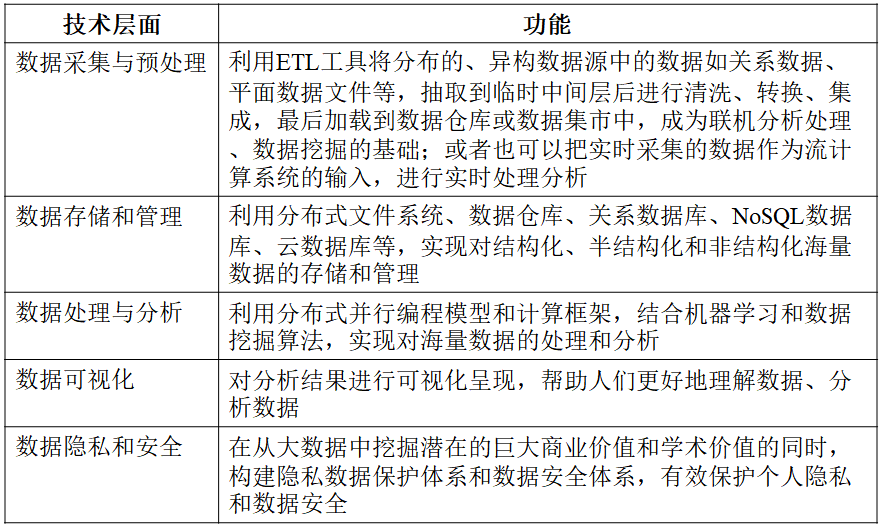
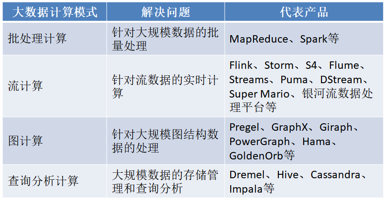
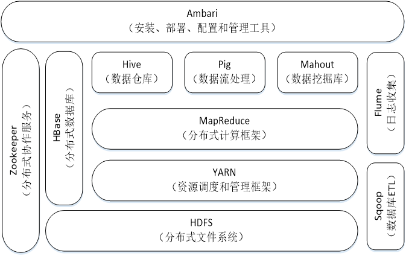
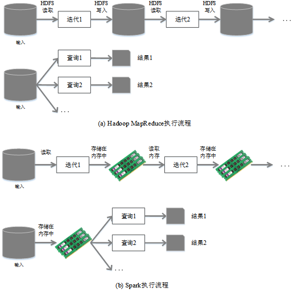
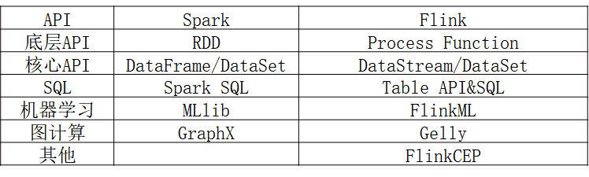

MapReduce采用“分而治之”策略，一个存储在分布式文件系统中的大规模数据集，会被切分成许多独立的分片（split），这些分片可以被多个Map任务并行处理
YARN的目标就是实现“一个集群多个框架”，即在一个集群上部署一个统一的资源调度管理框架YARN，在YARN之上可以部署其他各种计算框架
由YARN为这些计算框架提供统一的资源调度管理服务，并且能够根据各种计算框架的负载需求，调整各自占用的资源，实现集群资源共享和资源弹性收缩
可以实现一个集群上的不同应用负载混搭，有效提高了集群的利用率
不同计算框架可以共享底层存储，避免了数据集跨集群移动

```
Hadoop存在如下一些缺点：

表达能力有限
磁盘IO开销大
延迟高
任务之间的衔接涉及IO开销
在前一个任务执行完成之前，其他任务就无法开始，难以胜任复杂、多阶段的计算任务 
```
```
Spark在借鉴Hadoop MapReduce优点的同时，很好地解决了MapReduce所面临的问题

相比于Hadoop MapReduce，Spark主要具有如下优点：

Spark的计算模式也属于MapReduce，但不局限于Map和Reduce操作，还提供了多种数据集操作类型，编程模型比Hadoop MapReduce更灵活
Spark提供了内存计算，可将中间结果放到内存中，对于迭代运算效率更高
Spark基于DAG的任务调度执行机制，要优于Hadoop MapReduce的迭代执行机制 

```
硬盘（Hard Disk Drive，HDD）：

功能： 用于永久性存储数据，包括操作系统、应用程序、文档等。
工作原理： 通过将数据存储在磁性涂层的盘片上，使用磁头进行读写操作。数据在硬盘上存储时不会丢失，即使电源关闭。
特点： 相对较大的存储容量，适合长期存储大量数据。但相对于其他存储设备，读写速度相对较慢。
内存（Random Access Memory，RAM）：

功能： 用于临时存储计算机正在使用的数据和程序。RAM是计算机在运行时存储数据的地方，其速度较快。
工作原理： RAM是一种易失性存储设备，意味着在断电时会丢失存储的数据。但由于其高速读写特性，使得计算机可以更快地访问正在运行的应用程序和数据。
特点： 相对较小的存储容量，但提供了更快的读写速度。RAM的容量越大，计算机执行多任务时的性能越好。
磁盘（Disk）：

泛指： 除硬盘外，还包括其他形式的磁性存储设备，如软盘、光盘等。
特点： 通常指的是磁性存储技术，利用磁性材料记录数据。磁盘可以是非易失性的（如硬盘）或易失性的（如软盘）

使用Hadoop进行迭代计算非常耗资源
Spark将数据载入内存后，之后的迭代计算都可以直接使用内存中的中间结果作运算，避免了从磁盘中频繁读取数据

park和Flink都是Apache软件基金会旗下的顶级项目，二者具有很多共同点，具体如下：
都是基于内存的计算框架，因此，都可以获得较好的实时计算性能；
都有统一的批处理和流处理APl，都支持类似SQL的编程接口；
都支持很多相同的转换操作，编程都是用类似于Scala Collection APl的函数式编程模式；
都有完善的错误恢复机制；
都支持“精确一次”（exactly once）的语义一致性。

同时，Flink和Spark还存在一些明显的区别，具体如下：
（1）Spark的技术理念是基于批来模拟流的计算。而Flink则完全相反，它采用的是基于流计算来模拟批计算。从技术发展方向看，用批处理来模拟流计算有一定的技术局限性，并且这个局限性可能很难突破。而Flink基于流计算来模拟批处理，在技术上有更好的扩展性。
（2）Flink和Spark都支持流计算，二者的区别在于，Flink是一条一条地处理数据，而Spark是基于RDD的小批量处理，所以，Spark在流式处理方面，不可避免地会增加一些延时，实时性没有Flink好。Flink的流计算性能和Storm差不多，可以支持毫秒级的响应，而Spark则只能支持秒级响应。
（3）当全部运行在Hadoop YARN之上时，Flink的性能要略好于Spark，因为，Flink支持增量迭代，具有对迭代进行自动优化的功能。
