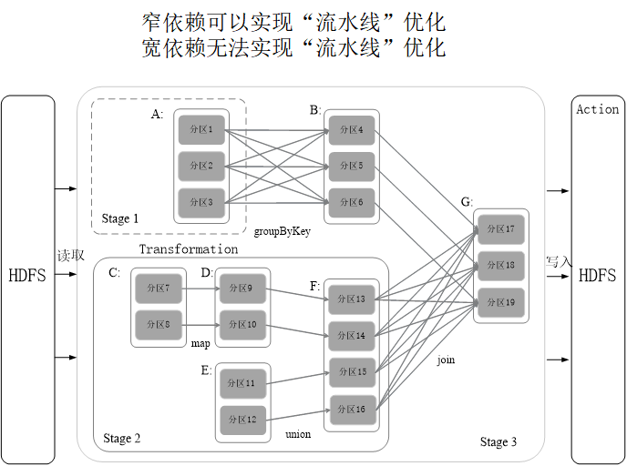

[TOC]
Spark在借鉴Hadoop MapReduce优点的同时，很好地解决了MapReduce所面临的问题

相比于Hadoop MapReduce，Spark主要具有如下优点：

Spark的计算模式也属于MapReduce，但不局限于Map和Reduce操作，还提供了多种数据集操作类型，编程模型比Hadoop MapReduce更灵活
Spark提供了内存计算，可将中间结果放到内存中，对于迭代运算效率更高
Spark基于DAG的任务调度执行机制，要优于Hadoop MapReduce的迭代执行机制 
Spark的设计遵循“一个软件栈满足不同应用场景”的理念，逐渐形成了一套完整的生态系统
既能够提供内存计算框架，也可以支持SQL即席查询、实时流式计算、机器学习和图计算等
Spark可以部署在资源管理器YARN之上，提供一站式的大数据解决方案
因此，Spark所提供的生态系统足以应对上述三种场景，即同时支持批处理、交互式查询和流数据处理

## 基本概念设计框架
RDD：是Resillient Distributed Dataset（弹性分布式数据集）的简称，是分布式内存的一个抽象概念，提供了一种高度受限的共享内存模型
DAG：是Directed Acyclic Graph（有向无环图）的简称，反映RDD之间的依赖关系
Executor：是运行在工作节点（WorkerNode）的一个进程，负责运行Task
应用（Application）：用户编写的Spark应用程序
任务（ Task ）：运行在Executor上的工作单元 
作业（ Job ）：一个作业包含多个RDD及作用于相应RDD上的各种操作
阶段（ Stage ）：是作业的基本调度单位，一个作业会分为多组任务，每组任务被称为阶段，或者也被称为任务集合，代表了一组关联的、相互之间没有Shuffle依赖关系的任务组成的任务集

一个应用（Application）由一个驱动器（Driver）和若干个作业（Job）构成，一个作业由多个阶段（Stage）构成，一个阶段由多个任务（Task）组成。当执行一个应用时，驱动器会向集群管理器（Cluster Manager）申请资源，启动执行器，并向执行器发送应用程序代码和文件，然后在执行器上执行任务，运行结束后，执行结果会返回给驱动器，写到HDFS或者其他数据库中。

## saprk运行流程
（1）首先为应用构建起基本的运行环境，即由Driver创建一个SparkContext，进行资源的申请、任务的分配和监控
（2）资源管理器为Executor分配资源，并启动Executor进程
（3）SparkContext根据RDD的依赖关系构建DAG图，DAG图提交给DAGScheduler解析成Stage，然后把一个个TaskSet提交给底层调度器TaskScheduler处理；Executor向SparkContext申请Task，Task Scheduler将Task发放给Executor运行，并提供应用程序代码
（4）Task在Executor上运行，把执行结果反馈给TaskScheduler，然后反馈给DAGScheduler，运行完毕后写入数据并释放所有资源 

RDD典型的执行过程如下：
RDD读入外部数据源进行创建
RDD经过一系列的转换（Transformation）操作，每一次都会产生不同的RDD，供给下一个转换操作使用
最后一个RDD经过“动作”操作进行转换，并输出到外部数据源 
这一系列处理称为一个Lineage（血缘关系），即DAG拓扑排序的结果

优点：惰性调用、管道化、避免同步等待、不需要保存中间结果、每次操作变得简单

**rdd是提供的转换接口都非常简单，都是类似map、filter、groupBy、join等粗粒度的数据转换操作，而不是针对某个数据项的细粒度修改**

### rdd特性
Spark采用RDD以后能够实现高效计算的原因主要在于：
（1）高效的容错性
现有容错机制：数据复制或者记录日志
RDD：血缘关系、重新计算丢失分区、无需回滚系统、重算过程在不同节点之间并行、只记录粗粒度的操作
（2）中间结果持久化到内存，数据在内存中的多个RDD操作之间进行传递，避免了不必要的读写磁盘开销
（3）存放的数据可以是Java对象，避免了不必要的对象序列化和反序列化
**（RDD只支持读操作，并且只支持粗粒度转换，即在大量记录上执行的单个操作。将创建RDD的一系列转换记录下来（即Lineage），以便恢复丢失的分区。）**
窄依赖可以实现“流水线”优化
宽依赖无法实现“流水线”优化
被分成三个Stage，在Stage2中，从map到union都是窄依赖，这两步操作可以形成一个流水线操作
流水线操作实例
分区7通过map操作生成的分区9，可以不用等待分区8到分区10这个map操作的计算结束，而是继续进行union操作，得到分区13，这样流水线执行大大提高了计算的效率
### 窄依赖优化示例

Spark根据DAG图中的RDD依赖关系，把一个作业分成多个阶段。对于宽依赖和窄依赖而言，窄依赖对于作业的优化很有利。只有窄依赖可以实现流水线优化，宽依赖包含Shuffle过程，无法实现流水线方式处理。
Spark通过分析各个RDD的依赖关系生成了DAG，再通过分析各个RDD中的分区之间的依赖关系来决定如何划分Stage，具体划分方法是：
在DAG中进行反向解析，遇到宽依赖就断开
遇到窄依赖就把当前的RDD加入到Stage中
将窄依赖尽量划分在同一个Stage中，可以实现流水线计算

## rdd运行过程
通过上述对RDD概念、依赖关系和Stage划分的介绍，结合之前介绍的Spark运行基本流程，再总结一下RDD在Spark架构中的运行过程：
（1）创建RDD对象；
（2）SparkContext负责计算RDD之间的依赖关系，构建DAG；
（3）DAGScheduler负责把DAG图分解成多个Stage，每个Stage中包含了多个Task，每个Task会被TaskScheduler分发给各个WorkerNode上的Executor去执行。

## TensorFlowOnSpark

## 总结
深刻理解Spark的设计与运行原理，是学习Spark的基础。作为一种分布式计算框架，Spark在设计上充分借鉴吸收了MapReduce的核心思想，并对MapReduce中存在的问题进行了改进，获得了很好的实时性能。
RDD是Spark的数据抽象，一个RDD是一个只读的分布式数据集，可以通过转换操作在转换过程中对RDD进行各种变换。一个复杂的Spark应用程序，就是通过一次又一次的RDD操作组合完成的。RDD操作包括两种类型，即转换操作和行动操作。Spark采用了惰性机制，在代码中遇到转换操作时，并不会马上开始计算，而只是记录转换的轨迹，只有当遇到行动操作时，才会触发从头到尾的计算。当遇到行动操作时，就会生成一个作业，这个作业会被划分成若干个阶段，每个阶段包含若干个任务，各个任务会被分发到不同的节点上并行执行。
Spark可以采用四种不同的部署方式，包括Local、Standalone、Spark on Mesos和Spark on YARN。Local模式是单机模式，常用于本地开发测试，后三种都属于集群部署模式，用于企业的实际生产环境。
