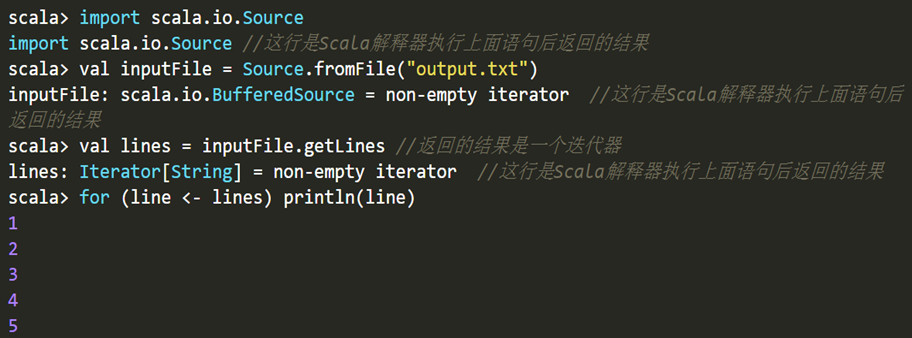
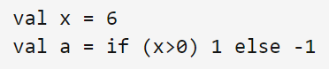
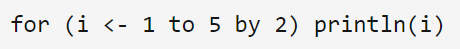
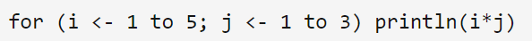
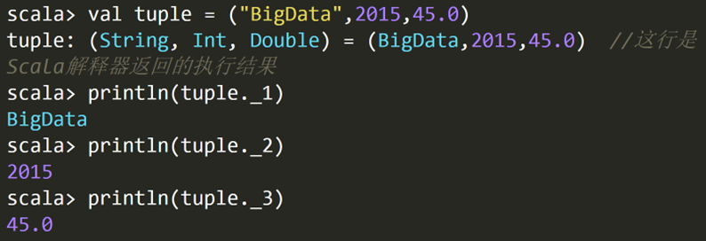
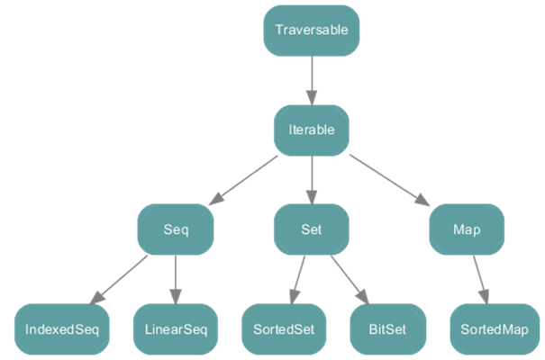

命令式编程涉及多线程之间的状态共享，需要锁机制实现并发控制
函数式编程不会在多个线程之间共享状态，不需要用锁机制，可以更好并行处理，充分利用多核CPU并行处理能力
```
Scala是一门类Java的多范式语言，它整合了面向对象编程和函数式编程的最佳特性。具体来讲：
Scala运行于Java虚拟机（JVM）之上，并且兼容现有的Java程序，可以与Java类进行互操作，包括调用Java方法，创建Java对象，继承Java类和实现Java接口
Scala是一门纯粹的面向对象的语言。在Scala语言中，每个值都是对象，每个操作都是方法调用。对象的数据类型以及行为由类和特质描述。类抽象机制的扩展有两种途径，一种途径是子类继承，另一种途径是灵活的混入（mixin）机制，这两种途径能避免多重继承的种种问题
Scala也是一门函数式语言。在Scala语言中，每个函数都是一个值，并且和其他类型（如整数、字符串等）的值处于同一地位。Scala提供了轻量级的语法用以定义匿名函数，支持高阶函数，允许嵌套多层函数，并支持柯里化


```
## 变量基础
>scala安装过程可以在B站首页的实况里查看

运行：
```scala
//代码文件为/usr/local/scala/mycode/HelloWorld.scala
object HelloWorld {
  def main(args: Array[String]) {
  println("Hello, world!");
 }
}

```
```shell
$ scalac  HelloWorld.scala
$ scala -classpath . HelloWorld
```

```scala
val i = 123            //123就是整数字面量
val i = 3.14           //3.14就是浮点数字面量
val i = true            //true就是布尔型字面量
val i = 'A'              //'A'就是字符字面量
val i = “Hello”       //“Hello”就是字符串字面量
val I =()              // 空括号()是Unit类型唯一的字面量
//操作符优先级：算术运算符 > 关系运算符 > 逻辑运算符 > 赋值运算符

```
```shell
scala> val myStr = "Hello World!"
myStr: String = Hello World!


scala> val myStr2 : String = "Hello World!"
myStr2: String = Hello World!

#myStr是val变量，因此，一旦初始化以后，就不能再次赋值

scala> myStr = "Hello Scala!"
<console>:27: error: reassignment to val
          myStr = "Hello Scala!"
          
scala> val a = "Xiamen University"
a: String = Xiamen University
scala> var a = 50
a: Int = 50

```
注意：在REPL环境下，可以重复使用同一个变量名来定义变量，而且变量前的修饰符和其类型都可以不一致，REPL会以最新的一个定义为准

```shell
scala> println("hello");println("world")
hello
world


scala> val i = 34
i: Int = 34
scala> val f=56.5
f: Double = 56.5
scala> printf("I am %d years old and weight %.1f Kg.","Li Lie",i,f)
I am 34 years old and weight 56.5 Kg.

```

插值字符串
基本语法：s " …$变量名… "  或 f " …$变量名%格式化字符… "

```shell
scala> val i=10
i: Int = 10
scala> val f=3.5
f: Double = 3.5452
scala> val s="hello"
s: String = hello
scala> println(s"$s:i=$i,f=$f")    //s插值字符串
hello:i=10,f=3.5452
scala> println(f"$s:i=$i%-4d,f=$f%.1f")   //f插值字符串
hello:i=10  ,f=3.5
```

读写文件
```shell
scala> import java.io.PrintWriter
scala> val outputFile = new PrintWriter("test.txt")
scala> outputFile.println("Hello World")
scala> outputFile.print("Spark is good")
scala> outputFile.close()
```



## 控制结构
if大致与java相同
If(x>0) 1 else -1 相当于c或Java里的三元操作符：x>0? 1: -1




> for (变量 <- 表达式 if 条件表达式) 语句块


```shell
scala> val r=for (i <- Array(1,2,3,4,5) if i%2==0) yield { println(i); i}
2
4
r: Array[Int] = Array(2,4)
```
Scala仍使用try-catch结构来捕获异常
```scala
import java.io.FileReader 
import java.io.FileNotFoundException 
import java.io.IOException 
try { 
  val f = new FileReader("input.txt") 
    // 文件操作 
} catch { 
  case ex: FileNotFoundException => 
    // 文件不存在时的操作 
  case ex: IOException => 
   // 发生I/O错误时的操作
} finally { 
  file.close() // 确保关闭文件 
} 
```
Scala提供了一个Breaks类（位于包scala.util.control）。Breaks类有两个方法用于对循环结构进行控制，即breakable和break。
 将需要控制的语句块作为参数放在breakable后面，然后，其内部在某个条件满足时调用break方法，程序将跳出breakable方法。
```scala
//代码文件为/usr/local/scala/mycode/TestBreak.scala
import util.control.Breaks._ //导入Breaks类的所有方法
val array = Array(1,3,10,5,4)
breakable{
for(i<- array){
        if(i>5) break //跳出breakable，终止for循环，相当于Java中的break
        println(i)
    }
}
// 上面的for语句将输出1，3
 
for(i<- array){
    breakable{
        if(i>5) break 
        //跳出breakable，终止当次循环，相当于Java的continue		println(i)
    }
}// 上面的for语句将输出1，3，5，4

```


## 数据结构
```scala
val intValueArr = new Array[Int](3)  //声明一个长度为3的整型数组，每个数组元素初始化为0

intValueArr(0) = 12 //给第1个数组元素赋值为12
intValueArr(1) = 45  //给第2个数组元素赋值为45
intValueArr(2) = 33 //给第3个数组元素赋值为33

val myStrArr = new Array[String](3) //声明一个长度为3的字符串数组，每个数组元素初始化为null

 myStrArr(0) = "BigData"
 myStrArr(1) = "Hadoop"
 myStrArr(2) = "Spark"
 for (i <- 0 to 2) println(myStrArr(i))

 val intValueArr = Array(12,45,33)
 val myStrArr = Array("BigData","Hadoop","Spark")

```
```scala
val  myMatrix = Array.ofDim[Int](3,4)  //类型实际就是Array[Array[Int]]
val  myCube = Array.ofDim[String](3,2,4)  //类型实际是Array[Array[Array[String]]]


scala> val a = new Array[Array[Int]](2)
a: Array[Array[Int]] = Array(null, null)

scala> a(0) = new Array[Int](3)

scala> a(1) = new Array[Int](3)

scala> a
res4: Array[Array[Int]] = Array(Array(0, 0, 0), Array(0, 0, 0))
```


如果需要在方法里返回多个不同类型的对象，Scala可以通过返回一个元组来实现使用下划线“_”加上从1开始的索引值，来访问元组的元素

在Iterable下的继承层次包括三个特质，分别是序列（Seq）、映射（Map）和 集合（Set），这三种容器最大的区别是其元素的索引方式，序列是按照从0开始的整数进行索引的，映射是按照键值进行索引的，而集合是没有索引的。

### 序列
序列（Sequence）: 元素可以按照特定的顺序访问的容器。序列中每个元素均带有一个从0开始计数的固定索引位置
序列容器的根是collection.Seq特质。其具有两个子特质 LinearSeq和IndexedSeq。LinearSeq序列具有高效的 head 和 tail 操作，而IndexedSeq序列具有高效的随机存储操作
实现了特质LinearSeq的常用序列有列表（List）和队列（Queue）。实现了特质IndexedSeq的常用序列有可变数组（ArrayBuffer）和向量（Vector）

不同于Java的java.util.List，scala的List一旦被定义，其值就不能改变，因此声明List时必须初始化
不能用new来建立List（原型：sealed abstract class List[+A] ）
补充相同类型：对于包括List在内的所有容器类型，如果没有显式指定元素类型，Scala会自动选择所有初始值的最近公共类型来作为元素的类型。因为Scala的所有对象都来自共同的根Any，因此，原则上容器内可以容纳任意不同类型的成员。例如：val x=List(1,3.4,"Spark")
var strList=List("BigData","Hadoop","Spark")


构造列表常用的方法是通过在已有列表前端增加元素，使用的操作符为::，例如：**：：是向右结合的（：结尾的操作符都是向右结合）**
val otherList="Apache"::strList
执行该语句后strList保持不变，而otherList将成为一个新的列表：
List("Apache","BigData","Hadoop","Spark")
Scala还定义了一个空列表对象Nil，借助Nil，可以将多个元素用操作符::串起来初始化一个列表
val intList = 1::2::3::Nil与val intList = List(1,2,3)等效
注意：除了head、tail操作是常数时间O(1)，其它按索引访问的操作都需要从头开始遍历，因此是线性时间复杂度O(N)。


Vetor可以实现所有访问操作都是常数时间。
+： 和 :+ 是Seq的方法，执行后vector本身没变

```
scala> val vec1=Vector(1,2)
vec1: scala.collection.immutable.Vector[Int] = Vector(1, 2, 3)
scala> val vec2 = 3 +: 4 +: vec1
vec2: scala.collection.immutable.Vector[Int] = Vector(3, 4, 1, 2)
scala> val vec3 = vec2 :+ 5
vec3: scala.collection.immutable.Vector[Int] = Vector(3, 4, 1, 2, 5)
scala> vec3(3)
res6: Int = 2
```
List 和vector对应的可变版本是ListBuffer,ArrayBuffer
1）不可变数组

上面Scala官网给出的集合框架图少了不可变Array，不可变的Array和String一样都是通过隐式转换和IndexedSeq相关联。

创建数组：

第一种方法类似Java去new：val arr: Array\[Int\] = new Array\[Int\] (5)

第二种方法用到了Array伴生对象中写有的apply方法，在 [Scala入门学习（四）： 面向对象](https://zhuanlan.zhihu.com/p/399419869) 中进行过介绍，调用apply去new一个伴生类实例对象可以省略apply，直接写类名，然后括号内加apply方法的参数即可。

Array伴生对象中的apply方法（其中之一）：

```scala
/** Creates an array of `Int` objects */
  // Subject to a compiler optimization in Cleanup, see above.
  def apply(x: Int, xs: Int*): Array[Int] = {
    val array = new Array[Int](xs.length + 1)
    array(0) = x
    var i = 1
    for (x <- xs.iterator) { array(i) = x; i += 1 }
    array
  }
```

xs为可变参数，对每种数据类型都提供了对应的apply方法，apply方法至少应该有一个参数x，方法体中会用传入的参数new一个Int类型的Array。

```scala
// 方法一
val arr: Array[Int] = new Array[Int] (5)
​
// 方法二
val arr1 = Array(1, 2, 3)
println(arr1.getClass.getSimpleName)
```

  

访问和修改数组：

访问Array中元素用 arr(0)，修改对 arr(0) 直接赋值即可，这里实际上是调用了Array的apply方法，写的时候省略apply，这个apply不是在Array的伴生对象中，而是在Array类中，且方法体是在运行时编译器自动填入的，如下：

```scala
final class Array[T](_length: Int) extends java.io.Serializable with java.lang.Cloneable {
​
  def length: Int = throw new Error()
​
  def apply(i: Int): T = throw new Error()
​
  def update(i: Int, x: T) { throw new Error() }
​
  override def clone(): Array[T] = throw new Error()
}
```

  

遍历数组：

-   范围遍历集合的下标 0 到 length，通过下标访问元素并输出。
-   使用引入特质SeqLike的indices方法，直接返回下标的Range集合。
-   下标集合中取下标再利用下标访问替换为直接从集合中取元素并访问。
-   用迭代器访问。
-   使用引入特质IndexedSeqOptimized的foreach方法，参数为匿名函数，声明要执行的操作。
-   使用引入特质Traversable的mkString方法将集合转化为字符串，需要传参集合中每个元素分开的分隔符。

```
// 方法一
for (i <- 0 until arr1.length) println(arr1(i))
​
// 方法二
for (i <- arr1.indices) println(arr1(i))
​
// 方法三
for (elem <- arr1) println(elem)
​
// 方法四
val iter = arr1.iterator
while (iter.hasNext) println(iter.next())
​
// 方法五
arr1.foreach((elem: Int) => println(elem))
arr1.foreach( println )
​
// 方法六
println(arr1.mkString("--"))
```

  

添加元素：

不可变对象添加元素是在数组基础上添加元素后返回新数组，调用ArrayOps的 +: 和 :+ 方法，前者在前面添加元素，后者在后面添加元素。Scala调用函数可以省略“点”，需要注意，调用 +: 和 :+ 方法时省略“点”，冒号那一侧是数组，加号那一侧是添加的元素，调用时新元素在左面则新数组中新元素就在最前面，新元素在右面则相反；也分享一个记忆小窍门，冒号在python中可代表全部选择，全部选择的自然就是集合。

```scala
val arr1 = Array(1, 2, 3, 4)
val newArr = arr1.:+(10)
println(newArr.mkString(", "))
​
val newArr1 = arr1.+:(10)
println(newArr1.mkString(", "))
​
val newArr2 = 7 +: 16 +: arr1 :+ 10 :+ 34
println(newArr2.mkString(", "))
​
​
--------  Output  --------
1, 2, 3, 4, 10
10, 1, 2, 3, 4
7, 16, 1, 2, 3, 4, 10, 34
```

  

2）可变数组

Scala中可变数组的集合类型为ArrayBuffer，ArrayBuffer将IndexedSeq和Buffer作了特质的混入。ArrayBuffer不像Array有隐式转换，所以需要导包 import scala.collection.mutable.ArrayBuffer。

创建数组：

创建ArrayBuffer和Array一样有new和apply两种方法，不可变数组new的时候可以不传参数初始长度，默认的构造器会将initialSize赋值为16；ArrayBuffer源码中发现并不能找到apply方法，实际上Scala为大部分集合提供了一个伴生对象的模版类，该模版类中实现了apply方法。

另外，ArrayBuffer可以直接println，输出一个对象会自动调用该对象的toString方法，ArrayBuffer会去调用引入父特质中的toString方法；但是上面不可变数组Array却不能直接输出，因为它不同于其它集合直接引入特质，Array直接继承了java.io.Serializable，可以作为一个Java的Object去调用toString方法，便不会再去调用其隐式转换的toString方法。

```
val arr1 = new ArrayBuffer[Int]()
val arr2 = ArrayBuffer.apply(1, 2, 3, 4)
println(arr2.toString())
​
​
--------  Output  --------
ArrayBuffer(1, 2, 3, 4)
```

访问和修改数组ArrayBuffer和Array方法相同。

遍历数组其它集合类都和Array的遍历方法类似。

  

添加元素：

不可变数组添加元素的 +: 方法在可变数组中也适用，但同样是添加元素生成一个新数组，所以这个方法最好是对不可变数组使用。

ArrayBuffer中建议使用 += 向后添加元素，在当前数组对象上直接进行修改切返回该数组对象的引用，不建议将该引用赋值给其它变量，否则会造成两个引用指向同一个数组对象；注意，在前面添加不是 =+，而是+=: ，使用示例如下：

```scala
val arr2 = ArrayBuffer.apply(1, 2, 3, 4)
arr2 += 10
println(arr2.toString())
16 +=: arr2
println(arr2.toString())
​
​
--------  Output  --------
ArrayBuffer(1, 2, 3, 4, 10)
ArrayBuffer(16, 1, 2, 3, 4, 10)
```

上面的添加元素方法并不好记，更建议使用 append / preappend / insert 方法来添加元素，通过方法名很容易区别他们各自的作用。它们的参数都是可变参数，不一定只添加一个，类型必须和集合的类型一致。

```scala
val arr1 = ArrayBuffer.apply(10, 16, 28)
val arr2 = ArrayBuffer.apply(1, 2, 3, 4)
println(arr2.toString())
​
arr2.append(7)  // 尾部添加 7
println(arr2.toString())
​
arr2.prepend(8)  // 头部添加 8
println(arr2.toString())
​
arr2.insert(2, 34, 47, 55)  // 在下标2处插入（34, 47, 55）
println(arr2.toString())
​
arr2.appendAll(arr1)  // 尾部添加集合arr1
println(arr2.toString())  
​
arr2.prependAll(arr1)  // 头部添加集合arr1
println(arr2.toString())  
​
arr2.insertAll(4, arr1)  // 在下标4处插入集合arr1
println(arr2.toString())  
​
​
--------  Output  --------
ArrayBuffer(1, 2, 3, 4)
ArrayBuffer(1, 2, 3, 4, 7)
ArrayBuffer(8, 1, 2, 3, 4, 7)
ArrayBuffer(8, 1, 34, 47, 55, 2, 3, 4, 7)
ArrayBuffer(8, 1, 34, 47, 55, 2, 3, 4, 7, 10, 16, 28)
ArrayBuffer(10, 16, 28, 8, 1, 34, 47, 55, 2, 3, 4, 7, 10, 16, 28)
ArrayBuffer(10, 16, 28, 8, 10, 16, 28, 1, 34, 47, 55, 2, 3, 4, 7, 10, 16, 28)
```

  

删除元素：

remove方法， -= 方法；在上面的arr2基础上进行删除元素的测试：

```scala
arr2.remove(3)  // 删除下标为3的元素
println(arr2.toString())
​
arr2.remove(10, 5)  // 从下标为10的元素开始删除之后的5个元素
println(arr2.toString())
​
arr2 -= 10  // 从头开始遍历删除第一个值为10的元素
println(arr2.toString())
​
​
--------  Output  --------
ArrayBuffer(10, 16, 28, 10, 16, 28, 1, 34, 47, 55, 2, 3, 4, 7, 10, 16, 28)
ArrayBuffer(10, 16, 28, 10, 16, 28, 1, 34, 47, 55, 16, 28)
ArrayBuffer(16, 28, 10, 16, 28, 1, 34, 47, 55, 16, 28)
```

  

可变数组与不可变数组相互转换

```
val arr: ArrayBuffer[Int] = ArrayBuffer(9, 10, 22)
val newarr = arr.toArray
println(arr.mkString(", "))
println(newarr.mkString(", "))
​
println("==========")
val buffer: mutable.Buffer[Int] = newarr.toBuffer
println(buffer.mkString(", "))
println(buffer.getClass.getSimpleName)
​
​
--------  Output  --------
9, 10, 22
9, 10, 22
==========
9, 10, 22
ArrayBuffer
```

  

3）多维数组

Array中的ofDim方法用来创建指定维数的数组，最高提供到创建五维数组，底层就是嵌套地去new多维数组；访问多维数组的元素和访问一维类似，加其它维度的下标即可。

```scala
val array: Array[Array[Int]] = Array.ofDim[Int](2, 3)
array(0)(0) = 8
array(1)(2) = 10
array(0)(1) = 16
​
for (i <- array.indices; j <- array(i).indices) {
print(array(i)(j) + "\t")
if (j == array(i).length - 1) println()
}
​
array.foreach(_.foreach(println))
​
​
--------  Output  --------
8 16  0 
0 0 10  
8
16
0
0
0
10
```

可变数组好像没提供直接创建多维数组的方法，可以自己逐维去new一个多维可变数组，也可以创建多维不可变数组然后用上面不可变数组转换为可变数组的方法。

  

**列表**

列表通常用于保存按顺序排列的一组数据，链式结构（区别于数组的顺序结构）。

1）不可变列表 —— List

创建List：Scala底层将List封装为了抽象类，不同于数组，不能通过new的方法来创建；List伴生对象中提供了apply方法，可以通过传入可变参数创建List。

访问和修改List：引用的特质LinearSeqOptimized中提供了apply方法可以根据下标索引访问元素，访问方法和数组便相同，List(1) 即可访问下标为1的元素；由于List并不提供update方法，因此无法对指定下标元素进行修改。

添加元素：

第一种方法是同数组一样可以使用 +: 和 :+ 在头部和尾部添加元素；

第二种是List是抽象类的 :: 方法，List有一个实现类名也为 :: ，:: 方法会构造一个 :: 类实现在头部添加元素的功能；这里也引申出了另外一种创建List的方法，List还有一个实现类 Nil 表示空列表，可以在空列表头插元素创建一个List。

无论用 +: / :+ 还是 ::，**每次都只能添加一个元素**，如果传入的参数有多个，会被识别为在头部插入一个元组，这个List的类型会识别为Any，这一点在前面的数组也类似。

合并列表：List提供了 ::: 和 ++ 两种方法合并列表，效果相同，第二种方法在Array和ArrayBuffer中也都可以使用。

遍历列表：同ArrayBuffer，父特质有toString方法，可以直接println输出；foreach方法在List中也同样支持。

```
val list1 = List[Any](2, 3, 4)
println(list1)
list1.foreach(println)
​
val list2 = 16 +: list1 :+ 10
println(list2)
​
val list3 = 34 :: 11 :: 19 :: Nil
println(list3)
​
val list4 = list3 ::: list2
val list5 = list3 ++ list2
println(list4)
println(list5)
​
​
--------  Output  --------
List(2, 3, 4)
2
3
4
List(16, 2, 3, 4, 10)
List(34, 11, 19)
List(34, 11, 19, 16, 2, 3, 4, 10)
List(34, 11, 19, 16, 2, 3, 4, 10)
```

2）可变列表

ListBuffer，和ArrayBuffer使用方法几乎一样，不再多做介绍。
 Range类：一种特殊的、带索引的不可变数字等差序列。其包含的值为从给定起点按一定步长增长(减小)到指定终点的所有数值
 Range可以支持创建不同数据类型的数值序列，包括Int、Long、Float、Double、Char、BigInt和BigDecimal等
> scala> val r=new Range(1,5,1)
创建一个从1到5的数值序列，包含区间终点5，步长为1


### 集合
集合(set)：不重复元素的容器（collection）
列表（List）中的元素是按照插入的先后顺序来组织的，但是，“集合”中的元素并不会记录元素的插入顺序，而是以“哈希”方法对元素的值进行组织，所以，它允许你快速地找到某个元素
集合包括可变集和不可变集，分别位于scala.collection.mutable包和scala.collection.immutable包，缺省情况下创建的是不可变集
```scala
var mySet = Set("Hadoop","Spark")
mySet += "Scala" 

//不可变
import scala.collection.mutable.Set
val myMutableSet = Set("Database","BigData")
myMutableSet += "Cloud Computing" 
```

### 映射
Scala 的映射包含了可变的和不可变的两种版本，分别定义在包scala.collection.mutable 和scala.collection.immutable 里。默认情况下，Scala中使用不可变的映射。如果想使用可变映射，必须明确地导入scala.collection.mutable.Map

```scala
val university = Map("XMU" -> "Xiamen University", "THU" -> "Tsinghua University","PKU"->"Peking University")

println(university("XMU"))
val xmu = if (university.contains("XMU")) university("XMU") else 0
```
下面是可变映射
```
import scala.collection.mutable.Map
val university2 = Map("XMU" -> "Xiamen University", "THU" -> "Tsinghua University","PKU"->"Peking University")
university2("XMU") = "Ximan University" //更新已有元素的值
university2("FZU") = "Fuzhou University" //添加新元素

university2 + = ("TJU"->"Tianjin University") //添加一个新元素
university2 + = ("SDU"->"Shandong University","WHU"->"Wuhan University") //同时添加两个新元素
```

**Set**

Set 是一个数据无序的集合，集合内元素**不可重复**，同样提供可变和不可变两个版本，默认是不可变的 Set。

1）不可变 Set

创建集合：Set 是特质无法直接 new，创建方法和之前在 ArrayBuffer 中提到过的相同，调用伴生对象模版类中的 apply 方法。

添加元素：使用 + 方法，返回一个新的 Set。

合并集合： 使用 ++ 方法，合并时去重，返回一个新的 Set，结果仍然无序。

删除元素： 使用 - 方法，返回一个新的 Set，不包含 remove 的元素。

```scala
// 创建集合
val set1 = Set(1, 2, 3)
println(set1)
​
// 添加元素
val set2 = set1 + 6
println(set2)
​
// 合并集合
val set3 = Set(1, 10, 100)
val set4 = set3 ++ set1
println(set4)
​
// 删除元素
val set5 = set4 - 100
println(set5)
​
​
--------  Output  --------
Set(1, 2, 3)
Set(1, 2, 3, 6)
Set(10, 1, 2, 3, 100)
Set(10, 1, 2, 3)
```

  

2）可变 Set

不同于 Array 和 List 可变与不可变的集合可以直接用名字区分开，Set 声明为可变集合需要显示的声明 mutable.Set，导入可变Set的包。

上面对不可变 Set 的操作方法都适用于可变 Set，用原集合接收返回的集合就可以实现在原集合上进行增删的效果（ += / -= ）；可变集合对不可变集合的操作方法都做了封装，更建议使用封装后的方法来操作可变集合，以此加以区分。

创建集合：与不可变Set唯一区别是在 Set 前声明mutable。

添加元素：使用 += 或 add 方法，将元素加入原集合中，add 方法 对 += 方法进行封装，如果待添加元素已经存在于原集合中返回 false。

合并集合： 使用 ++= 方法，将另外一个集合合并到当前集合中并去重。

删除元素： 使用 -= 或 remove 方法，从原集合中删除指定元素，remove 方法 对 -= 方法进行封装，如果待删除元素不存在于原集合中返回false。

```scala
// 创建集合
val set1 = mutable.Set(10, 13, 16, 10, 28, 34)
println(set1)
println("===============================")
​
// 添加元素
val set2 = set1 + 11
println(set1)
println(set2)
​
set1 += 11
println(set1)
​
val flag1 = set1.add(20)
println(flag1)
println(set1)
println("===============================")
​
// 删除元素
set1 -= 10
println(set1)
val flag2 = set1.remove(10)
println(flag2)
println(set1)
println("===============================")
​
// 合并集合
val set3 = mutable.Set(1, 2, 3, 16, 28)
val set4 = set1 ++ set3
println(set4)
set1 ++= set3
println(set1)
​
​
--------  Output  --------
Set(16, 13, 34, 10, 28)
===============================
Set(16, 13, 34, 10, 28)
Set(16, 13, 34, 10, 28, 11)
Set(16, 13, 34, 10, 28, 11)
true
Set(16, 13, 34, 20, 10, 28, 11)
===============================
Set(16, 13, 34, 20, 28, 11)
false
Set(16, 13, 34, 20, 28, 11)
===============================
Set(1, 16, 13, 34, 20, 2, 3, 28, 11)
Set(1, 16, 13, 34, 20, 2, 3, 28, 11)
```

  

**Map**

Key-Value集合，默认为不可变的 Map。

1）不可变 Map

创建集合：同Set只能通过伴生对象模版类的 apply 方法创建集合，但 Map 集合与其它常规集合不同，Map在构造时需要接收键值对，因此它有自己的模版类。

遍历集合：可以直接 print，也可以用 foreach 遍历，会将 KEY 和 VALUE 结合成一个元组。

取集合中元素：使用 Map 的 get 方法，返回内容为 Option 类型，为了避免空指针异常将返回结果包装成 Option，Option 本身是一个抽象类，它有两个实现 Some 和 None，Some表示有值， None 表示空值，两个类都实现了 Option 的 get 方法；若返回 Some，可以通过 get 取到对应的 VALUE，若返回 None，执行 get 方法会抛出异常；如果不想抛出异常，Map 提供了 getOrElse方法，接受两个参数分别为 KEY 和找不到对应 VALUE 时应该返回的内容；但其实 getOrElse 还是相对麻烦，Map 提供了 apply 方法对 getOrElse 做了进一步封装，apply方法如下：

```
def apply(key: K): V = get(key) match {
  case None => default(key)
  case Some(value) => value
}
```

不可变Map操作示例代码如下：

```
// 创建集合
val map1 = Map.apply(16 -> "Ramsey", 7 -> "Saka", 10 -> "Rowe")
println(map1)
​
// 遍历集合
map1.foreach(println);
for (kv <- map1) println(kv) // Tuple
​
// 取Map中所有key
for (key <- map1.keys) {
println(s"${key} ---> ${map1.get(key)}")
}
​
println("7: " + map1.get(8))
println("16: " + map1.get(16).get)
println("10: " + map1.getOrElse(9, 0))
​
println("7: " + map1(7))
​
​
--------  Output  --------
Map(16 -> Ramsey, 7 -> Saka, 10 -> Rowe)
(16,Ramsey)
(7,Saka)
(10,Rowe)
(16,Ramsey)
(7,Saka)
(10,Rowe)
16 ---> Some(Ramsey)
7 ---> Some(Saka)
10 ---> Some(Rowe)
7: None
16: Ramsey
10: 0
7: Saka
```

  

2）可变Map

可变Map的底层实际上是一个HashMap，操作和其它集合大同小异，直接看代码

```
// 创建集合
val map1 = mutable.Map(16 -> "Ramsey", 7 -> "Saka", 10 -> "Rowe")
​
// 添加元素
map1.put(14, "Auba")
println(map1)
map1 += ((9, "Laca"), (1, "Leno"))
println(map1)
​
​
// 删除元素
map1.remove(9)
println(map1.getOrElse(9, 0))
map1 -= 1
println(map1)
​
// 修改元素
map1.update(10, "S.Rowe")
​
// 合并集合
var map2 = Map(34 -> "Xhaka", 5 -> "Partey", 3 -> "Thierney", 14 -> "Aubameyang")
map1 ++= map2
println(map1)
println(map2)
​
​
--------  Output  --------
Map(14 -> Auba, 7 -> Saka, 16 -> Ramsey, 10 -> Rowe)
Map(14 -> Auba, 7 -> Saka, 16 -> Ramsey, 1 -> Leno, 10 -> Rowe, 9 -> Laca)
0
Map(14 -> Auba, 7 -> Saka, 16 -> Ramsey, 10 -> Rowe)
Map(5 -> Partey, 14 -> Aubameyang, 34 -> Xhaka, 7 -> Saka, 16 -> Ramsey, 10 -> S.Rowe, 3 -> Thierney)
Map(34 -> Xhaka, 5 -> Partey, 3 -> Thierney, 14 -> Aubameyang)
```

put 方法底层也是 update 方法；合并集合时若有重复 KEY 的元素，会对原集合该 KEY 对应的 VALUE 进行更新。

  

**元组**

元组将相同或不同数据类型的元素封装为一个整体。

上一节在介绍 Map 的时候提到了Map中每一项是 KEY 和 VALUE 组合成的一个二元元组，数据类型是Tuple2，元组的底层有Tuple1 - Tuple22，所以最多只能有22个元素。

元组用小括号声明，逗号分隔各元素；可以用下划线加序号访问元组中每一个元素，也可以使用元组引入的特质中实现的迭代器去访问每个元素；每一个TupleX都重写了toString方法。

```
// 1. 创建元组
val tuple: (String, Int, Char, Boolean) = ("ssss", 22, 'j', true)
println(tuple)
​
// 2. 访问元组
println(tuple._1)
println(tuple._2)
println(tuple._3)
println(tuple._4)
​
println("==========")
​
// 3. 遍历元组数据
for (elem <- tuple.productIterator)
println(elem)
​
​
--------  Output  --------
(ssss,22,j,true)
ssss
22
j
true
==========
ssss
22
j
true
```

  

**队列**

操作受限的列表，同样分可变和不可变两种。

可变的Queue是一个普通的类，可以直接用new去创建；Queue同样有伴生对象，也可以用模版类中的apply方法创建。

```
// 创建队列
val queue = new mutable.Queue[Int]()
val queue1 = mutable.Queue(1, 2, 3)
println(queue1)
​
queue.enqueue(1, 8, 10)
queue.dequeue()
println(queue)
​
​
--------  Output  --------
Queue(1, 2, 3)
Queue(8, 10)
```

不可变Queue是一个密封类，只能通过伴生对象的方法创建。

```
val queue1 = Queue[Int](1, 2, 3)
println(queue1)
val queue2 = queue1.enqueue("10")
println(queue2)
​
​
--------  Output  --------
Queue(1, 2, 3)
Queue(1, 2, 3, 10)
```

  

**并行集合**

充分利用多核CPU，Scala提供并行集合，可进行并行计算。

只需要加 .par

```
val result1: immutable.IndexedSeq[Long] = (1 to 100).map(
  x => Thread.currentThread().getId
)
println(result1)
val result2: ParSeq[Long] = (1 to 100).par.map(
  x => Thread.currentThread().getId
)
println(result2)
​
​
--------  Output  --------
Vector(1, 1, 1, 1, 1, 1, 1, 1, 1, 1, 1, 1, 1, 1, 1, 1, 1, 1, 1, 1, 1, 1, 1, 1, 1, 1, 1, 1, 1, 1, 1, 1, 1, 1, 1, 1, 1, 1, 1, 1, 1, 1, 1, 1, 1, 1, 1, 1, 1, 1, 1, 1, 1, 1, 1, 1, 1, 1, 1, 1, 1, 1, 1, 1, 1, 1, 1, 1, 1, 1, 1, 1, 1, 1, 1, 1, 1, 1, 1, 1, 1, 1, 1, 1, 1, 1, 1, 1, 1, 1, 1, 1, 1, 1, 1, 1, 1, 1, 1, 1)
ParVector(11, 11, 11, 11, 11, 11, 17, 17, 17, 17, 17, 17, 15, 15, 15, 15, 15, 15, 15, 15, 15, 15, 15, 15, 15, 13, 13, 13, 13, 13, 13, 13, 13, 13, 13, 13, 13, 16, 16, 16, 16, 16, 16, 16, 16, 16, 16, 16, 16, 16, 12, 12, 12, 12, 12, 12, 12, 12, 12, 12, 12, 12, 17, 16, 16, 14, 14, 14, 13, 18, 18, 15, 15, 16, 16, 14, 14, 14, 14, 14, 14, 14, 14, 14, 14, 14, 14, 18, 18, 18, 18, 18, 18, 18, 18, 18, 18, 18, 18, 18)
```

  

  

至此，Scala 集合的三大类型介绍完毕，不打算在接下来继续介绍集合的常用方法，根据我个人的编程经验，很多API的使用都是一个熟能生巧的过程，而且大多数API存在即合理，因此要用到的时候再去百度或者查API文档，更有利于记忆，这里还建议大家去积累自己的API代码库。

### 迭代器
```scala
val iter = Iterator("Hadoop","Spark","Scala")
while (iter.hasNext) {
    println(iter.next())
}
```
建议：除next和hasnext方法外，在对一个迭代器调用了某个方法后，不要再次使用该迭代器


