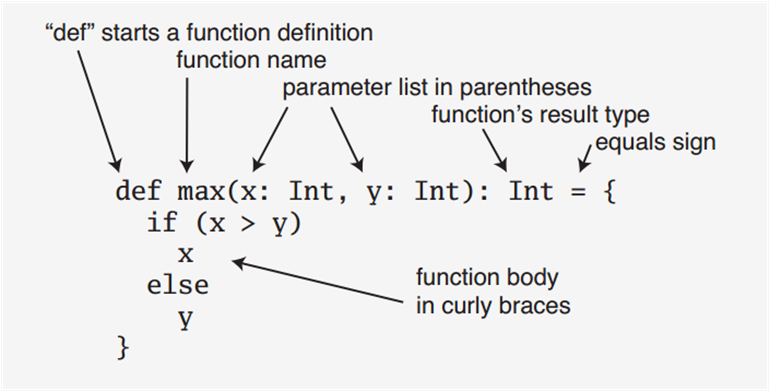

# 函数式编程基础
定义函数最通用的方法是作为某个类或者对象的成员，这种函数被称为方法，其定义的基本语法为

def 方法名(参数列表):结果类型={方法体}

函数字面量可以体现函数式编程的核心理念
在函数式编程中，函数是“头等公民”，可以像任何其他数据类型一样被传递和操作，也就是说，函数的使用方式和其他数据类型的使用方式完全一致了
可以像定义变量那样去定义一个函数，由此导致的结果是，函数也会和其他变量一样，开始有“值”
就像变量的“类型”和“值”是分开的两个概念一样，函数式编程中，函数的“类型”和“值”也成为两个分开的概念，函数的“值”，就是“函数字面量”

#### **1 偏函数(partial function)**

##### **1.1 提出一个需求，引出思考**

给你一个集合 val list = List(1, 2, 3, 4, "abc")，请完成如下要求: 1、将集合 list 中的所有数字 +1，并返回一个新的集合。 2、要求忽略掉 非数字 的元素，即返回的 新的集合 形式为 (2, 3, 4, 5)。

##### **13.1.2 解决方式-filter + map 返回新的集合**

##### **13.1.3 解决方式-模式匹配**

两种方式的示例代码如下： 示例代码如下：

```scala
package com.atguigu.chapter13

/**
  * 给你一个集合 val list = List(1, 2, 3, 4, "abc")，请完成如下要求:
  * 1、将集合 list 中的所有数字 +1，并返回一个新的集合。
  * 2、要求忽略掉 非数字 的元素，即返回的 新的集合 形式为 (2, 3, 4, 5)。
  */
object PartialFunDemo01 {
  def main(args: Array[String]): Unit = {
    // 思路1：filter + map 方式解决
    // 虽然可以解决问题，但是麻烦。
    val list = List(1, 2, 3, 4, "abc")
    // 先过滤，再map
    list.filter(f1)
    println(list.filter(f1).map(f2).map(f3)) // List(2, 3, 4, 5)

    // 思路2：模式匹配
    // 小结：虽然使用模式匹配比较简单，但是不够完美。
    val list2 = list.map(addOne2)
    println(list2) // List(2, 3, 4, 5, ())
  }

  // 模式匹配
  def addOne2(i: Any): Any = {
    i match {
      case x:Int => x + 1
      case _ =>
    }
  }

  // 将 List 转为 Any
  def f1(n: Any): Boolean = {
    n.isInstanceOf[Int]
  }

  // 将 Any 转为 Int [map]
  def f2(n: Any): Int = {
    n.asInstanceOf[Int]
  }

  def f3(n: Int): Int = {
    n + 1
  }
}
```

输出结果如下：

```javascript
List(2, 3, 4, 5) List(2, 3, 4, 5, ())
```

##### **1.1.4 偏函数的基本介绍**


##### **1.1.5 偏函数的快速入门**

示例代码如下：

```scala
package com.atguigu.chapter13

object PartialFunDemo02 {
  def main(args: Array[String]): Unit = {
    // 使用偏函数解决
    val list = List(1, 2, 3, 4, "hello")
    // 定义一个偏函数
    // 1. PartialFunction[Any, Int] 表示偏函数接收的参数类型是 Any，返回的类型是 Int
    // 2. isDefinedAt(x: Any) 如果返回 true，就会去调用 apply 构建对象实例，如果是 false，就过滤
    // 3. apply 构造器，对传入的值 + 1，并返回（新的集合）
    val addOne3 = new PartialFunction[Any, Int] {
      def isDefinedAt(any: Any) = if (any.isInstanceOf[Int]) true else false
      def apply(any: Any) = any.asInstanceOf[Int] + 1 // 将 any 显示转换成 Int
    }

    // 使用偏函数
    // 说明：如果是使用偏函数，则不能使用 map，应该使用 collect
    // 说明偏函数的执行流程
    // 1. 遍历 list 集合的所有元素
    // 2. 然后调用 val element = if(partialFun-isDefinedAt(list单个元素)) {partialFun-apply(list单个元素)}
    // 3. 每得到一个符合要求的元素 element，放入到新的集合，最后返回
    val list3 = list.collect(addOne3)
    println(list3) // List(2, 3, 4, 5)
  }
}
```

输出结果如下：
List(2, 3, 4, 5)
##### **13.1.6 偏函数的小结**


##### **13.1.7 偏函数的简写形式**

示例代码如下：

```scala
package com.atguigu.chapter13

/**
  * 偏函数简化形式
  */
object PartialFunDemo03 {
  def main(args: Array[String]): Unit = {
    // 使用偏函数的简化形式解决
    // 第一种简写形式：
    def f2: PartialFunction[Any, Int] = {
      case i: Int => i + 1 // case 语句可以自动转换为偏函数
      case j: Double => (j * 2).toInt
    }

    val list2 = List(1, 2, 3, 4, 5.6, "hello").collect(f2)
    println(list2) // List(2, 3, 4, 5, 11)

    // 第二种简写形式：
    val list3 = List(1, 2, 3, 4, "ABC").collect { case i: Int => i + 1 }
    println(list3) // List(2, 3, 4, 5)
  }
}
```

输出结果如下：

```javascript
List(2, 3, 4, 5, 11)
List(2, 3, 4, 5)
```

#### **1.2 作为参数的函数**

**1、基本介绍**


**2、快速入门案例** 示例代码如下：

```scala
package com.atguigu.chapter13

object FunParameterDemo01 {
  def main(args: Array[String]): Unit = {
    def plus(x: Int) = 3 + x
    val result1 = Array(1, 2, 3, 4).map(plus(_))
    println(result1.mkString(",")) // (4,5,6,7)

    // 1. 在 scala 中，函数也是有类型，比如 plus 就是 <function1>
    println("puls的函数类型是" + (plus _))

  }
}
```

输出结果如下：

```javascript
4,5,6,7
puls的函数类型是<function1>
```

**3、应用案例小结**


#### **13.3 匿名函数**

**1、基本介绍**


**2、快速入门案例** 示例代码如下：

```scala
package com.atguigu.chapter13

object AnonymouseFunctionDemo01 {
  def main(args: Array[String]): Unit = {
    // 对匿名函数的说明
    // 1. 不需要写 def 函数名
    // 2. 不需要写返回类型，使用类型推导
    // 3. =  变成  =>
    // 4. 如果有多行，则使用 {} 包括
    val triple = (x: Double) => 3 * x
    println(triple) // <function1>
    println(triple(3)) // 9.0
  }
}
```

输出结果如下：
<function1>
9.0

**3、练习题** 请编写一个匿名函数，可以返回2个整数的和，并输出该匿名函数的类型。 示例代码如下：

```scala
    val f1 = (n1: Int, n2: Int ) => {
      println("匿名函数被调用")
      n1 + n2
    }
    println("f1类型=" + f1) // f1类型=<function2>
    println(f1(10, 30)) // 40
```

#### **13.4 高阶函数(higher-order function)**

**1、基本介绍**   能够接受函数作为参数的函数，叫做高阶函数 (higher-order function)。可使应用程序更加健壮。 **2、高阶函数基本使用案例**


扩展代码如下：

```scala
package com.atguigu.chapter13

object HigherOrderFunctionDemo01 {
  def main(args: Array[String]): Unit = {
    // test 就是一个高阶函数，它可以接收 f: Double => Double 和 f1: Double => Int
    def test(f: Double => Double, f1: Double => Int, n1: Double) = {
      f(f1(n1))
    }

    // sum 是接收一个 Double，返回一个 Double
    def sum(d: Double): Double = {
      d + d
    }

    def mod(d: Double): Int = {
      d.toInt % 2
    }

    val res = test(sum, mod, 5.0)
    println("res=" + res) // 2.0
  }
}
```

输出结果如下：
res=2.0
**3、高阶函数可以返回函数类型** 示例代码如下：

```scala
package com.atguigu.chapter13

object HigherOrderFunctionDemo02 {
  def main(args: Array[String]): Unit = {
    // 说明
    // 1. minusxy 是高阶函数，因为它返回匿名函数
    // 2. 返回的匿名函数是 (y: Int) => x - y
    // 3. 返回的匿名函数可以使用变量接收
    def minusxy(x: Int) = {
      (y: Int) => x - y // 匿名函数
    }

    // 分步执行
    // f1 就是 (y: Int) => 3 - y
    val f1 = minusxy(3)
    println("f1的类型=" + f1)
    println(f1(1)) // 2
    println(f1(9)) // -6

    // 也可以一步到位的调用（函数柯里化）
    println(minusxy(4)(9)) // -5
  }
}
```

输出结果如下：

```javascript
f1的类型=<function1>
2 
-6 
-5
```

#### **13.5 参数(类型)推断**

**1、基本介绍**


**2、应用案例** 示例代码如下：

```scala
package com.atguigu.chapter13

object ParameterInferDemo01 {
  def main(args: Array[String]): Unit = {

    val list = List(1, 2, 3, 4)
    println(list.map((x: Int) => x + 1)) // (2,3,4,5)
    println(list.map((x) => x + 1)) // (2,3,4,5) 参数类型是可以推断时，可以省略参数类型。
    println(list.map(x => x + 1)) // (2,3,4,5) 当传入的函数，只有单个参数时，可以省去括号。
    println(list.map(_ + 1)) // (2,3,4,5) 如果变量只在=>右边只出现一次，可以用_来代替。

    println(list.reduce(f1)) // 10
    println(list.reduce((n1: Int, n2: Int) => n1 + n2)) // 10
    println(list.reduce((n1, n2) => n1 + n2)) // 10
    println(list.reduce(_ + _)) // 10
  }

  def f1(n1: Int, n2: Int): Int = {
    n1 + n2
  }
}
```

输出结果如下：

```javascript
List(2, 3, 4, 5) 
List(2, 3, 4, 5) 
List(2, 3, 4, 5) 
List(2, 3, 4, 5) 
10 10 10 10
```

**3、应用案例小结**


#### **13.6 闭包(closure)**

**1、基本介绍**


**2、应用案例小结**


**3、闭包的最佳实践** 示例代码如下：

```scala
package com.atguigu.chapter13

/**
  * 请编写一个程序，具体要求如下：
  * 编写一个函数 makeSuffix(suffix: String) 可以接收一个文件后缀名(比如.jpg)，并返回一个闭包
  * 调用闭包，可以传入一个文件名，如果该文件名没有指定的后缀(比如.jpg)，则返回 文件名.jpg，如果已经有.jpg后缀，则返回原文件名。
  * 要求使用闭包的方式完成。
  * String.endsWith(xx)
  */
object ClosureDemo01 {
  def main(args: Array[String]): Unit = {
    // 使用并测试
    val f = makeSuffix(".jpg")
    println(f("dog.jpg")) // dog.jpg
    println(f("cat")) // cat.jpg

  }

  // 自定义的函数
  def makeSuffix(suffix: String) = {
    // 返回一个匿名函数，该匿名函数会使用外部函数的suffix，那么该函数和suffix整体形成一个闭包。
    (filename: String) => {
      if (filename.endsWith(suffix)) {
        filename
      } else {
        filename + suffix
      }
    }
  }
}
```
dog.jpg
cat.jpg
输出结果如下：

**4、闭包的好处**


#### **13.7 函数柯里化(curry)**

**1、基本介绍**


**2、函数柯里化快速入门案例**


**3、函数柯里化最佳实践**


示例代码如下：

```scala
package com.atguigu.chapter13

/**
  * 函数柯里化最佳实践
  * 比较两个字符串在忽略大小写的情况下是否相等，注意，这里是两个任务：
  * 全部转大写（或小写）
  * 比较是否相等
  * 针对这两个操作，我们用一个函数去处理的思想，其实也变成了两个函数处理的思想（柯里化）
  */
object CurryDemo02 {
  def main(args: Array[String]): Unit = {
    // 方式1：简单的方式，使用一个函数完成
    def eq(s1: String)(s2: String): Boolean = {
      s1.toLowerCase == s2.toLowerCase
    }
    println(eq("hello")("HELLO"))

    // 方式2：使用稍微高级的用法(隐式类)：形式为 str.方法()
    def eq2(s1: String, s2: String): Boolean = {
      s1.equals(s2)
    }
    // 隐式类：该隐式类扩展了String对象的功能
    implicit class TestEq(s: String) {
      // 体现了将比较字符串的事情，分解成两个任务完成：
      // 任务1：checkEq 完转换大小写
      // 任务2.：f函数完成比较任务
      def checkEq(ss: String)(f: (String, String) => Boolean): Boolean = {
        f(s.toLowerCase, ss.toLowerCase)
      }
    }
    val str1 = "hello"
    println(str1.checkEq("HeLLO")(eq2))

    // 方式2的简化写法
    str1.checkEq("HeLLO")((s1: String, s2: String) => { s1.equals(s2) })
    str1.checkEq("HeLLO")((s1: String, s2: String) => s1.equals(s2)) // 代码块只有一行代码时。可以省略{}
    str1.checkEq("HeLLO")((s1, s2) => s1.equals(s2)) // 参数类型是可以推断时，可以省略参数类型。
    str1.checkEq("HeLLO")(_.equals(_)) // 如果变量只在=>右边只出现一次，可以用_来代替。
  }
}
```

输出结果如下：
true
true
#### **13.8 控制抽象函数**

**1、看一个需求**


**2、控制抽象基本介绍**


**3、快速入门案例** 示例代码如下：

```scala
package com.atguigu.chapter13

object AbstractControlDemo01 {
  def main(args: Array[String]): Unit = {
    // myRunInThread 就是一个抽象控制函数，其参数是没有输入，也没有输出的函数 f1: () => Unit
    def myRunInThread(f1: () => Unit) = {
      new Thread {
        override def run(): Unit = {
          f1()
        }
      }.start()
    }

    myRunInThread {
      () =>
        println("干活咯！5秒完成...")
        Thread.sleep(5000)
        println("干完咯！")
    }

    // 简写形式
    def myRunInThread2(f1: => Unit) = {
      new Thread {
        override def run(): Unit = {
          f1
        }
      }.start()
    }

    // 对于没有输入，也没有返回值函数，可以简写成如下形式：
    myRunInThread2 {
      println("干活咯！5秒完成...~~~")
      Thread.sleep(5000)
      println("干完咯！~~~")
    }

  }
}
```

**4、进阶用法：实现类似 while 的 mywhile 函数** 示例代码如下：

```scala
package com.atguigu.chapter13

object AbstractControlDemo02 {
  def main(args: Array[String]): Unit = {
    var x = 10
    while (x > 0) {
      x -= 1
      println("x=" + x)
    }

    // 说明：实现类似 while 的 mywhile 函数
    // 1 函数名为 mywhile，实现了类似 while 循环的效果
    // 2. condition: => Boolean 是一个没有输入值，返回 Boolean 类型函数
    // 3. block: => Unit 没有输入值，也没有返回值的函数
    def mywhile(condition: => Boolean)(block: => Unit): Unit = {
      // 类似 while 循环，递归
      if (condition) {
        block // x=9 x=8 x=7 ...
        mywhile(condition)(block)
      }
    }

    x = 10
    mywhile(x > 0) {
      x -= 1
      println("x=" + x)
    }

  }
}
```

输出结果如下：

```javascript
x=9 x=8 x=7 x=6 x=5 x=4 x=3 x=2 x=1 x=0 ----- x=9 x=8 x=7 x=6 x=5 x=4 x=3 x=2 x=1 x=0
```

>本文参与 [腾讯云自媒体分享计划](https://cloud.tencent.com/developer/support-plan)，分享自作者个人站点/博客。

>原始发表：2019-04-03 ，如有侵权请联系 [cloudcommunity@tencent.com](mailto:cloudcommunity@tencent.com) 删除

# 参考自
https://cloud.tencent.com/developer/article/1414684?areaId=106001