https://cloud.tencent.com/developer/article/1419057
## 基础

**、RDD 三个特点**   
3.1、不可分，在 RDD 上调用转换算子，会生成一个新的 RDD，不会更改原 RDD 的数据结构。   
3.2、可分区，RDD 的数据可以根据配置分成多个分区，每个分区都被一个 Task 任务去处理，可以认为分区数就是并行度。   
3.3、弹性：     
    3.3.1、存储的弹性，RDD 的数据可以在内存和磁盘进行自动切换，对用户透明。 3.3.2、计算的弹性，RDD 的计算之间会有`重试机制`，避免由于网络等原因导致的任务失败。     
    3.3.3、容错的弹性，RDD 可以通过`血统机制`来进行 RDD 的恢复。     
    3.3.4、分区的弹性，可以根据需求来`动态改变 RDD 分区的分区数`，也就是动态改变了并行度。
```scala
转换操作：
1、def map[U: ClassTag](f: T => U): RDD[U]      映射，将一种类型的数据转换成为另外一种类型的数据。
2、def filter(f: T => Boolean): RDD[T]          返回满足条件的数据。
3、def flatMap[U: ClassTag](f: T => TraversableOnce[U]): RDD[U]     将一个数据结构转换成为一个可迭代的数据结构，然后将数据压平。

4、def mapPartitions[U: ClassTag](f: Iterator[T] => Iterator[U], preservesPartitioning: Boolean = false): RDD[U]                    对于每一个分区执行一次函数，它的执行效率要比 map 高。
5、def mapPartitionsWithIndex[U: ClassTag](f: (Int, Iterator[T]) => Iterator[U], preservesPartitioning: Boolean = false): RDD[U]    类似于 mapPartitions，但 func 带有一个整数参数表示分片的索引值。

6、def sample(withReplacement: Boolean,fraction: Double,seed: Long = Utils.random.nextLong): RDD[T]     对 RDD 进行采样，主要用于观察大数据集的分布情况。

7、def union(other: RDD[T]): RDD[T]             和另外一个 RDD 取并集。
8、def intersection(other: RDD[T]): RDD[T]      和另外一个 RDD 取交集。
9、def distinct(numPartitions: Int)             对原 RDD 进行去重后返回一个新的 RDD。

10、def partitionBy(partitioner: Partitioner): RDD[(K, V)]      对 KV 结构 RDD 进行重新分区。
11、def reduceByKey(func: (V, V) => V): RDD[(K, V)]             返回值 V 的数据类型必须和输入一样。先预聚合再聚集。
12、def groupByKey(partitioner: Partitioner): RDD[(K, Iterable[V])]     将相同 Key 的 value 进行聚集。

13、def combineByKey[C](createCombiner: V => C, mergeValue: (C, V) => C, mergeCombiners: (C, C) => C): RDD[(K, C)]
    (1) 后面三个函数的逻辑是针对某一个 Key 的聚集来起作用。
    (2) createCombiner 每个分区都有，当遇到新 Key 的时候调用，产生一个新的数据结构。
    (3) mergeValue 每个分区都有，当遇到旧 Key 的时候调用，将当前数据合并到数据结构中。
    (4) mergeCombiners 这个是全局所有，合并所有分区中过来的数据。

14、def aggregateByKey[U: ClassTag](zeroValue: U, partitioner: Partitioner)(seqOp: (U, V) => U, combOp: (U, U) => U): RDD[(K, U)]
是 combineBykey 的简化操作，zeroValue 类似于 createCombiner， seqOp 类似于 mergeValue， combOp 类似于 mergeCombiner。

15、def foldByKey(zeroValue: V, partitioner: Partitioner) (func: (V, V) => V): RDD[(K, V)]      注意：V 的类型不能改变。

16、def sortByKey(ascending: Boolean = true, numPartitions: Int = self.partitions.length): RDD[(K, V)]  对 KV 结构 RDD 进行排序（默认升序），K 必须实现 trait Ordering[T]，复写 compare 方法，返回一个按照 key 进行排序的 (K,V) 的 RDD。
17、def sortBy[K](f: (T) => K, ascending: Boolean = true, numPartitions: Int = this.partitions.length)(implicit ord: Ordering[K], ctag: ClassTag[K]): RDD[T]  sortBy 使用 func 产生的 Key 来做比较。

18、def join[W](other: RDD[(K, W)], partitioner: Partitioner): RDD[(K, (V, W))]     和另外的 RDD 进行 JOIN。
19、def cogroup[W](other: RDD[(K, W)], partitioner: Partitioner): RDD[(K, (Iterable[V], Iterable[W]))]      类似于两个 RDD 分别做 groupByKey 然后再 全JOIN。

20、def cartesian[U: ClassTag](other: RDD[U]): RDD[(T, U)]      笛卡尔积。
21、def pipe(command: String): RDD[String]      对于每个分区，支持使用外部脚本比如 shell、perl 等处理分区内的数据。

22、def coalesce(numPartitions: Int, shuffle: Boolean = false,partitionCoalescer: Option[PartitionCoalescer] = Option.empty)(implicit ord: Ordering[T] = null): RDD[T]      改变分区数。
23、def repartition(numPartitions: Int)(implicit ord: Ordering[T] = null): RDD[T]       重新分区，所有数据全部网络混洗。
24、def repartitionAndSortWithinPartitions(partitioner)     在重新分区的过程中会进行排序，如果重新分区后还要进行 sortBy 或者 sorkByKey 操作，那么直接使用该算子。性能比 repartition 要高。

25、def glom(): RDD[Array[T]]       将每一个分区中的所有数据转换为一个 Array 数组，形成新的 RDD。

26、def mapValues[U](f: V => U): RDD[(K, U)]        只对 KV 结构中 value 数据进行映射。value 可以改变类型。

27、def subtract(other: RDD[T]): RDD[T]  求差集

----------------------------------------------------------------------------------------------------------

行动操作：
1、def reduce(f: (T, T) => T): T        规约某个 RDD
2、collect()    将数据返回到 Driver，是以数组的形式返回数据集的所有元素（简单测试用，生产环境中不用）
3、count()      返回 RDD 中的元素个数
4、first()      返回第一个元素
5、take(n)      返回前 n 个元素
6、takeSample(withReplacement, num, [seed])      采样，返回 Array 数组
7、takeOrdered (n)      返回排序后的前几个元素，如果需要倒序，那么可以利用重写 Ordering 来做

8、aggregate (zeroValue: U)(seqOp: (U, T) => U, combOp: (U, U) => U)  
9、fold(zeroValue)(func)    aggregate 的简化操作

10、saveAsTextFile(path)        以文本的方式保存到HDFS兼容的文件系统
11、saveAsSequenceFile(path)    以 SequenceFile 形式来存文件
12、saveAsObjectFile(path)      以 ObjectFile 来存文件

13、countByKey()        返回 Map 结构，获取每一个 key 的数量
14、foreach(func)       在数据集上的每一个元素运行 func 函数
```

1. 从文件系统中加载数据创建RDD
```scala
scala> val lines = sc.textFile("file:///usr/local/spark/mycode/rdd/word.txt")
lines: org.apache.spark.rdd.RDD[String] = file:///usr/local/spark/mycode/rdd/word.txt MapPartitionsRDD[12] at textFile at <console>:27
```
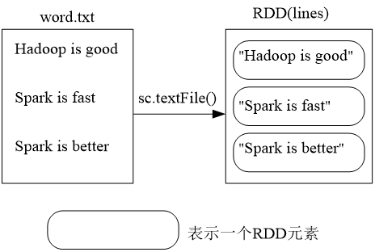
```scala
scala> val lines = sc.textFile("hdfs://localhost:9000/user/hadoop/word.txt")
scala> val lines = sc.textFile("/user/hadoop/word.txt")
scala> val lines = sc.textFile("word.txt")
```

2. 通过并行集合（数组）创建RDD

```scala
scala>val array = Array(1,2,3,4,5)
array: Array[Int] = Array(1, 2, 3, 4, 5)
scala>val rdd = sc.parallelize(array)
rdd: org.apache.spark.rdd.RDD[Int] = ParallelCollectionRDD[13] at parallelize at <console>:29
```
或者列表
```scala
scala>val list = List(1,2,3,4,5)
list: List[Int] = List(1, 2, 3, 4, 5)
scala>val rdd = sc.parallelize(list)
rdd: org.apache.spark.rdd.RDD[Int] = ParallelCollectionRDD[14] at parallelize at <console>:29

```
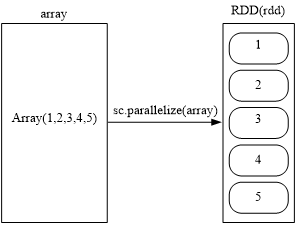

## rdd操作
### 转换
常见操作
```scala
rdd.filter(line=>line.contains(“a”))
rdd.map(word=>(word,1))
rdd.reduceByKey((a,b)=>a+b)
rdd.flatMap(line=>line.split(“ ”))

```
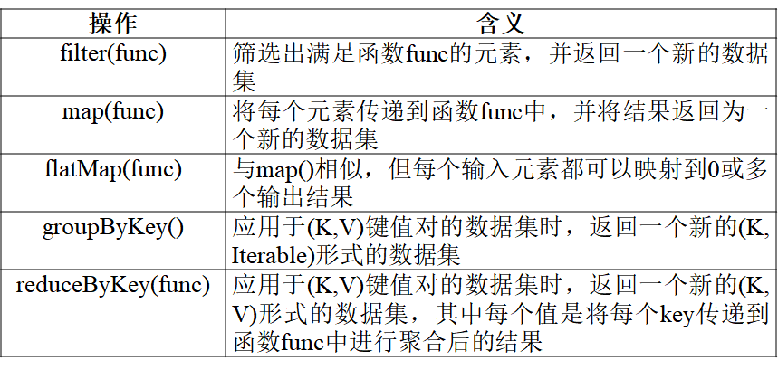
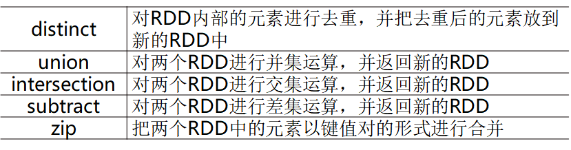

具体用法不再过多展示
> rdd.reduceByKey((a,b)=>a+b)
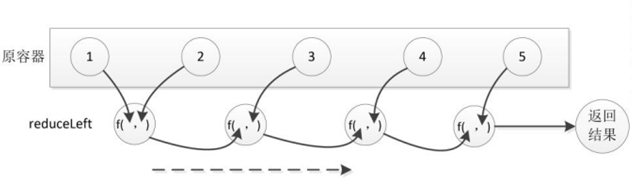

>distinct操作会对RDD内部的元素进行去重，并把去重后的元素放到新的RDD中。该方法实际是对map方法及reduceByKey方法的封装。

>union操作会对两个RDD进行并集运算，并返回新的RDD，整个过程不会对元素进行去重。下面是一个具体实例。
```scala
scala> val rdd1 = sc.parallelize(Array(1,2,3))
scala> val rdd2 = sc.parallelize(Array(3,4,5))
scala> val rdd3 = rdd1.union(rdd2)
```
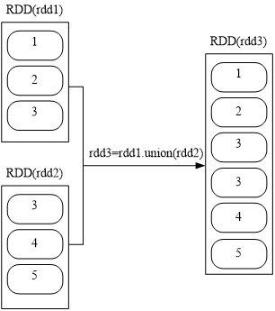

>intersection操作会对两个RDD进行交集运算，并返回新的RDD。下面是一个具体实例。
```scala
scala> val rdd1 = sc.parallelize(Array(1,2,3))
scala> val rdd2 = sc.parallelize(Array(3,4,5))
scala> val rdd3 = rdd1.intersection (rdd2)
```
执行rdd1.intersection (rdd2)以后得到的结果rdd3中，包含了1个元素，即3。

>subtract操作会对两个RDD进行差集运算，并返回新的RDD，整个过程不会对元素去重。

>zip操作会把两个RDD中的元素以键值对的形式进行合并。需要注意的是，在使用zip操作时，需要确保两个RDD中的元素个数是相同的。下面是一个具体实例。
scala> val rdd1 = sc.parallelize(Array(1,2,3))
scala> val rdd2 = sc.parallelize(Array("Hadoop","Spark","Flink"))
scala> val rdd3 = rdd1.zip (rdd2)
如图，rdd1中有三个元素，即1、2和3，rdd2中有三个元素，即"Hadoop"、"Spark"和"Flink"，执行rdd1.zip(rdd2)以后得到的结果rdd3中，包含了3个元素，即(1,"Hadoop")、(2,"Spark")和(3,"Flink")。
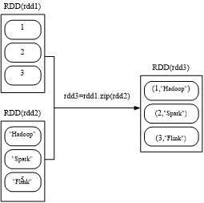

### 行动
行动操作是真正触发计算的地方。
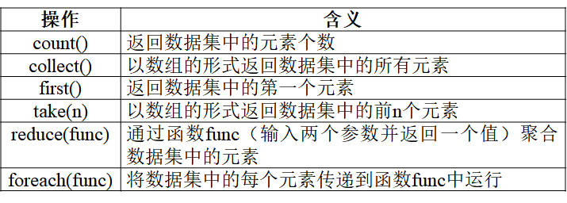
```scala
scala> val  rdd=sc.parallelize(Array(1,2,3,4,5))
rdd: org.apache.spark.rdd.RDD[Int]=ParallelCollectionRDD[1] at parallelize at <console>:24
scala> rdd.count()
res0: Long = 5
scala> rdd.first()
res1: Int = 1
scala> rdd.take(3)
res2: Array[Int] = Array(1,2,3)
scala> rdd.reduce((a,b)=>a+b)
res3: Int = 15
scala> rdd.collect()
res4: Array[Int] = Array(1,2,3,4,5)
scala> rdd.foreach(elem=>println(elem))
1
2
3
4
5
```
### 惰性机制
所谓的“惰性机制”是指，整个转换过程只是记录了转换的轨迹，并不会发生真正的计算，只有遇到行动操作时，才会触发“从头到尾”的真正的计算
这里给出一段简单的语句来解释Spark的惰性机制
### 持久化
```scala
scala> val  list = List("Hadoop","Spark","Hive")
list: List[String] = List(Hadoop, Spark, Hive)
scala> val  rdd = sc.parallelize(list)
rdd: org.apache.spark.rdd.RDD[String] = ParallelCollectionRDD[22] at parallelize at <console>:29
scala> println(rdd.count())  //行动操作，触发一次真正从头到尾的计算
3
scala> println(rdd.collect().mkString(","))  //行动操作，触发一次真正从头到尾的计算
Hadoop,Spark,Hive
```
可以通过持久化（缓存）机制避免这种重复计算的开销
可以使用persist()方法对一个RDD标记为持久化
之所以说“标记为持久化”，是因为出现persist()语句的地方，并不会马上计算生成RDD并把它持久化，而是要等到遇到第一个行动操作触发真正计算以后，才会把计算结果进行持久化
持久化后的RDD将会被保留在计算节点的内存中被后面的行动操作重复使用

>一般而言，使用cache()方法时，会调用persist(MEMORY_ONLY)

>persist(MEMORY_AND_DISK)表示将RDD作为反序列化的对象存储在JVM中，如果内存不足，超出的分区将会被存放在硬盘上
>可以使用unpersist()方法手动地把持久化的RDD从缓存中移除
```scala
scala> val  list = List("Hadoop","Spark","Hive")
list: List[String] = List(Hadoop, Spark, Hive)
scala> val  rdd = sc.parallelize(list)
rdd: org.apache.spark.rdd.RDD[String] = ParallelCollectionRDD[22] at parallelize at <console>:29
scala> rdd.cache()  //会调用persist(MEMORY_ONLY)，但是，语句执行到这里，并不会缓存rdd，因为这时rdd还没有被计算生成
scala> println(rdd.count()) //第一次行动操作，触发一次真正从头到尾的计算，这时上面的rdd.cache()才会被执行，把这个rdd放到缓存中
3
scala> println(rdd.collect().mkString(",")) //第二次行动操作，不需要触发从头到尾的计算，只需要重复使用上面缓存中的rdd
Hadoop,Spark,Hive

```

### 分区
RDD是弹性分布式数据集，通常RDD很大，会被分成很多个分区，分别保存在不同的节点上
1.分区的作用
（1）增加并行度

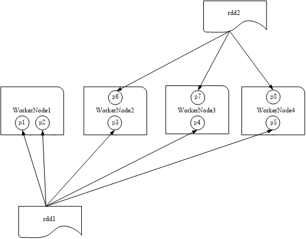
（2）减少通信开销
UserData（UserId，UserInfo）
Events（UserID，LinkInfo）
UserData 和Events 表进行连接操作，获得
（UserID，UserInfo，LinkInfo）

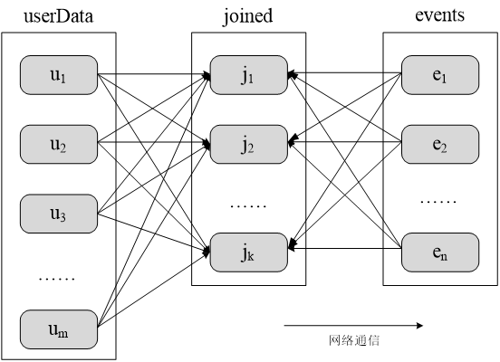

**变成**
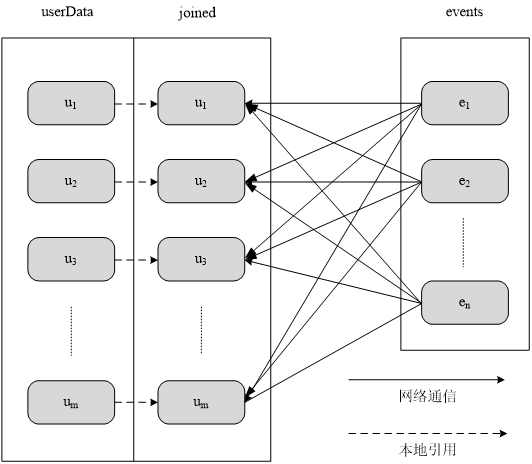

RDD分区的一个原则是使得分区的个数尽量等于集群中的CPU核心（core）数目

```
问题：spark在读取本地文件时，在执行action的时候会拷贝相应分区到多个worker节点进行并行计算吗？
答案：不是，这种读取local file system而不是hdfs的情况，需要同一个文件存在所有的worker node上面，在读取的时候每个worker node的task会去读取本文件的一部分。打个比方，比如你有一个file，有一个spark集群(node1是master,node2,node3两个是slaves)，那么这个file需要在node2,node3上面都存在，这两个节点的task会各读一半，不然会出错。（这里其实还有一个点注意，你的spark app所运行的节点也需要有这个file，因为需要用到file进行Partition划分）。

关于repartition的用法问题
有时候需要重新设置Rdd的分区数量，比如Rdd的分区中，Rdd分区比较多，但是每个Rdd的数据量比较小，需要设置一个比较合理的分区。或者需要把Rdd的分区数量调大。还有就是通过设置一个Rdd的分区来达到设置生成的文件的数量。
```
在调用textFile()和parallelize()方法的时候手动指定分区个数即可，语法格式如下：
sc.textFile(path, partitionNum)
其中，path参数用于指定要加载的文件的地址，partitionNum参数用于指定分区个数。 
```scala
scala> val  data = sc.textFile("file:///usr/local/spark/mycode/rdd/word.txt",2)
data: org.apache.spark.rdd.RDD[String] = file:///usr/local/spark/mycode/rdd/word.txt MapPartitionsRDD[12] at textFile at <console>:24
scala> data.partitions.size  //显示data这个RDD的分区数量
res2: Int=2
scala> val  rdd = data.repartition(1)  //对data这个RDD进行重新分区
rdd: org.apache.spark.rdd.RDD[String] = MapPartitionsRDD[11] at repartition at :26
scala> rdd.partitions.size
res4: Int = 1
```

Spark提供了自带的HashPartitioner（哈希分区）与RangePartitioner（区域分区），能够满足大多数应用场景的需求。与此同时，Spark也支持自定义分区方式，即通过提供一个自定义的Partitioner对象来控制RDD的分区方式，从而利用领域知识进一步减少通信开销
要实现自定义分区，需要定义一个类，这个自定义类需要继承org.apache.spark.Partitioner类，并实现下面三个方法：
numPartitions: Int  返回创建出来的分区数
getPartition(key: Any): Int  返回给定键的分区编号（0到numPartitions-1）
equals()  Java判断相等性的标准方法
```scala
import org.apache.spark.{Partitioner, SparkContext, SparkConf}
//自定义分区类，需要继承org.apache.spark.Partitioner类
class MyPartitioner(numParts:Int) extends Partitioner{
  //覆盖分区数
  override def numPartitions: Int = numParts 
  //覆盖分区号获取函数
  override def getPartition(key: Any): Int = {
    key.toString.toInt%10
  }
}
object TestPartitioner {
  def main(args: Array[String]) {
    val conf=new SparkConf()
    val sc=new SparkContext(conf)
    //模拟5个分区的数据
    val data=sc.parallelize(1 to 10,5)
    //根据尾号转变为10个分区，分别写到10个文件
    data.map((_,1)).partitionBy(new MyPartitioner(10)).map(_._1).saveAsTextFile("file:///usr/local/spark/mycode/rdd/partitioner")
  }
} 
```
### 综合实例
```shell
scala> val  lines = sc.  //代码一行放不下，可以在圆点后回车，在下行继续输入
|  textFile("file:///usr/local/spark/mycode/wordcount/word.txt")
scala> val wordCount = lines.flatMap(line => line.split(" ")).
|  map(word => (word, 1)).reduceByKey((a, b) => a + b)
scala> wordCount.collect()
scala> wordCount.foreach(println)
```
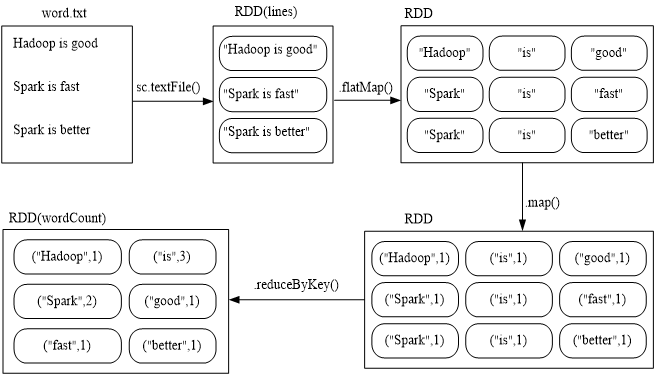
在实际应用中，单词文件可能非常大，会被保存到分布式文件系统HDFS中，Spark和Hadoop会统一部署在一个集群上
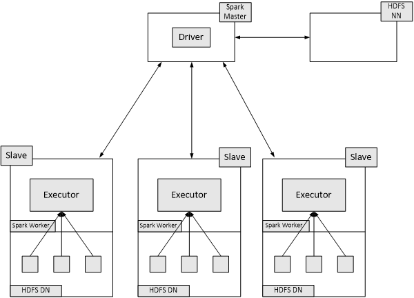
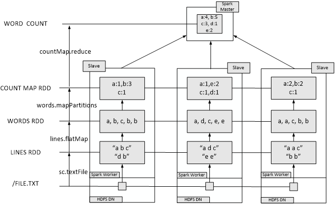


## rdd键值对
```scala
scala> val lines = sc.textFile("file:///usr/local/spark/mycode/pairrdd/word.txt")
lines: org.apache.spark.rdd.RDD[String] = file:///usr/local/spark/mycode/pairrdd/word.txt MapPartitionsRDD[1] at textFile at <console>:27
scala> val pairRDD = lines.flatMap(line => line.split(" ")).map(word => (word,1))
pairRDD: org.apache.spark.rdd.RDD[(String, Int)] = MapPartitionsRDD[3] at map at <console>:29
scala> pairRDD.foreach(println)
(i,1)
(love,1)
(hadoop,1)
……
```
```scala
scala> val list = List("Hadoop","Spark","Hive","Spark")
list: List[String] = List(Hadoop, Spark, Hive, Spark)
 
scala> val rdd = sc.parallelize(list)
rdd: org.apache.spark.rdd.RDD[String] = ParallelCollectionRDD[11] at parallelize at <console>:29
 
scala> val pairRDD = rdd.map(word => (word,1))
pairRDD: org.apache.spark.rdd.RDD[(String, Int)] = MapPartitionsRDD[12] at map at <console>:31
 
scala> pairRDD.foreach(println)
(Hadoop,1)
(Spark,1)
(Hive,1)
(Spark,1)
```
### 常用操作
**groupByKey&&reduceByKey**
```scala
scala> pairRDD.reduceByKey((a,b)=>a+b).foreach(println)
(Spark,2)
(Hive,1)
(Hadoop,1)

scala> pairRDD.groupByKey()
res15: org.apache.spark.rdd.RDD[(String, Iterable[Int])] = ShuffledRDD[15] at groupByKey at <console>:34

scala>  val words = Array("one", "two", "two", "three", "three", "three")  
  
scala>  val wordPairsRDD = sc.parallelize(words).map(word => (word, 1))  
  
scala>  val wordCountsWithReduce = wordPairsRDD.reduceByKey(_ + _)  
  
scala>  val wordCountsWithGroup = wordPairsRDD.groupByKey().map(t => (t._1, t._2.sum))  

```
上面得到的wordCountsWithReduce和wordCountsWithGroup是完全一样的，但是，它们的内部运算过程是不同的

**keys**
```scala
scala> pairRDD.keys
res17: org.apache.spark.rdd.RDD[String] = MapPartitionsRDD[17] at keys at <console>:34
scala> pairRDD.keys.foreach(println)
Hadoop
Spark
Hive
Spark
```
**values**
```
scala> pairRDD.values
res0: org.apache.spark.rdd.RDD[Int] = MapPartitionsRDD[2] at values at <console>:34 
scala> pairRDD.values.foreach(println)
1
1
1
1
```
**sortByKey()**
```scala
scala> pairRDD.sortByKey()
res0: org.apache.spark.rdd.RDD[(String, Int)] = ShuffledRDD[2] at sortByKey at <console>:34
scala> pairRDD.sortByKey().foreach(println)
(Hadoop,1)
(Hive,1)
(Spark,1)
(Spark,1)
```

```shell
scala> val d1 = sc.parallelize(Array((“c",8),(“b“,25),(“c“,17),(“a“,42),(“b“,4),(“d“,9),(“e“,17),(“c“,2),(“f“,29),(“g“,21),(“b“,9)))  
scala> d1.reduceByKey(_+_).sortByKey(false).collect
res2: Array[(String, Int)] = Array((g,21),(f,29),(e,17),(d,9),(c,27),(b,38),(a,42)) 

```
d1.reduceByKey(_+_)：这一步是使用reduceByKey操作，它将相同键的值进行相加。这意味着对于每个键，它将其对应的值进行累加。

sortByKey(false)：接下来，使用sortByKey操作按照键对结果进行排序。这里的false参数表示降序排序。

collect：最后，使用collect操作将结果收集到Driver程序中，并以数组的形式返回。
```shell
scala> val d2 = sc.parallelize(Array((“c",8),(“b“,25),(“c“,17),(“a“,42),(“b“,4),(“d“,9),(“e“,17),(“c“,2),(“f“,29),(“g“,21),(“b“,9)))

scala> d2.reduceByKey(_+_).sortBy(_._2,false).collect
res4: Array[(String, Int)] = Array((a,42),(b,38),(f,29),(c,27),(g,21),(e,17),(d,9)) 

```
d2.reduceByKey(_+_)：这一步和之前一样，对相同键的值进行求和。

sortBy(_._2,false)：这里使用了sortBy操作，但是与之前不同的是，这次排序是根据元组的第二个元素（即值）进行排序，并且是降序排序（因为false参数）。

collect：最后，使用collect操作将排序后的结果收集到Driver程序中，并以数组的形式返回。
**mapValues**
```scala
scala> pairRDD.mapValues(x => x+1)
res2: org.apache.spark.rdd.RDD[(String, Int)] = MapPartitionsRDD[4] at mapValues at <console>:34
scala> pairRDD.mapValues(x => x+1).foreach(println)
(Hadoop,2)
(Spark,2)
(Hive,2)
(Spark,2)

```
**join**内连接
```scala
scala> val pairRDD1 = sc.parallelize(Array(("spark",1),("spark",2),("hadoop",3),("hadoop",5)))
pairRDD1: org.apache.spark.rdd.RDD[(String, Int)] = ParallelCollectionRDD[24] at parallelize at <console>:27
 
scala> val pairRDD2 = sc.parallelize(Array(("spark","fast")))
pairRDD2: org.apache.spark.rdd.RDD[(String, String)] = ParallelCollectionRDD[25] at parallelize at <console>:27
 
scala> pairRDD1.join(pairRDD2)
res9: org.apache.spark.rdd.RDD[(String, (Int, String))] = MapPartitionsRDD[28] at join at <console>:32
 
scala> pairRDD1.join(pairRDD2).foreach(println)
(spark,(1,fast))
(spark,(2,fast))
```

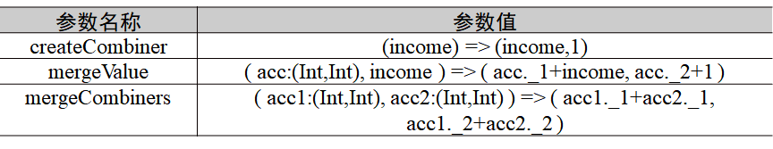
combineByKey(createCombiner,mergeValue,mergeCombiners,partitioner,mapSideCombine)中的各个参数的含义如下：
（1）createCombiner：在第一次遇到key时创建组合器函数，将RDD数据集中的V类型值转换成C类型值（V => C）；
（2）mergeValue：合并值函数，再次遇到相同的Key时，将createCombiner的C类型值与这次传入的V类型值合并成一个C类型值（C,V）=>C；
（3）mergeCombiners：合并组合器函数，将C类型值两两合并成一个C类型值；
（4）partitioner：使用已有的或自定义的分区函数，默认是HashPartitioner；
（5）mapSideCombine：是否在map端进行Combine操作，默认为true。
下面通过一个实例来解释如何使用combineByKey操作。假设有一些销售数据，数据采用键值对的形式，即<公司,当月收入>，要求使用combineByKey操作求出每个公司的总收入和每月平均收入，并保存在本地文件中。
```scala
import org.apache.spark.SparkContext
import org.apache.spark.SparkConf
object Combine {
    def main(args: Array[String]) {
        val conf = new SparkConf().setAppName("Combine").setMaster("local")
        val sc = new SparkContext(conf)
        val data = sc.parallelize(Array(("company-1",88),("company-1",96),("company-1", 85),("company-2",94),("company-2",86),("company-2",74),("company-3",86),("company-3",88),("company-3",92)),3)
        val res = data.combineByKey(
            (income) => (income,1),
            ( acc:(Int,Int), income ) => ( acc._1+income, acc._2+1 ),
            ( acc1:(Int,Int), acc2:(Int,Int) ) => ( acc1._1+acc2._1, acc1._2+acc2._2 )
        ).map({ case (key, value) => (key, value._1, value._1/value._2.toFloat) })
res.repartition(1).saveAsTextFile("file:///usr/local/spark/mycode/rdd/result")
    }
}
```
**aggregateByKey**(zeroValue)(seqOp,combOp)是一个柯里化方法，有两个参数体，各个参数的含义如下：
(a) zeroValue：设置聚合时的初始值。需要注意的是，初始值并非总是数字，有时候可能是集合；
(b) seqOp：将值V聚合到类型为U的对象中；
(c) combOp：跨分区聚合，对数据进行最终的汇总时调用此操作。
```scala
scala> val rdd1=sc.parallelize(Array(("USER1","URL1"),("USER2","URL1"),("USER1","URL1"),("USER1","URL2"),("USER2","URL3")))
scala> val rdd2=rdd1.aggregateByKey(collection.mutable.Set[String]())(
     | (urlSet,url)=>urlSet+url,
     | (urlSet1,urlSet2)=>urlSet1++=urlSet2)
scala> rdd2.collect
res12: Array[(String, scala.collection.mutable.Set[String])] = Array((USER1,Set(URL1, URL2)), (USER2,Set(URL1, URL3)))
```


**flatMapValues与mapValues**
```scala
rdd1=sc.parallelize(Array(("file1","storm/hadoop/spark/flink"),("file1","hbase/hdfs/spark/flink"),("file2","zookeeper/flink/hadoop/hive"),("file2","flink/hive/flume")))
scala> val rdd2=rdd1.flatMapValues(_.split("/"))
scala> rdd2.collect
res0: Array[(String, String)] = Array((file1,storm), (file1,hadoop), (file1,spark), (file1,flink), (file1,hbase), (file1,hdfs), (file1,spark), (file1,flink), (file2,zookeeper), (file2,flink), (file2,hadoop), (file2,hive), (file2,flink), (file2,hive), (file2,flume))
scala> val rdd3=rdd1.mapValues(_.split("/"))
scala> rdd3.collect
res1: Array[(String, Array[String])] = Array((file1,Array(storm, hadoop, spark, flink)), (file1,Array(hbase, hdfs, spark, flink)), (file2,Array(zookeeper, flink, hadoop, hive)), (file2,Array(flink, hive, flume)))
```
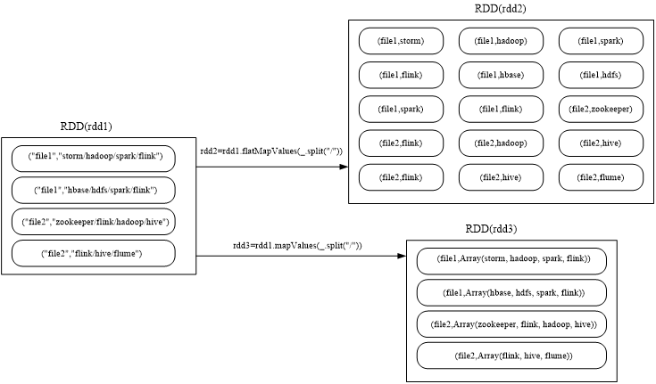

### 综合实例
题目：给定一组键值对("spark",2),("hadoop",6),("hadoop",4),("spark",6)，键值对的key表示图书名称，value表示某天图书销量，请计算每个键对应的平均值，也就是计算每种图书的每天平均销量。
```scala
scala> val rdd = sc.parallelize(Array(("spark",2),("hadoop",6),("hadoop",4),("spark",6)))
rdd: org.apache.spark.rdd.RDD[(String, Int)] = ParallelCollectionRDD[38] at parallelize at <console>:27
 
scala> rdd.mapValues(x => (x,1)).reduceByKey((x,y) => (x._1+y._1,x._2 + y._2)).mapValues(x => (x._1 / x._2)).collect()
res22: Array[(String, Int)] = Array((spark,4), (hadoop,5))
scala> val rdd = sc.parallelize(Array(("spark",2),("hadoop",6),("hadoop",4),("spark",6)))
rdd: org.apache.spark.rdd.RDD[(String, Int)] = ParallelCollectionRDD[38] at parallelize at <console>:27
 
scala> rdd.mapValues(x => (x,1)).reduceByKey((x,y) => (x._1+y._1,x._2 + y._2)).mapValues(x => (x._1 / x._2)).collect()
res22: Array[(String, Int)] = Array((spark,4), (hadoop,5))

```

## 数据读写

**16、Spark Core 数据读取与存储的主要方式**  
 （1）文本文件的输入输出：
textFile 和 saveAsTextFile，注意：在写出 text 文件的时候，每一个 partition 会单独写出，文件系统支持所有和 Hadoop 文件系统兼容的文件系统。

（2）JSON 文件或者 CSV 文件：
这种有格式的文件的输入和输出还是通过文本文件的输入和输出来支持的，Spark Core 没有内置对 JSON 文件和 CSV 文件的解析和反解析功能，这个解析功能是需要用户自己根据需求来定制的。
注意：JSON 文件的读取如果需要多个 partition 来读，那么 JSON 文件一般一行是一个 json。如果你的 JSON 是跨行的，那么需要整体读入所有数据，并整体解析。

（3）Sequence 文件：
Spark 有专门用来读取 SequenceFile 文件的接口。可以直接使用 sequenceFile[keyClass, valueClass](path) 进行读取。
注意：针对于 HDFS 中的文件 block 数为 1，那么 Spark 设定了最小的读取 partition 数为 2。如果 HDFS 中的文件 block 数为大于 1，比如 block 数为 5，那么 Spark 的读取 partition 数为 5。（因为 Spark 本质上属于内存计算层，它的输入输出很大一部分依赖于 HDFS 文件系统。）

（4）ObjectFile 文件：
1. 对于 ObjectFile 它的读取和保存使用了读取和保存 SequenceFile 的 API，也最终调用了 hadoop 的 API。
2. ObjectFile 的读取使用 objectFile 进行。
3. ObjectFile 的输出直接使用 saveAsObjectFile 来进行输出。
4. 需要注意的是：在读取 ObjectFile 的时候需要指定对象的类型，而并不是 K-V 的类型。

（5）HadoopAPI 的读取和输入：
读取：newApiHadoopFile 和 newApiHadoopRDD 两个方法，最终都是调用 newApiHadoopRDD 来进行实现。
输出：saveAsNewApiHadoopFile 和 saveAsNewApiHadoopDataset 两个方法，最终都是调用 saveAsNewApiHadoopDataset 这个方法进行实现。

（6）关系型数据库的输入输出：
JdbcRDD 里面包括了驱动，数据库用户名/密码
1. 对于关系型数据库的读取使用 JdbcRDD 来进行实现，JdbcRDD 需要依次传入 sparkContext、获取 JDBC Connection 的无参方法、查询数据库的 SQL 语句，id 的下界、id 的上界、分区数、提供解析 ResultSet 的函数。
2. 对于关系型数据库的输出，直接采用 jdbc 执行 insert 语句或者 update 语句进行实现。

### 本地文件
```scala

scala> val  textFile = sc.
|  textFile("file:///usr/local/spark/mycode/wordcount/word123.txt")

```
因为Spark采用了惰性机制，在执行转换操作的时候，即使输入了错误的语句，spark-shell也不会马上报错（假设word123.txt不存在）
```scala
scala> val  textFile = sc.
|  textFile("file:///usr/local/spark/mycode/wordcount/word.txt")
scala> textFile.
|  saveAsTextFile("file:///usr/local/spark/mycode/wordcount/writeback")
```

```scala
scala> val  jsonStr = sc.
|  textFile("file:///usr/local/spark/examples/src/main/resources/people.json")
scala> jsonStr.foreach(println)
{"name":"Michael"}
{"name":"Andy", "age":30}
{"name":"Justin", "age":19}
```
Scala中有一个自带的JSON库——scala.util.parsing.json.JSON，可以实现对JSON数据的解析
JSON.parseFull(jsonString:String)函数，以一个JSON字符串作为输入并进行解析，如果解析成功则返回一个Some(map: Map[String, Any])，如果解析失败则返回None
```scala
import org.apache.spark.SparkContext
import org.apache.spark.SparkContext._
import org.apache.spark.SparkConf
import scala.util.parsing.json.JSON
object JSONRead {
    def main(args: Array[String]) {
        val inputFile = "file:///usr/local/spark/examples/src/main/resources/people.json"
        val conf = new SparkConf().setAppName("JSONRead")
        val sc = new SparkContext(conf)
        val jsonStrs = sc.textFile(inputFile)
        val result = jsonStrs.map(s => JSON.parseFull(s))
        result.foreach( {r => r match {
                        case Some(map: Map[String, Any]) => println(map)
                        case None => println("Parsing failed")
                        case other => println("Unknown data structure: " + other)
                }
        }
        )
    }
}
```
```
把simple.sbt文件设置为如下内容：

name := "Simple Project"
version := "1.0"
scalaVersion := "2.12.15"
libraryDependencies += "org.apache.spark" %% "spark-core" % "3.2.0"
libraryDependencies += "org.scala-lang.modules" %% "scala-parser-combinators" % "1.0.4"
```

```scala
$ /usr/local/spark/bin/spark-submit   \
> --class "JSONRead”   
/usr/local/spark/mycode/json/target/scala-2.12/json-project_2.12-1.0.jar
```
Map(name -> Michael)
Map(name -> Andy, age -> 30.0)
Map(name -> Justin, age -> 19.0)


**hdfs**中的文件
从分布式文件系统HDFS中读取数据，也是采用textFile()方法，可以为textFile()方法提供一个HDFS文件或目录地址，如果是一个文件地址，它会加载该文件，如果是一个目录地址，它会加载该目录下的所有文件的数据
```scala
scala> val  textFile = sc.textFile("hdfs://localhost:9000/user/hadoop/word.txt")
scala> textFile.first()
```
scala> val textFile = sc.textFile("hdfs://localhost:9000/user/hadoop/word.txt")
scala> val textFile = sc.textFile("/user/hadoop/word.txt")
scala> val textFile = sc.textFile("word.txt")

scala> textFile.saveAsTextFile("writeback")
同样，可以使用saveAsTextFile()方法把RDD中的数据保存到HDFS文件中，命令如下：


### Mysql数据库中的
```sql
$ service mysql start
$ mysql -u root -p  #屏幕会提示输入密码

```
```sql
mysql> create database spark;
mysql> use spark;
mysql> create table student (id int(4), name char(20), gender char(4), age int(4));
mysql> insert into student values(1,'Xueqian','F',23);
mysql> insert into student values(2,'Weiliang','M',24);
mysql> select * from student;
```
```
$ cd ~/Downloads

$ sudo tar -zxvf mysql-connector-java-5.1.40.tar.gz -C /usr/local/spark/jars

$ cd ~/sparkapp/src/main/scala  #假设该目录已经存在
$ vim ReadMySQL.scala


```
```scala
import java.sql.DriverManager
import org.apache.spark.rdd.JdbcRDD
import org.apache.spark.{SparkConf,SparkContext}
object ReadMySQL{
  def main(args: Array[String]) {
    val conf = new SparkConf().setAppName("ReadMySQL").setMaster("local[2]")
    val sc = new SparkContext(conf)
    sc.setLogLevel("ERROR")
    val inputMySQL = new JdbcRDD(sc,
      () => {
        Class.forName("com.mysql.jdbc.Driver")        DriverManager.getConnection("jdbc:mysql://localhost:3306/spark?useUnicode=true&characterEncoding=utf8","root","123456")
        //root是数据库用户名，123456是密码
      },
      "SELECT * FROM student where id >= ? and id <= ?;",
      1, //设置条件查询中id的下界
      2, //设置条件查询中id的上界
      1, //设置分区数
      r => (r.getInt(1),r.getString(2),r.getString(3),r.getInt(4))
    )
    inputMySQL.foreach(println)
    sc.stop()
  }
}
```
在sparkapp目录下新建simple.sbt文件并输入以下内容：
```
name := "Simple Project"
version := "1.0"
scalaVersion := "2.12.15"
libraryDependencies += "org.apache.spark" %% "spark-core" % "3.2.0"
```
```
$ cd ~/sparkapp
$ /usr/local/sbt/sbt package


$ cd ~/sparkapp
$ /usr/local/spark/bin/spark-submit \
> --jars  \
> /usr/local/spark/jars/mysql-connector-java-5.1.40/mysql-connector-java-5.1.40-bin.jar \
> --class "ReadMySQL" \
> ./target/scala-2.12/simple-project_2.12-1.0.jar


(1,Xueqian,F,23)
(2,Weiliang,M,24)
```
向数据库写入文件
```scala
import java.sql.DriverManager
import org.apache.spark.rdd.JdbcRDD
import org.apache.spark.{SparkConf,SparkContext}

object WriteMySQL{
  def main(args: Array[String]) {
    val conf = new SparkConf().setAppName("WriteMySQL").setMaster("local[2]")
    val sc = new SparkContext(conf)
    sc.setLogLevel("ERROR")
    Class.forName("com.mysql.jdbc.Driver")
    val rddData = sc.parallelize(List((3,"Rongcheng","M",26),(4,"Guanhua","M",27)))
    

    rddData.foreachPartition((iter:Iterator[(Int,String,String,Int)]) => {
      val conn = DriverManager.getConnection("jdbc:mysql://localhost:3306/spark?useUnicode=true&characterEncoding=utf8","root","123456")
      conn.setAutoCommit(false)
      val preparedStatement = conn.prepareStatement("INSERT INTO student(id,name,gender,age) VALUES (?,?,?,?)")
      iter.foreach(t => {
        preparedStatement.setInt(1,t._1)
        preparedStatement.setString(2,t._2)
        preparedStatement.setString(3,t._3)
        preparedStatement.setInt(4,t._4)
        preparedStatement.addBatch()
      })
      preparedStatement.executeBatch()
      conn.commit()
      conn.close()
    })
    sc.stop()
  }
}
```

```
$ /usr/local/spark/bin/spark-submit \
> --jars  \
> /usr/local/spark/jars/mysql-connector-java-5.1.40/mysql-connector-java-5.1.40-bin.jar \
> --class "WriteMySQL" \
> ./target/scala-2.12/simple-project_2.12-1.0.jar


```
```sql
mysql> select * from student;
+------+-----------+--------+------+
| id | name | gender | age |
+------+-----------+--------+------+
| 1 | Xueqian | F | 23 |
| 2 | Weiliang | M | 24 |
| 3 | Rongcheng | M | 26 |
| 4 | Guanhua | M | 27 |
+------+-----------+--------+------+
4 rows in set (0.00 sec)(2,Weiliang,M,24)
```

### 综合案例
照抄代码就完了