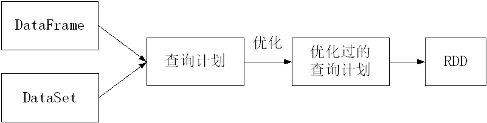

[TOC]
# sparkSql

## shark
Shark的设计导致了两个问题：
一是执行计划优化完全依赖于Hive，不方便添加新的优化策略
二是因为Spark是线程级并行，而MapReduce是进程级并行，因此，Spark在兼容Hive的实现上存在线程安全问题，导致Shark不得不使用另外一套独立维护的打了补丁的Hive源码分支
## 转化为spark SQL 以及hive on spark
Spark SQL作为Spark生态的一员继续发展，而不再受限于Hive，只是兼容Hive
Hive on Spark是一个Hive的发展计划，该计划将Spark作为Hive的底层引擎之一，也就是说，Hive将不再受限于一个引擎，可以采用Map-Reduce、Tez、Spark等引擎


**spark SQL：**
数据兼容方面  不但兼容Hive，还可以从RDD、parquet文件、JSON文件中获取数据，未来版本甚至支持获取RDBMS数据以及cassandra等NOSQL数据；
l性能优化方面  除了采取In-Memory Columnar Storage、byte-code generation等优化技术外、将会引进Cost Model对查询进行动态评估、获取最佳物理计划等等；
l组件扩展方面  无论是SQL的语法解析器、分析器还是优化器都可以重新定义，进行扩展。


Spark SQL的特点如下：
（1）容易整合（集成）。Spark SQL可以将SQL查询和Spark程序无缝集成，允许我们使用SQL或熟悉的DataFrame API在Spark程序中查询结构化数据。
（2）统一的数据访问方式。Spark SQL可以以相同方式连接到任何数据源，DataFrame和SQL提供了访问各种数据源的方法，包括Hive、Avro、Parquet、ORC、JSON和JDBC。
（3）兼容Hive。Spark SQL支持HiveQL语法以及Hive SerDes和UDF（用户自定义函数），允许我们访问现有的Hive仓库。
（4）标准的数据库连接。Spark SQL支持JDBC或ODBC连接。

在RDD编程中，使用的是SparkContext接口，在Spark SQL编程中，需要使用Spark Session接口。
SparkSession实现了SQLContext及HiveContext所有功能。此外，SparkSession也封装了SparkContext、SparkConf和StreamingContext等。
```scala
import org.apache.spark.sql.SparkSession
val spark=SparkSession.builder().appName(“SparkSessionExample”).getOrCreate()
```

介绍一下
```shell
$ cd  ~           # 进入用户主目录
$ mkdir  ./sparkapp        # 创建应用程序根目录，如果已经存在，则不用创建
$ mkdir  -p  ./sparkapp/src/main/scala     # 创建所需的目录结构
```

```scala
import org.apache.spark.sql.SparkSession
object SimpleApp {
  def main(args: Array[String]) {
    val logFile = "file:///usr/local/spark/README.md"
    val spark = SparkSession.builder.appName("Simple Application").getOrCreate()
    val logData = spark.read.textFile(logFile).cache()
    val numAs = logData.filter(line => line.contains("a")).count()
    val numBs = logData.filter(line => line.contains("b")).count()
    println(s"Lines with a: $numAs, Lines with b: $numBs")
    spark.stop()
  }
}
```

```
在sparkapp目录下创建一个文件simple.sbt，并设置为如下内容：
name := "Simple Project"
version := "1.0"
scalaVersion := "2.12.15"
libraryDependencies += "org.apache.spark" %% "spark-sql" % "3.2.0"

执行如下代码使用sbt工具对代码进行编译打包：
$ /usr/local/sbt/sbt package
然后，使用spark-submit命令运行程序，就可以得到执行结果，具体如下：
$ cd ~/sparkapp
$ /usr/local/spark/bin/spark-submit  \
> --class "SimpleApp" \
> ./target/scala-2.12/simple-project_2.12-1.0.jar  2>&1  |  grep "Lines with a:" 
上面命令的执行结果如下：
Lines with a: 65, Lines with b: 33
```
```
只不过RDD就像一个空旷的屋子，你要找东西要把这个屋子翻遍才能找到。那我们的这个DataFrame相当于在你的屋子里面打上了货架。那你只要告诉他你是在第几个货架的第几个位置，那不就是二维表吗。那就是我们DataFrame就是在RDD基础上加入了列。实际上我们处理数据就像处理二维表一样。
```
给定一组键值对("spark",2)、("hadoop",6)、("hadoop",4)、("spark",6)，键值对的key表示图书名称，value表示某天图书销量，现在需要计算每个键对应的平均值，也就是计算每种图书的每天平均销量。当使用RDD编程时，具体语句如下：
```scala
scala> val bookRDD = sc.
| parallelize(Array(("spark",2),("hadoop",6),("hadoop",4),("spark",6)))
scala> val saleRDD = bookRDD.map(x=>(x._1,(x._2,1))).
| reduceByKey((x,y)=>(x._1+y._1,x._2+y._2)).
| map(x=>(x._1,x._2._1 / x._2._2)).collect()
```
可以看出，这段代码难度较高，可读性也较差。这段代码是在告诉Spark如何计算出查询结果。这个过程对于Spark而言是完全不透明的，因为代码没有告诉Spark最终目的是什么。相反，如果是使用DataFrame API来表达相同的查询，就会简单很多。
```sql
scala> val bookDF = spark.
| createDataFrame(Array(("spark",2),("hadoop",6),("hadoop",4),("spark",6))).
| toDF("book","amount")
scala> val avgDF = bookDF.groupBy("book").agg(avg("amount"))
scala> avgDF.show()
+------+-----------+                                                            
|  book|avg(amount)|
+------+-----------+
| spark|        4.0|
|hadoop|        5.0|
+------+-----------+
```

另外支持对Parquet JSON CSV
```scala
scala> df.write.format("parquet").mode("overwrite").option("compression","snappy").
|  save("file:///home/hadoop/otherusers")

```
上面代码执行以后，在本地文件系统中的“/home/hadoop/”目录下会生成一个名称为“otherusers”的子目录，该目录下包含两个文件，即_SUCCESS文件和像part-00000-XXXX.snappy.parquet这样的文件，后者是使用snappy压缩算法得到的压缩文件。如果要再次读取文件生成DataFrame，load()中可以直接使用目录“file:///home/hadoop/otherusers”，也可以使用文件“file:///home/hadoop/otherusers/part-00000-XXXX.snappy.parquet”。

```scala
scala> df.write.parquet("file:///home/hadoop/otherusers")
```
```sql
scala> val filePath =
|  "file:///usr/local/spark/examples/src/main/resources/people.json"
scala> val df = spark.read.format("json").load(filePath)
scala> df.show()
+----+-------+
| age|   name|
+----+-------+
|null|Michael|
|  30|   Andy|
|  19| Justin|
+----+-------+
```
```shell
scala> val filePath =
|  "file:///usr/local/spark/examples/src/main/resources/people.json"
scala> val df = spark.read.json(filePath)
```
```shell
scala> df.write.format("json").mode("overwrite").
|  save("file:///home/hadoop/otherpeople")
```
```sql
scala> val filePath =
|  "file:///usr/local/spark/examples/src/main/resources/people.csv"
scala> val schema = "name STRING,age INT,job STRING"
scala> val df = spark.read.format("csv").schema(schema).option("header","true").
|  option("sep",";").load(filePath)
scala> df.show()
+-----+---+---------+
| name|age|      job|
+-----+---+---------+
|Jorge| 30|Developer|
|  Bob| 32|Developer|
+-----+---+---------+
```
读取
```scala
scala> val filePath =
|  "file:///usr/local/spark/examples/src/main/resources/people.csv"
scala> val schema = "name STRING,age INT,job STRING"
scala> val df = spark.read.schema(schema).option("header","true").
|  option("sep",";").csv(filePath)
```
保存同理

## rdd到dataframe转化
Spark官网提供了两种方法来实现从RDD转换得到DataFrame
第一种方法是，利用反射来推断包含特定类型对象的RDD的schema，适用对已知数据结构的RDD转换
第二种方法是，使用编程接口，构造一个schema并将其应用在已知的RDD上

在利用反射机制推断RDD模式时，需要首先定义一个case class，因为，只有case class才能被Spark隐式地转换为DataFrame
```scala
scala> import org.apache.spark.sql.catalyst.encoders.ExpressionEncoder
import org.apache.spark.sql.catalyst.encoders.ExpressionEncoder 
scala> import org.apache.spark.sql.Encoder
import org.apache.spark.sql.Encoder 

scala> import spark.implicits._  //导入包，支持把一个RDD隐式转换为一个DataFrame

import spark.implicits._
scala> case class Person(name: String, age: Long)  //定义一个case class
defined class Person
scala> val peopleDF = spark.sparkContext.
| textFile("file:///usr/local/spark/examples/src/main/resources/people.txt").
| map(_.split(",")).
| map(attributes => Person(attributes(0), attributes(1).trim.toInt)).toDF()
peopleDF: org.apache.spark.sql.DataFrame = [name: string, age: bigint] 
scala> peopleDF.createOrReplaceTempView("people") //必须注册为临时表才能供下面的查询使用
scala> val personsRDD = spark.sql("select name,age from people where age > 20")
//最终生成一个DataFrame，下面是系统执行返回的信息
personsRDD: org.apache.spark.sql.DataFrame = [name: string, age: bigint]
scala> personsRDD.map(t => "Name: "+t(0)+ ","+"Age: "+t(1)).show()  //DataFrame中的每个元素都是一行记录，包含name和age两个字段，分别用t(0)和t(1)来获取值
//下面是系统执行返回的信息
+------------------+ 
| value|
+------------------+
|Name:Michael,Age:29|
| Name:Andy,Age:30|
+------------------+

```
当无法提前定义case class时，就需要采用编程方式定义RDD模式。
比如，现在需要通过编程方式把people.txt加载进来生成DataFrame，并完成SQL查询。

```scala
scala> import org.apache.spark.sql.types._
import org.apache.spark.sql.types._
scala> import org.apache.spark.sql.Row
import org.apache.spark.sql.Row
//生成字段
scala> val fields = Array(StructField("name",StringType,true), StructField("age",IntegerType,true))
fields: Array[org.apache.spark.sql.types.StructField] = Array(StructField(name,StringType,true), StructField(age,IntegerType,true))
scala> val schema = StructType(fields)
schema: org.apache.spark.sql.types.StructType = StructType(StructField(name,StringType,true), StructField(age, IntegerType,true))
//从上面信息可以看出，schema描述了模式信息，模式中包含name和age两个字段
//shcema就是“表头”
//下面加载文件生成RDD
scala> val peopleRDD = spark.sparkContext.
| textFile("file:///usr/local/spark/examples/src/main/resources/people.txt")
peopleRDD: org.apache.spark.rdd.RDD[String] = file:///usr/local/spark/examples/src/main/resources/people.txt MapPartitionsRDD[1] at textFile at <console>:26 
//对peopleRDD 这个RDD中的每一行元素都进行解析
scala> val rowRDD = peopleRDD.map(_.split(",")).
|  map(attributes => Row(attributes(0), attributes(1).trim.toInt))
rowRDD: org.apache.spark.rdd.RDD[org.apache.spark.sql.Row] = MapPartitionsRDD[3] at map at <console>:29
//上面得到的rowRDD就是“表中的记录”

//下面把“表头”和“表中的记录”拼装起来
 scala> val peopleDF = spark.createDataFrame(rowRDD, schema)
peopleDF: org.apache.spark.sql.DataFrame = [name: string, age: int]
 //必须注册为临时表才能供下面查询使用
scala> peopleDF.createOrReplaceTempView("people")
 scala> val results = spark.sql("SELECT name,age FROM people")
results: org.apache.spark.sql.DataFrame = [name: string, age: int] 
scala> results.
|  map(attributes => "name: " + attributes(0)+","+"age:"+attributes(1)).
|  show()
+--------------------+
| value|
+--------------------+
|name: Michael,age:29|
| name: Andy,age:30|
| name: Justin,age:19|
+--------------------+


```


```scala
scala> val jdbcDF = spark.read.format("jdbc").
| option("url","jdbc:mysql://localhost:3306/spark").
| option("driver","com.mysql.jdbc.Driver").
| option("dbtable", "student").
| option("user", "root").
| option("password", "123456").
| load()
scala> jdbcDF.show()
+---+--------+------+---+
| id| name|gender|age|
+---+--------+------+---+
| 1| Xueqian| F| 23|
| 2|Weiliang| M| 24|
+---+--------+------+---+
```
插入
```scala
import java.util.Properties
import org.apache.spark.sql.types._
import org.apache.spark.sql.Row
 
//下面我们设置两条数据表示两个学生信息
val studentRDD = spark.sparkContext.parallelize(Array("3 Rongcheng M 26","4 Guanhua M 27")).map(_.split(" "))
 
//下面要设置模式信息
val schema = StructType(List(StructField("id", IntegerType, true),StructField("name", StringType, true),StructField("gender", StringType, true),StructField("age", IntegerType, true)))

//下面创建Row对象，每个Row对象都是rowRDD中的一行
val rowRDD = studentRDD.map(p => Row(p(0).toInt, p(1).trim, p(2).trim, p(3).toInt))
 
//建立起Row对象和模式之间的对应关系，也就是把数据和模式对应起来
val studentDF = spark.createDataFrame(rowRDD, schema)
 
//下面创建一个prop变量用来保存JDBC连接参数
val prop = new Properties()
prop.put("user", "root") //表示用户名是root
prop.put("password", "hadoop") //表示密码是hadoop
prop.put("driver","com.mysql.jdbc.Driver") //表示驱动程序是com.mysql.jdbc.Driver
 
//下面就可以连接数据库，采用append模式，表示追加记录到数据库spark的student表中
studentDF.write.mode("append").jdbc("jdbc:mysql://localhost:3306/spark", "spark.student", prop)

```
```sql
mysql> select * from student;
+------+-----------+--------+------+
| id | name | gender | age |
+------+-----------+--------+------+
| 1 | Xueqian | F | 23 |
| 2 | Weiliang | M | 24 |
| 3 | Rongcheng | M | 26 |
| 4 | Guanhua | M | 27 |
+------+-----------+--------+------+
4 rows in set (0.00 sec)
```

读取
```scala
import org.apache.log4j.{Level, Logger}
import org.apache.spark.sql.SparkSession
object SparkReadMySQL {
  def main(args: Array[String]): Unit ={
    Logger.getLogger("org").setLevel(Level.ERROR)
    val spark = SparkSession.builder().appName("SparkReadMySQL").getOrCreate()
    val df = spark.read
      .format("jdbc")
      .option("url", "jdbc:mysql://localhost:3306/spark")
      .option("driver", "com.mysql.jdbc.Driver")
      .option("dbtable", "student")
      .option("user", "root")
      .option("password", "123456")
      .load()
df.show()
spark.stop()
  }
}
```
对代码进行编译打包，然后执行命令运行程序：
```shell
$ /usr/local/spark/bin/spark-submit \
> --jars  \
> /usr/local/spark/jars/mysql-connector-java-5.1.40/mysql-connector-java-5.1.40-bin.jar \
> --class "SparkReadMySQL" \
> /home/hadoop/sparkapp/target/scala-2.12/simple-project_2.12-1.0.jar
```

写入MySQL
```scala

import java.util.Properties
import org.apache.spark.sql.types._
import org.apache.spark.sql.Row
import org.apache.log4j.{Level, Logger}
import org.apache.spark.sql.SparkSession

object SparkWriteMySQL {
  def main(args: Array[String]): Unit ={
    Logger.getLogger("org").setLevel(Level.ERROR)
    val spark = SparkSession.builder().appName("SparkWriteMySQL").getOrCreate()
    //下面我们设置两条数据表示两个学生信息
    val studentRDD = spark.sparkContext.parallelize(Array("3 Rongcheng M 26","4 Guanhua M 27")).map(_.split(" "))
     //下面要设置模式信息
    val schema = StructType(List(StructField("id", IntegerType, true),StructField("name", StringType, true),StructField("gender", StringType, true),StructField("age", IntegerType, true)))
    
    //下面创建Row对象，每个Row对象都是rowRDD中的一行
    val rowRDD = studentRDD.map(p => Row(p(0).toInt, p(1).trim, p(2).trim, p(3).toInt))
    
    //建立起Row对象和模式之间的对应关系，也就是把数据和模式对应起来
    val studentDF = spark.createDataFrame(rowRDD, schema)
    
    //下面创建一个prop变量用来保存JDBC连接参数
    val prop = new Properties()
    prop.put("user", "root") //表示用户名是root
    prop.put("password", "123456") //表示密码是123456
    prop.put("driver","com.mysql.jdbc.Driver") //表示驱动程序是com.mysql.jdbc.Driver
    //下面就可以连接数据库，采用append模式，表示追加记录到数据库spark的student表中
    studentDF.write.mode("append").jdbc("jdbc:mysql://localhost:3306/spark", "spark.student", prop)
    spark.stop()
    }
}
```
对代码进行编译打包，然后执行命令运行程序


这里以一个简单实例阐述DataFrame、DataSet和RDD的区别。


RDD、DataFrame和DataSet都是不可变的、具有分区的数据集。在模式（Schema）方面，DataFrame和DataSet都具有一定的模式，而RDD则不具有模式。在查询优化器方面，DataFrame和DataSet都可以使用Spark SQL优化过的执行引擎，能够提前对查询计划进行优化（如图6-18所示），而RDD则不具备查询优化能力。在API级别方面，RDD提供了较为底层的API，而DataFrame和DataSet都是高层次的API，二者的底层都是基于RDD实现的。在类型安全方面，RDD和DataSet都是类型安全的，而DataFrame并不是类型安全的。在检测语法错误方面，三者都是在编译时检测。在检测分析错误方面，DataFrame是在运行时检测，而RDD和DataSet则是在编译时检测。


RDD的优点是：（1）相比于传统的MapReduce框架，Spark在RDD中内置了很多函数操作（比如map、filter、sort等），方便处理结构化或非结构化数据；（2）面向对象编程，直接存储Java对象，类型转化比较安全。

RDD的缺点是：（1）没有针对特殊场景进行优化，比如对于结构化数据处理相对于SQL来比显得非常麻烦；（2）默认采用的是Java序列化方式，序列化结果比较大，而且数据存储在Java堆内存中，导致垃圾回收比较频繁。


DataFrame的优点是：（1）结构化数据处理非常方便，支持Avro、 CSV、 Elasticsearch、Cassandra等类型数据，也支持Hive、MySQL等传统数据表；（2）可以进行有针对性的优化，比如采用Kryo序列化，由于Spark中已经保存了数据结构元信息，因此，序列化时就不需要带上元信息，这就大大减少了序列化开销，而且数据保存在堆外内存中，减少了垃圾回收次数，所以运行更快。

DataFrame的缺点是：（1）不支持编译时类型安全，运行时才能确定是否有问题；（2）对于对象支持不友好，RDD内部数据直接以Java对象存储，而DataFrame内存存储的是Row对象，而不是自定义对象。

DataSet整合了RDD和DataFrame的优点，支持结构化和非结构化数据；和RDD一样，DataSet支持自定义对象存储；和DataFrame一样，DataSet支持结构化数据的SQL查询；Dataset采用堆外内存存储，垃圾回收比较高效
比较高效

### 总结三个容器
在具体应用中应该采用RDD、DataFrame和DataSet中的哪一种呢？可以大体遵循以下原则：
（1）如果需要丰富的语义、高层次的抽象和特定情景的API，则使用DataFrame或DataSet；
（2）如果处理要求涉及到filter、map、aggregation、average、sum、SQL查询或其他lambda匿名函数，则使用DataFrame或DataSet；
（3）如果希望在编译时获得更高的类型安全性，需要类型化的JVM对象，并且希望利用Tungsten编码进行高效的序列化和反序列化，则使用DataSet；
（4）如果想统一和简化Spark的API，则使用DataFrame或DataSet；
（5）如果与R语言或Python语言结合使用，则使用DataFrame；
（6）如果需要更多的控制功能，尽量使用RDD。
总体而言，DataFrame和DataSet是Spark SQL提供的基于RDD的结构化数据抽象，它既有RDD的不可变、分区等特性，又拥有类似于关系数据库的结构化信息。所以，基于DataFrame和DataSet API开发出的程序会被自动优化，使得开发人员不需要操作底层的RDD API来进行手动优化，大大提升了开发效率。但是，RDD API对于非结构化的数据处理具有独特的优势，比如文本流数据，而且更方便我们做底层的操作。所以，在实际开发中，还是要根据实际情况来选择使用哪种API。


（1）RDD和DataFrame之间的转换：如果要把一个RDD转换成DataFrame，可以采用6.6节中介绍的两种方法，即利用反射机制推断RDD模式（会调用toDF方法）和使用编程方式定义RDD模式（会调用createDataFrame方法）。如果要把一个DataFrame转换成RDD，只需要直接在DataFrame上调用rdd方法即可。
（2）RDD和DataSet之间的转换：在一个指定了case class的RDD上调用toDS方法，可以把一个RDD转换成DataSet；在一个DataSet上调用rdd方法，可以把它转换为RDD。
（3）DataSet和DataFrame之间的转换：在一个DataSet上调用toDF方法，就可以转换为DataFrame；反过来，在一个DataFrame上调用as方法，就可以转换为DataSet。

```shell
scala> case class Person(name:String,age:Int)
defined class Person

scala> val data = List(Person("ZhangSan",23),Person("LiSi",35))
data: List[Person] = List(Person(ZhangSan,23), Person(LiSi,35))

scala>  val peopleDS = data.toDS
peopleDS: org.apache.spark.sql.Dataset[Person] = [name: string, age: int]

scala> val peopleDF = peopleDS.toDF
peopleDF: org.apache.spark.sql.DataFrame = [name: string, age: int]

scala> val anotherPeopleDS = peopleDF.as[Person]
anotherPeopleDS: org.apache.spark.sql.Dataset[Person] = [name: string, age: int]
```
