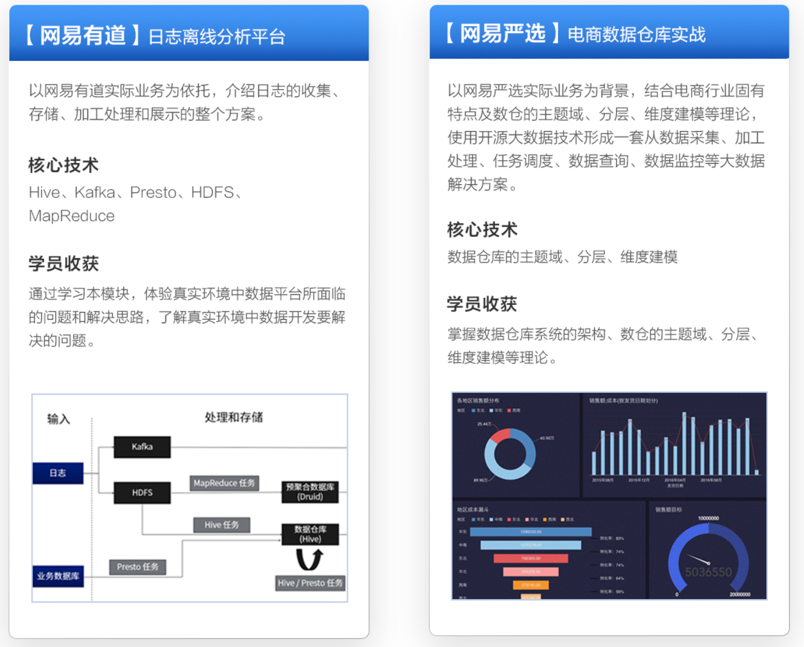
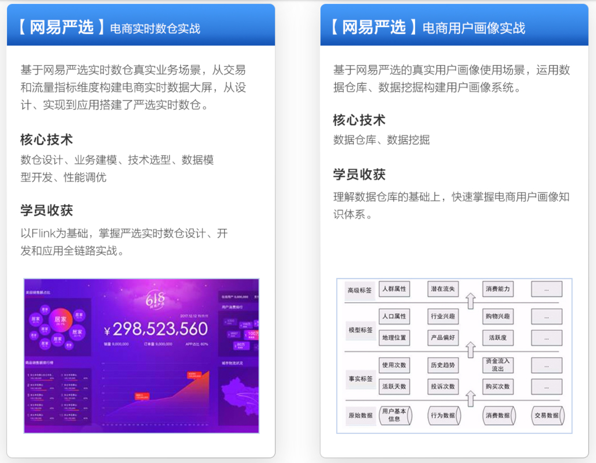
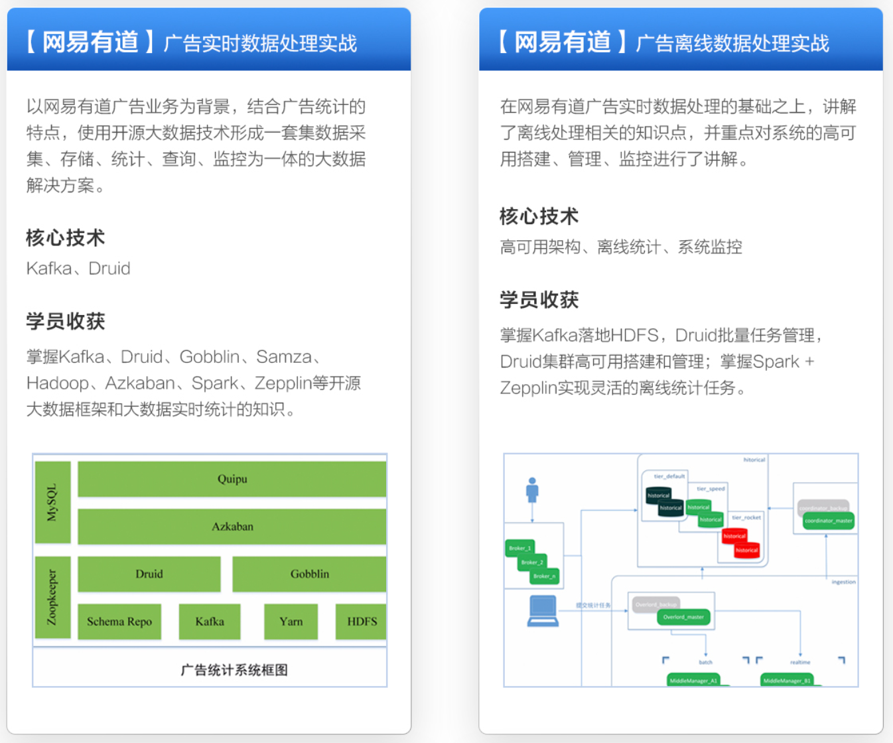
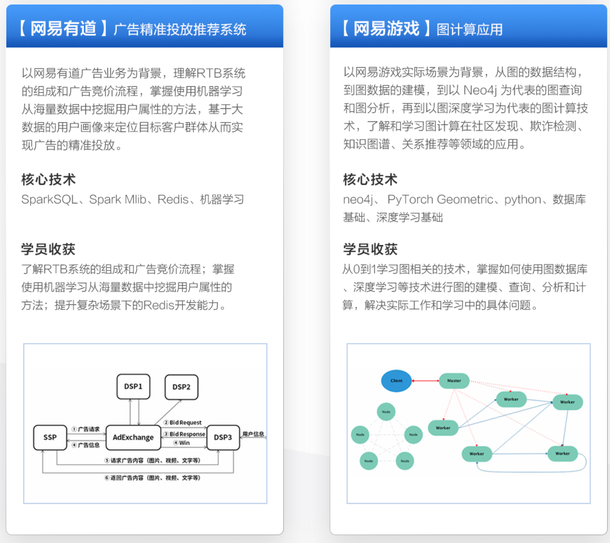
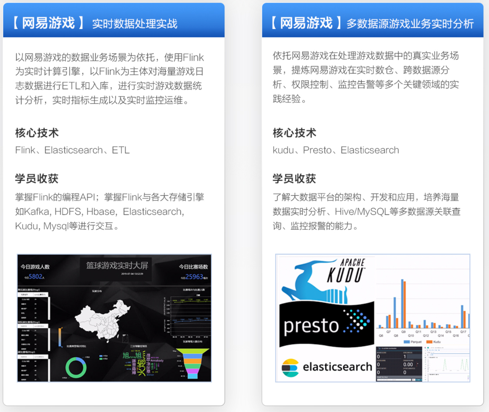
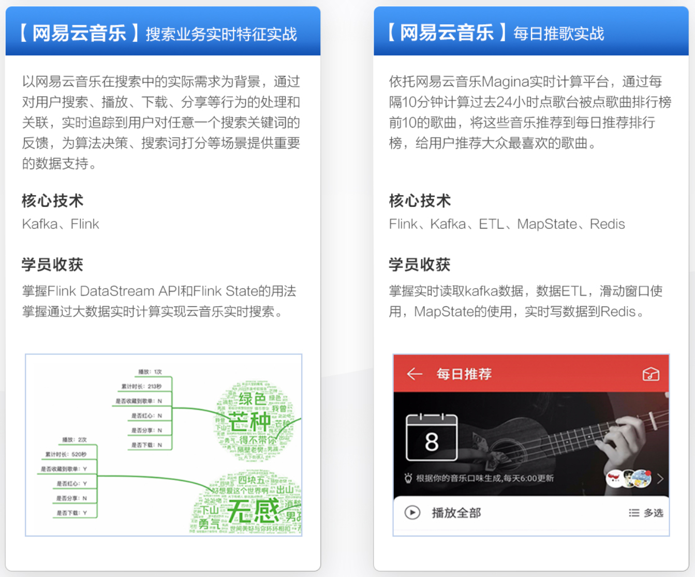
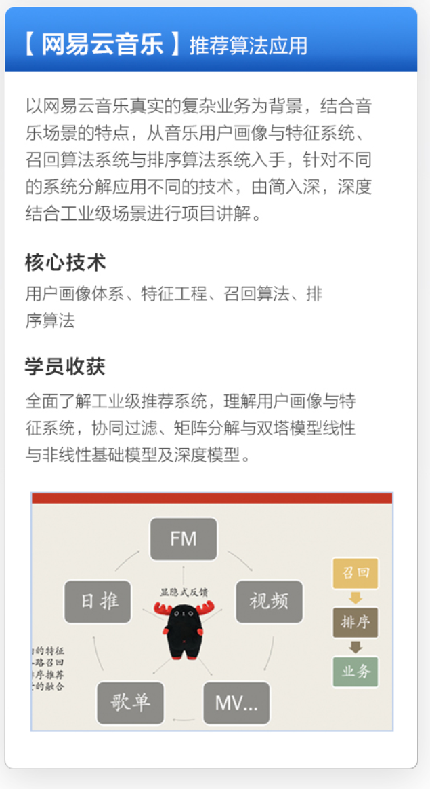

[日志收集框架flume](https://juejin.cn/post/6844903710338842631)

[日志收集框架logstash](https://www.cnblogs.com/cjsblog/p/9459781.html)

[presto](https://github.com/BigDataScholar/TheKingOfBigData/blob/master/note/%E5%85%B6%E4%BB%96%E7%BB%84%E4%BB%B6/%E4%BB%8E%200%20%E5%88%B0%201%20%E5%AD%A6%E4%B9%A0%20Presto%EF%BC%8C%E8%BF%99%E4%B8%80%E7%AF%87%E5%B0%B1%E5%A4%9F%E4%BA%86.md)

[olap](https://segmentfault.com/a/1190000040428093#/)

[什么是数据集市](https://www.ibm.com/cn-zh/topics/data-mart#/)

[什么是从属的数据集市？什么是独立的数据集市？](http://www.tjxzj.net/5418.html#/)

[ali大数据之路](https://blog.csdn.net/BeiisBei/article/details/106167009#/)
[八股笔试](https://developer.aliyun.com/article/1038716?spm=a2c6h.12873639.article-detail.7.34052b3buPSHty#/)
[底层原理面试八股相关文章](https://developer.aliyun.com/profile/skdg26tulds2a?spm=a2c6h.12873639.article-detail.35.3e881b9403Li9H#/)