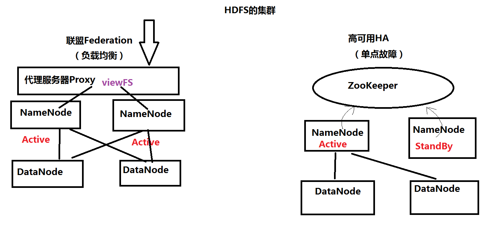
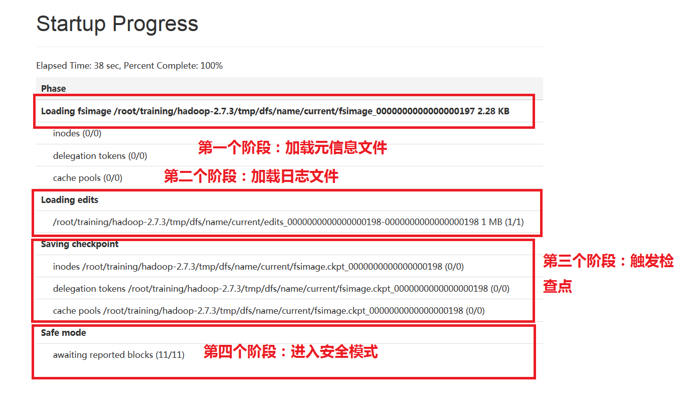
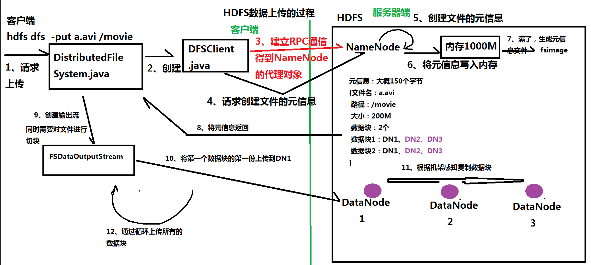
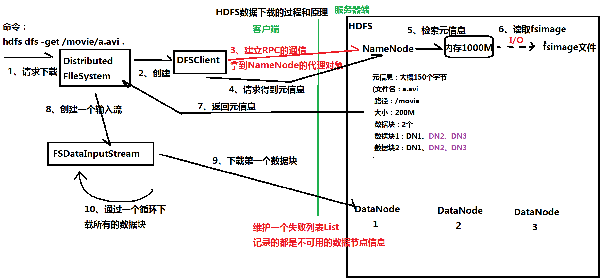
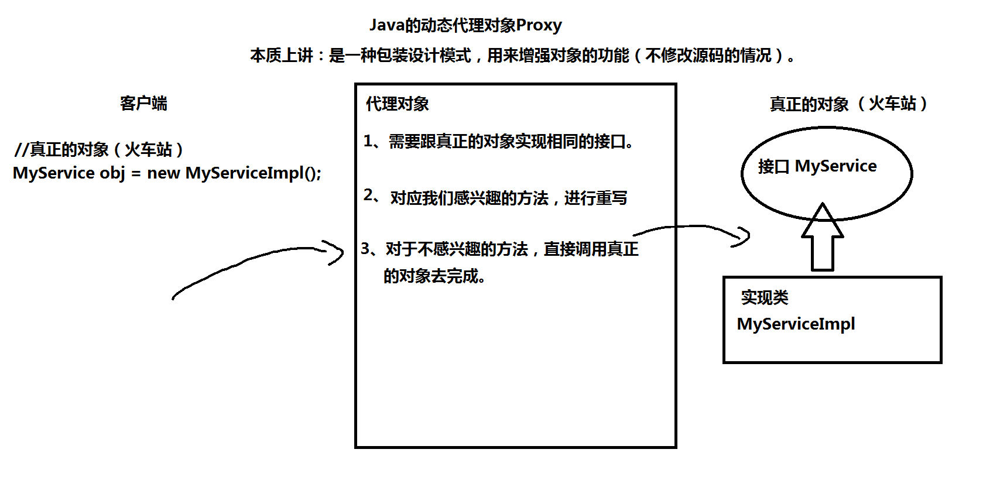

1.4-HDFS  课堂笔记
====================================
一、操作HDFS

	1、Web Console网页工具
		（1）NameNode：端口50070
		（2）SecondaryNameNode：端口50090
	
	2、命令行
		（1）普通的操作命令：hdfs dfs ****
			-mkdir 在HDFS中创建目录
				hdfs dfs -mkdir /aaa
				hdfs dfs -mkdir -p /bbb/ccc 如果父目录不存在，使用-p参数先创建父目录
			
			-ls		查询HDFS的某个目录
			-ls -R	查询HDFS的某个目录，包含子目录
					简写：-lsr
			
			-put			上传数据
			-copyFromLocal  上传数据
			-moveFromLocal  上传数据，本质ctrl+x 剪切
			
			-copyToLocal	下载数据
			-get			下载数据
		
			-rm				删除目录
			-rmr			删除目录，包含子目录
				举例：hdfs dfs -rmr /bbb
				日志：Deleted /bbb
			
			-getmerge：先把某个目录下的文件合并，再下载
				[root@bigdata111 ~]# vi student01.txt
				[root@bigdata111 ~]# vi student02.txt
				[root@bigdata111 ~]# hdfs dfs -mkdir /students
				[root@bigdata111 ~]# hdfs dfs -put student0* /students
				[root@bigdata111 ~]# hdfs dfs -ls /students
				Found 2 items
				-rw-r--r--   1 root supergroup         19 2020-02-24 10:19 /students/student01.txt
				-rw-r--r--   1 root supergroup         10 2020-02-24 10:19 /students/student02.txt
				[root@bigdata111 ~]# hdfs dfs -getmerge /students ./allstudents.txt
			
			-cp：拷贝  hdfs dfs -cp /input/data.txt /input/data2.txt
			-mv：剪切
			
			-count：举例 hdfs dfs -count /students
			[root@bigdata111 ~]# hdfs dfs -count /students
					   1            2                 29 /students
			-du：类似-count，更详细
				hdfs dfs -du /students
				19  /students/student01.txt
				10  /students/student02.txt
						
			-text、-cat 查看文本文件的内容
				hdfs dfs -cat /students/student01.txt
						
			balancer：平衡操作
				hdfs balancer
		
		（2）管理的命令：hdfs dfsadmin ****
				-report：hdfs dfsadmin -report
				
				-safemode 安全模式
					[root@bigdata111 ~]# hdfs dfsadmin -safemode
					Usage: hdfs dfsadmin [-safemode enter | leave | get | wait]
					[root@bigdata111 ~]# hdfs dfsadmin -safemode get
					Safe mode is OFF
					[root@bigdata111 ~]# hdfs dfsadmin -safemode enter
					Safe mode is ON
					[root@bigdata111 ~]# hdfs dfs -mkdir /xyz
					mkdir: Cannot create directory /xyz. Name node is in safe mode.
					[root@bigdata111 ~]# hdfs dfsadmin -safemode leave
					Safe mode is OFF

		
	3、Java API
		包含的jar包
		$HADOOP_HOME/share/hadoop/common/*.jar
		$HADOOP_HOME/share/hadoop/common/lib/*.jar
		$HADOOP_HOME/share/hadoop/hdfs/*.jar
		$HADOOP_HOME/share/hadoop/hdfs/lib/*.jar
	
	
二、HDFS的原理解析（画图）：比较重要

	1、数据上传的过程

	2、数据下载的过程

	
三、HDFS的高级特性
	1、回收站
		启用回收站
			<property>
			   <name>fs.trash.interval</name>
			   <value>1440</value>
			</property>
		
		日志：Moved: 'hdfs://bigdata111:9000/folder1' to trash at: hdfs://bigdata111:9000/user/root/.Trash/Current
	
	2、配额Quota：
		（1）名称配额：规定的是某个HDFS目录下文件的个数，
		               比如：设置名称配额是N，表示只能在该目录下存放N-1个文件或者目录
			hdfs dfsadmin [-setQuota <quota> <dirname>...<dirname>]
			hdfs dfsadmin [-clrQuota <dirname>...<dirname>]
			
			举例：
			hdfs dfs -mkdir /t1 
			
			设置该目录的名称配额是3
			hdfs dfsadmin -setQuota 3 /t1 
				
		（2）空间配额：规定的是某个HDFS目录下文件的大小
					   比如：设置某个HDFS目录的空间配额是200M，只能存放200M以下的文件
			hdfs dfsadmin [-setSpaceQuota <quota> [-storageType <storagetype>] <dirname>...<dirname>]
			hdfs dfsadmin [-clrSpaceQuota [-storageType <storagetype>] <dirname>...<dirname>]
		
			举例：
			hdfs dfs -mkdir /t2
			
			设置该目录的空间配额是1M （逻辑单位）
			hdfs dfsadmin -setSpaceQuota 1M /t2
			
			错误
			The DiskSpace quota of /t2 is exceeded: quota = 1048576 B = 1 MB but diskspace consumed = 134217728 B = 128 MB
	
	3、快照Snapshot：备份（本质：就是cp命令）
		开启快照
		hdfs dfsadmin -allowSnapshot /input
		
		创建快照（备份）
		hdfs dfs -createSnapshot /input backup_input_01
		
		往/input目录再存放一个文件，创建快照
		hdfs dfs -put a.xml /input
		hdfs dfs -createSnapshot /input backup_input_02

		
	4、安全模式 SafeMode
	5、权限管理：类似Linux
	6、HDFS的集群
		集群的两大功能：（1）负载均衡
						（2）失败迁移，就是实现HA
	
		（1）联盟Federation
		（2）HA
		
四、HDFS的底层原理：Java程序

	1、Java的代理对象Proxy
		案例：利用Java的代理对象实现数据库的连接池。
		（1）通过连接池返回一个Connection对象
		（2）使用完后，connection.close，把该连接直接还给数据库
		（3）重写close方法，把该连接还给数据库的连接池
		
		准备实验环境：MySQL的数据库
			如何安装MySQL，在Hive的时候，再介绍
	
	
	2、RPC协议（remote procedure call远程过程调用）

