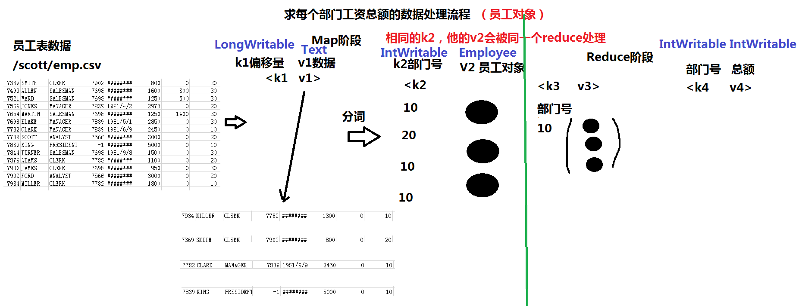
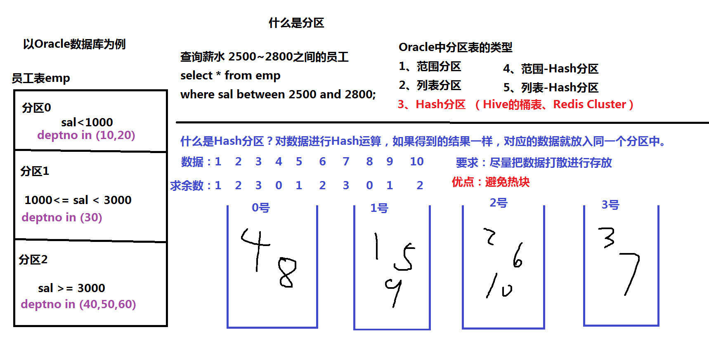

1.5 MapReduce编程
----------------------------------
一、演示Demo：WordCount程序
	位置：$HADOOP_HOME/share/hadoop/mapreduce/hadoop-mapreduce-examples-2.7.3.jar
	命令：hadoop jar hadoop-mapreduce-examples-2.7.3.jar wordcount /input/data.txt /output/0225/wc

二、开发自己的WordCount程序
	1、（画图）非常重要：分析WordCount数据处理的过程（Map阶段+Reduce阶段）

	2、开发自己的Java程序，实现WordCount
		需要的jar包：
			$HADOOP_HOME/share/hadoop/common/*.jar
			$HADOOP_HOME/share/hadoop/common/lib/*.jar
			$HADOOP_HOME/share/hadoop/mapreduce/*.jar
			$HADOOP_HOME/share/hadoop/mapreduce/lib/*.jar
	
	3、举例：求每个部门的工资总额（类似SQL）
		SQL：select deptno,sum(sal)
			 from emp
			 group by deptno;

三、MapReduce的高级特性
	1、序列化：接口Writable（类似Java的序列化）
		功能：实现自定义的数据类型
		（1）举例：创建一个Employee类，封装员工数据，作为Map输出的value（v2，k2使用员工号）
		
	2、排序：默认的排序规则：数字---升序
							  字符串---按照字典顺序
							  对象：按照员工的薪水
			 按照K2进行排序
			 自定义排序排序规则：数字、字符串、对象（WritableComparable）
	3、分区：Partition（非常重要）
		默认：MapReduce只有一个分区（一个分区是一个输出文件）
		根据Map的输出建立分区<k2,v2>
		举例：根据员工的部门号建立分区

	4、Combiner合并，是一种特殊的Reduce；是MapReduce的一种优化的方式
		（1）有些情况不能使用Combiner：求平均值
		（2）不管有没有Combiner不能改变最后运行结果
		（3）不管有没有Combiner，都不应该改变原有的处理逻辑。（案例：倒排索引）

	5、MapReduce核心：Shuffle洗牌

四、编程案例
	1、数据去重：SQL的distinct语句
		相同的k2，他的v2会被同一个reduce处理
		举例：select distinct job from emp;
	
	2、多表查询
		（1）补充：SQL中的多表查询
				（*）什么是笛卡尔积？
				（*）连接条件：至少有N-1
				根据连接条件的不同，多表查询的类型
				（*）等值连接
				（*）不等值连接
				（*）外连接：左、右、全（在Flink DataSet API实现批处理）
				（*）自连接：只需要一张表
		（2）等值连接：查询员工信息，显示：员工号、姓名，薪水，部门名称

			SQL:select e.ename,d.dname
				from emp e,dept d
				where e.deptno=d.deptno;
						
			MapReduce：分析等值连接数据处理的流程
		
		
		（3）自连接：通过表的别名，将同一张表视为多张表

			查询员工信息，显示：老板名称、员工姓名
			SQL：
				select b.ename,e.ename
				from emp e,emp b
				where e.mgr=b.empno;
			
			MapReduce：
			
	3、倒排索引
					  
		准备测试数据
		  vi data01.txt
				I love Beijing and love Shanghai
		  		  
		  vi data02.txt
				I love China
		  
		  vi data03.txt
				Beijing is the capital of China
	

	4、单元测试
