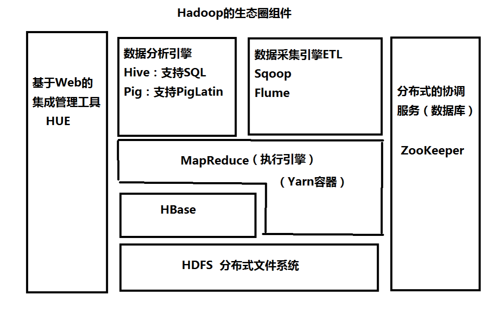
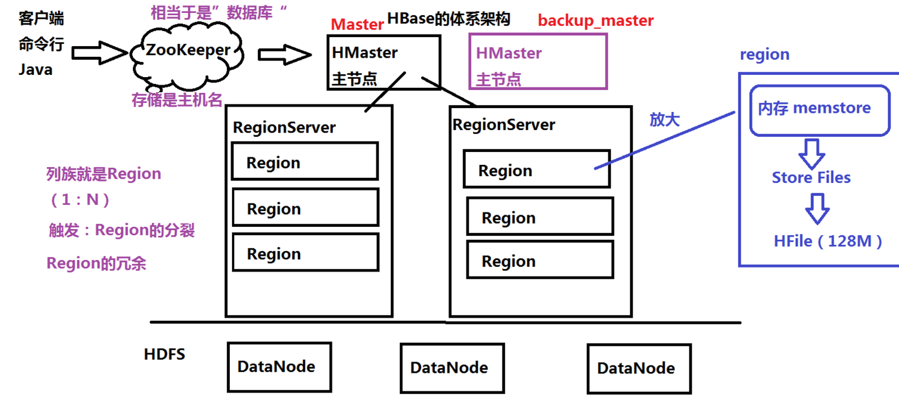
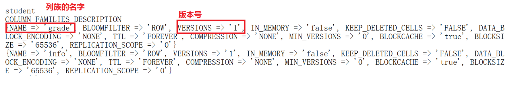
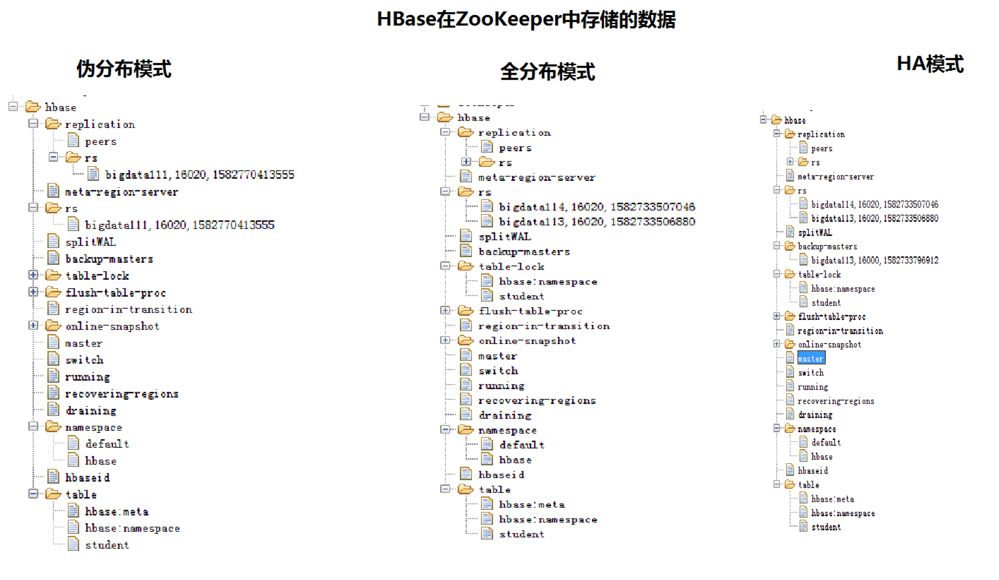
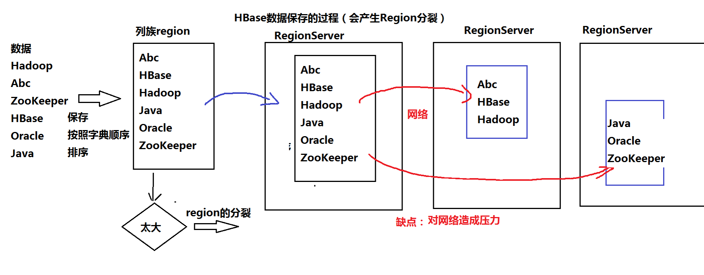

1.6-HBase课堂笔记
-----------------------------------
一、常见的NoSQL数据库

	1、什么是NoSQL数据库？not only sql
		（*）基于Key—Value格式
			关系型数据库：基于关系模式，二维表，适合执行insert update delete
		（*）一般来说，NoSQL数据库中不支持事务Transaction
		
	2、常见的NoSQL
		（*）HBase：基于HDFS之上的NoSQL（本地模式除外）、面向列，适合执行select
					 主从架构
				HBase		HDFS
				表	---->   目录
				列族 --->   目录
				数据 --->   文件（HFile，默认大小128M）
				
		（*）Redis：基于内存的NoSQL数据库，支持持久化（RDB、AOF）
					从3.0版本开始，Redis Cluster去中心化，没有中心节点，不存在单点故障的问题
				前身：Memcached缓存，不支持持久化（比如：OpenStack）
				
		（*）MongoDB：基于文档（BSON文档，就是json的二进制）的NoSQL数据库
		（*）Cassandra：面向列的NoSQL，类似HBase
						去中心化，没有中心节点，不存在单点故障的问题

二、HBase体系架构和表结构

	1、Hadoop的生态圈

	2、HBase的体系架构

	3、HBase表结构
		没有数据类型、都是二进制

三、搭建HBase的环境

	共同的操作
	（1）解压：tar -zxvf hbase-1.3.1-bin.tar.gz -C ~/training/
	（2）设置环境变量  vi ~/.bash_profile
			HBASE_HOME=/root/training/hbase-1.3.1
			export HBASE_HOME

			PATH=$HBASE_HOME/bin:$PATH
			export PATH
		生效环境变量 source ~/.bash_profile
		
	（3）核心配置文件  conf/hbase-site.xml

	1、本地模式：特点：不需要HDFS的支持，直接把数据存储在操作系统中
		hbase-env.sh
			export JAVA_HOME=/root/training/jdk1.8.0_181
		
		hbase-site.xml
		
			配置HBase数据存储的路径
			<property>
				<name>hbase.rootdir</name>
				<value>file:///root/training/hbase-1.3.1/data</value>
			</property>
			
		启动HBase
			start-hbase.sh 
			日志：starting master, logging to /root/training/hbase-1.3.1/logs/hbase-root-master-bigdata111.out
	
	2、伪分布模式：特点：在单机上模拟一个分布式的环境；具备HBase所有的功能；多用于开发和测试
			具备：ZooKeeper、HMaster、RegionServer
			
		hbase-env.sh
			表示使用HBase自带的ZooKeeper
			export HBASE_MANAGES_ZK=true
			
		hbase-site.xml		
			<!--数据存储在HDFS上-->
			<property>
				<name>hbase.rootdir</name>
				<value>hdfs://192.168.157.111:9000/hbase</value>
			</property>		

			<!--表示是一个分布式的环境-->
			<property>
				<name>hbase.cluster.distributed</name>
				<value>true</value>
			</property>	

			<!--ZK的地址-->
			<property>
				<name>hbase.zookeeper.quorum</name>
				<value>192.168.157.111</value>
			</property>

			<!--Region的冗余-->
			<property>
				<name>dfs.replication</name>
				<value>1</value>
			</property>

		regionservers
			192.168.157.111
			
		启动：start-hbase.sh
		日志：
			192.168.157.111: starting zookeeper, logging to /root/training/hbase-1.3.1/bin/../logs/hbase-root-zookeeper-bigdata111.out
			starting master, logging to /root/training/hbase-1.3.1/logs/hbase-root-master-bigdata111.out
			192.168.157.111: starting regionserver, logging to /root/training/hbase-1.3.1/bin/../logs/hbase-root-regionserver-bigdata111.out
	
	3、全分布模式：3台
		（1）同步时间、启动Hadoop
		（2）在bigdata112上进行搭建
		hbase-env.sh
			export JAVA_HOME=/root/training/jdk1.8.0_181	

			表示使用HBase自带的ZooKeeper
			export HBASE_MANAGES_ZK=true
			
		hbase-site.xml		
			<!--数据存储在HDFS上-->
			<property>
				<name>hbase.rootdir</name>
				<value>hdfs://192.168.157.112:9000/hbase</value>
			</property>		

			<!--表示是一个分布式的环境-->
			<property>
				<name>hbase.cluster.distributed</name>
				<value>true</value>
			</property>	

			<!--ZK的地址-->
			<property>
				<name>hbase.zookeeper.quorum</name>
				<value>192.168.157.112</value>
			</property>

			<!--Region的冗余-->
			<property>
				<name>dfs.replication</name>
				<value>2</value>
			</property>			

		regionservers 指定从节点的地址，一般来说，RegionServer跟DataNode在一起
			192.168.157.113
			192.168.157.114
			
		（3）把112上的hbase复制到113和114
			scp -r hbase-1.3.1/ root@bigdata113:/root/training
			scp -r hbase-1.3.1/ root@bigdata114:/root/training
			
		（4）在112上启动HBase
			日志：
			192.168.157.112: starting zookeeper, logging to /root/training/hbase-1.3.1/bin/../logs/hbase-root-zookeeper-bigdata112.out
			starting master, logging to /root/training/hbase-1.3.1/logs/hbase-root-master-bigdata112.out
			192.168.157.114: starting regionserver, logging to /root/training/hbase-1.3.1/bin/../logs/hbase-root-regionserver-bigdata114.out
			192.168.157.113: starting regionserver, logging to /root/training/hbase-1.3.1/bin/../logs/hbase-root-regionserver-bigdata113.out
			
	4、HA的模式：非常简单，不需要单独搭建，只需要在某个从节点上，手动启动一个Master就可以
		在113上
			hbase-daemon.sh start master
	
四、HBase在ZooKeeper中存储的数据

五、操作HBase
	1、Web Console网页：端口16010
	
	2、命令行：hbase shell
		DML语句：Data Manipulation Language 数据操作语言
				insert update delete （select）
				
		DDL语句：Data Definition Language 数据定义语言
				创建表create...
				
		（1）创建表	create 'student','info','grade'
			        list
					查看表结构
					describe 'student'
					desc 'student'
					
		（2）插入数据  put：put 'student','s01','info:name','Tom'
							 put 'student','s01','info:age','24'
							 
		（3）查询数据：scan、get
				scan：相当于是select * from student，还可以设置过滤器
						scan 'student'
						
				get：通过行键查询
				       get 'student','s01'
					   
		（4）清空表中的数据: truncate 'student'
				本质：先删除表，再重建表
				日志：
					hbase(main):010:0> 
					hbase(main):010:0> truncate 'student'
					Truncating 'student' table (it may take a while):
					 - Disabling table...
					 - Truncating table...
					0 row(s) in 4.2790 seconds
					
				老版本HBase
					hbase(main):010:0> truncate 'student'
					Truncating 'student' table (it may take a while):
					 - Disabling table...
					 - Dropping table...
					 - Creating table
					0 row(s) in 4.2790 seconds				
			
			（*）删除表 
					disable 'student'
					drop 'student'
	
	
	3、Java API：面向对象
	
六、数据保存的过程（会产生Region分裂）

七、HBase的过滤器：Java程序，相当于where条件

	1、列值过滤器：根据列的值进行查询 where sal=3000
	2、列名前缀过滤器：查询指定的列，查询员工的姓名  select ename from emp;
	3、多个列名前缀过滤器：查询指定多个列，查询员工的姓名和薪水：select ename,sal from emp;
	4、Rowkey过滤器：通过行键进行查询
	5、查询中，组合多个过滤器

八、HBase上的MapReduce

	测试数据
	create 'word','content'
	put 'word','1','content:info','I love Beijing'
	put 'word','2','content:info','I love China'
	put 'word','3','content:info','Beijing is the capital of China'
	
	创建表保存结果
	create 'stat','content'
	
	错误：Caused by: java.lang.ClassNotFoundException: org.apache.hadoop.hbase.client.Scan
		需要在执行的路径中，包含HBase的jar包
		export HADOOP_CLASSPATH=$HBASE_HOME/lib/*:$CLASSPATH
