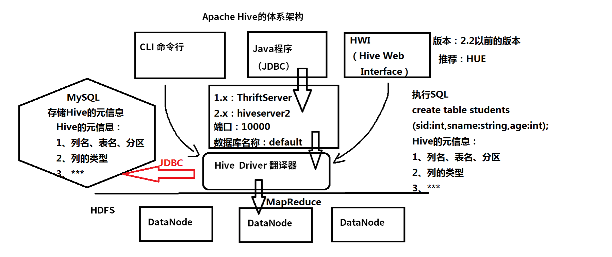
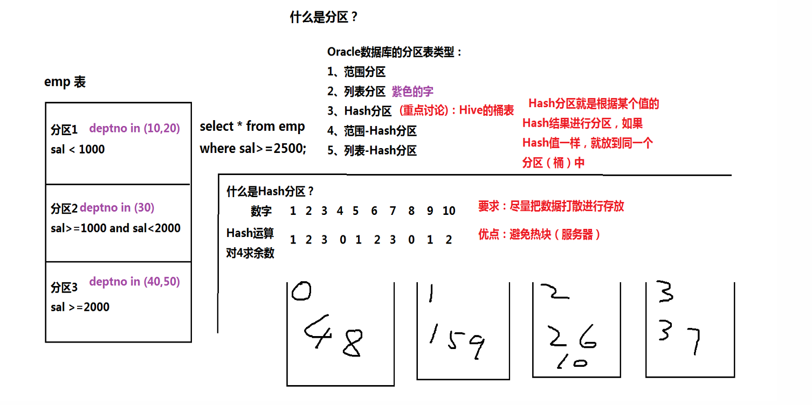

1.7-数据分析引擎Hive课堂笔记
-------------------------------------------

大数据的终极目标：是使用SQL语句来分析和处理大数据。

常见的大数据的分析引擎：Hive和Pig-------> 属于Hadoop体系

                Spark SQL 
                Flink Table & SQL
                Presto：支持SQL，基于内存，通常集成Presto和Hive
                Impala
						 
一、什么是Hive？特点

	1、Hive是一个翻译器，默认（Hive on MR）：把SQL语句----> MapReduce程序

	2、Hive是一个基于HDFS之上的数据仓库

		Hive		HDFS
		表   -----> 目录
		分区 -----> 目录
		数据 -----> 文件
		桶   -----> 文件
		
	3、Hive支持SQL（SQL的子集）

二、Apache Hive的体系架构

三、Hive的安装和配置

	解压：tar -zxvf apache-hive-2.3.0-bin.tar.gz -C ~/training/
	设置环境变量: vi ~/.bash_profile
		HIVE_HOME=/root/training/apache-hive-2.3.0-bin
		export HIVE_HOME

		PATH=$HIVE_HOME/bin:$PATH
		export PATH
	source ~/.bash_profile
	
	安装模式：核心配置 conf/hive-site.xml(自己生成)
	1、嵌入模式
		特点：（1）不需要MySQL的支持，使用自带的Derby数据库来存储元信息
			  （2）只支持一个链接
			  （3）用于开发测试
				<?xml version="1.0" encoding="UTF-8" standalone="no"?>
				<?xml-stylesheet type="text/xsl" href="configuration.xsl"?>
				<configuration>
				  <property>
					<name>javax.jdo.option.ConnectionURL</name>
					<value>jdbc:derby:;databaseName=metastore_db;create=true</value>
				  </property>

				  <property>
					<name>javax.jdo.option.ConnectionDriverName</name>
					<value>org.apache.derby.jdbc.EmbeddedDriver</value>
				  </property>

				  <property>
					<name>hive.metastore.local</name>
					<value>true</value>
				  </property>
				 
				 <!--Hive数据存储的路径-->
				  <property>
					<name>hive.metastore.warehouse.dir</name>
					<value>file:///root/training/apache-hive-2.3.0-bin/warehouse</value>
				  </property> 
				  
				</configuration>			  
			 
			初始化Derby：schematool -dbType derby -initSchema
			
	2、本地模式（远程模式）
		特点：（1）需要MySQL的数据库支持
			  （2）用于开发、生产
			
		搭建MySQL数据库：参考PPT
			tar -xvf mysql-5.7.19-1.el7.x86_64.rpm-bundle.tar
			把MySQL的Driver放到Hive的lib目录

		重新配置hive-site.xml
		<?xml version="1.0" encoding="UTF-8" standalone="no"?>
		<?xml-stylesheet type="text/xsl" href="configuration.xsl"?>
		<configuration>
		  <property>
			<name>javax.jdo.option.ConnectionURL</name>
			<value>jdbc:mysql://localhost:3306/hive?useSSL=false</value>
		  </property>		

		  <property>
			<name>javax.jdo.option.ConnectionDriverName</name>
			<value>com.mysql.jdbc.Driver</value>
		  </property>

		  <property>
			<name>javax.jdo.option.ConnectionUserName</name>
			<value>hiveowner</value>
		  </property>
		  
		  <property>
			<name>javax.jdo.option.ConnectionPassword</name>
			<value>Welcome_1</value>
		  </property>

		</configuration>	
	
	
		初始化MetaStore：schematool -dbType mysql -initSchema
		
		
	
四、（重点）Hive的数据模型：表结构

	1、内部表：最简单一种表，相当于是MySQL、Oracle中表
			   将数据保存到Hive自己的数据仓库中。/user/hive/warehouse
			   默认的情况下，分隔符：tab
		
		员工数据 7654,MARTIN,SALESMAN,7698,1981/9/28,1250,1400,30
			create table emp
			(empno int,
			ename string,
			job string,
			mgr int,
			hiredate string,
			sal int,
			comm int,
			deptno int);
			
			加载数据：insert语句、load语句（本地文件、HDFS文件）
				load加载本地文件：load data local inpath '/root/temp/emp.csv' into table emp;
				load加载HDFS的文件(ctrl+x): load data inpath '/scott/emp.csv' into table emp1;
		
		创建员工表，指定分隔符
			create table emp1
			(empno int,
			ename string,
			job string,
			mgr int,
			hiredate string,
			sal int,
			comm int,
			deptno int)
			row format delimited fields terminated by ',';		

		创建部门表 dept
			create table dept
			(deptno int,dname string,loc string)
			row format delimited fields terminated by ',';

			load data inpath '/scott/dept.csv' into table dept;		
	
	
	2、外部表


		create external table student_ex
		(sid int,sname string,age int)
		row format delimited fields terminated by ','
		location '/students';
	
	

	3、分区表：（问题）如何判断SQL的执行效率得到了提高？

		创建一张分区表，按照员工的部门号建立分区
			create table emp_part
			(empno int,
			ename string,
			job string,
			mgr int,
			hiredate string,
			sal int,
			comm int)
			partitioned by (deptno int)
			row format delimited fields terminated by ',';
			
		使用insert语句导入数据到分区表
			insert into table emp_part partition(deptno=10) select empno,ename,job,mgr,hiredate,sal,comm from emp1 where deptno=10;
			insert into table emp_part partition(deptno=20) select empno,ename,job,mgr,hiredate,sal,comm from emp1 where deptno=20;
			insert into table emp_part partition(deptno=30) select empno,ename,job,mgr,hiredate,sal,comm from emp1 where deptno=30;	
	
		SQL的执行计划
	
	4、桶表：思想：Hash分区
		根据员工的职位（job）创建一张桶(文件)表
			create table emp_bucket
			(empno int,
			ename string,
			job string,
			mgr int,
			hiredate string,
			sal int,
			comm int,
			deptno int)
			clustered by (job) into 4 buckets
			row format delimited fields terminated by ',';

		通过一个子查询往桶表中，插入数据
			insert into table emp_bucket select * from emp1;
			
	5、视图view（封装）
		（1）视图是一张虚表：不存数据
				底层的表叫做视图的基表
		（2）一般：视图只做select
		（3）简化查询
		
		查询员工信息：部门名称、员工姓名
			create view view1		
			as
			select dept.dname,emp1.ename
			from dept,emp1
			where dept.deptno=emp1.deptno;
	
五、执行Hive的查询（HQL）：就是SQL

	1、查询所有的员工信息
		select * from emp1;
		
	2、查询员工信息：员工号，姓名，薪水，部门号
		select empno,ename,sal,deptno from emp1;
		
	3、多表查询：查询员工姓名和部门名称
		select dept.dname,emp1.ename
		from dept,emp1
		where dept.deptno=emp1.deptno;	
		
	4、子查询：hive只支持from和where语句中子查询
		查询部门名称是SALES的所有员工
			select *
			from emp1
			where emp1.deptno in (select deptno from dept where dname='SALES');
			
		SQL中的子查询：from、where、select、having
		
	5、SQL内置函数：查询最高薪水
		select max(sal) from emp1;
		
	6、条件函数，本质上就是if...else...
		做一个报表：涨工资，总裁1000，经理800，其他400
		case ...when(标准的SQL)
		
		select empno,ename,sal,
		case job when 'PRESIDENT' then sal+1000
				 when 'MANAGER' then sal+800
				 else sal+400
		end
		from emp1;
		
		Oracle有另外的一种实现方式：decode函数

六、Hive的Java API：通过JDBC

	Caused by: java.lang.RuntimeException: java.lang.RuntimeException: org.apache.hadoop.ipc.RemoteException(org.apache.hadoop.security.authorize.AuthorizationException): User: root is not allowed to impersonate anonymous
	
	把Hadoop的HDFS的代理用户
		core-site.xml
			<property>
				<name>hadoop.proxyuser.root.hosts</name>
				<value>*</value>
			</property>
	
			<property>
				<name>hadoop.proxyuser.root.groups</name>
				<value>*</value>
			</property>


七、Hive的自定义函数（UDF：user define function）：就是一个Java程序

	1、实现字符串的拼加：SQL函数concat
		select concat('hello', ' world') from dual;
		
	2、根据员工的薪水判断级别
		 sal < 1000 返回  Grade A
		 1000<= sal < 3000 返回 Grade B
		 sal >= 3000 返回 Grade C
		 
	3、需要的jar $HIVE_HOME/lib
	4、生成jar包
		使用add命令加入Hive的classpath
		add jar /root/temp/myudf.jar;
		
	5、为自定义函数创建别名	
		create temporary function myconact as 'demo.udf.MyConcatString';
		create temporary function checksal as 'demo.udf.CheckSalaryGrade';

```sql
SQL的执行计划

===========================================Oracle的执行计划====================================================
查询10号部门的员工
explain plan for select * from emp where deptno=10;
select * from table(dbms_xplan.display);

1、没有索引
--------------------------------------------------------------------------
| Id  | Operation         | Name | Rows  | Bytes | Cost (%CPU)| Time     |
--------------------------------------------------------------------------
|   0 | SELECT STATEMENT  |      |     3 |   261 |     3   (0)| 00:00:01 |
|*  1 |  TABLE ACCESS FULL| EMP  |     3 |   261 |     3   (0)| 00:00:01 |
--------------------------------------------------------------------------

2、有索引  create index myindex on emp(deptno);
---------------------------------------------------------------------------------------
| Id  | Operation                   | Name    | Rows  | Bytes | Cost (%CPU)| Time     |
---------------------------------------------------------------------------------------
|   0 | SELECT STATEMENT            |         |     3 |   261 |     2   (0)| 00:00:01 |
|   1 |  TABLE ACCESS BY INDEX ROWID| EMP     |     3 |   261 |     2   (0)| 00:00:01 |
|*  2 |   INDEX RANGE SCAN          | MYINDEX |     3 |       |     1   (0)| 00:00:01 |
---------------------------------------------------------------------------------------

===========================================Hive的执行计划====================================================
查询10号部门的员工

1、查询内部表  explain select * from emp1 where deptno=10;
STAGE PLANS:
  Stage: Stage-0
    Fetch Operator
      limit: -1
      Processor Tree:
        TableScan
          alias: emp1
          Statistics: Num rows: 1 Data size: 629 Basic stats: COMPLETE Column stats: NONE
          Filter Operator
            predicate: (deptno = 10) (type: boolean)
            Statistics: Num rows: 1 Data size: 629 Basic stats: COMPLETE Column stats: NONE
            Select Operator
              expressions: empno (type: int), ename (type: string), job (type: string), mgr (type: int), hiredate (type: string), sal (type: int), comm (type: int), 10 (type: int)
              outputColumnNames: _col0, _col1, _col2, _col3, _col4, _col5, _col6, _col7
              Statistics: Num rows: 1 Data size: 629 Basic stats: COMPLETE Column stats: NONE
              ListSink

2、查询分区表  explain select * from emp_part where deptno=10;
STAGE PLANS:
  Stage: Stage-0
    Fetch Operator
      limit: -1
      Processor Tree:
        TableScan
          alias: emp_part
          Statistics: Num rows: 3 Data size: 118 Basic stats: COMPLETE Column stats: NONE
          Select Operator
            expressions: empno (type: int), ename (type: string), job (type: string), mgr (type: int), hiredate (type: string), sal (type: int), comm (type: int), 10 (type: int)
            outputColumnNames: _col0, _col1, _col2, _col3, _col4, _col5, _col6, _col7
            Statistics: Num rows: 3 Data size: 118 Basic stats: COMPLETE Column stats: NONE
            ListSink

```
