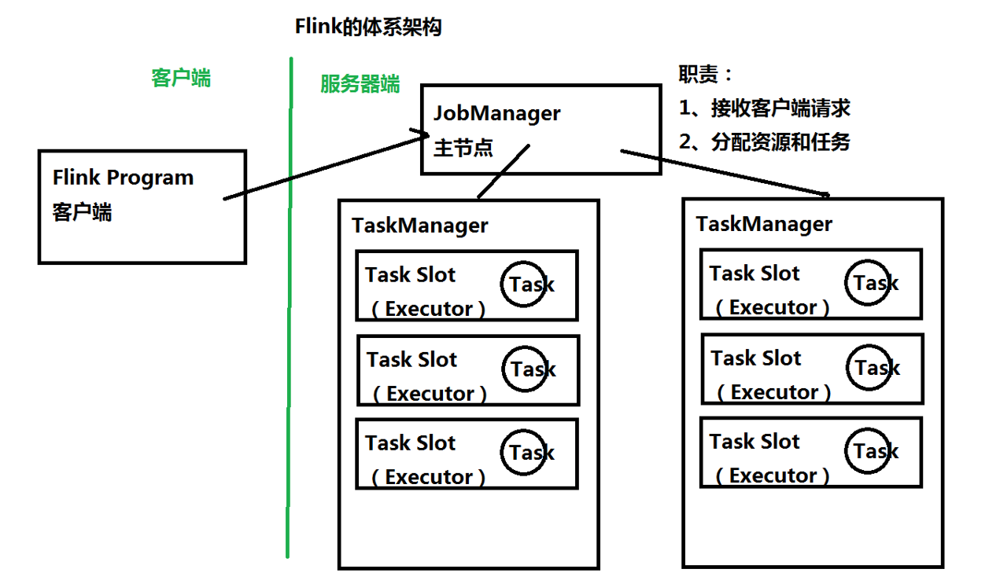
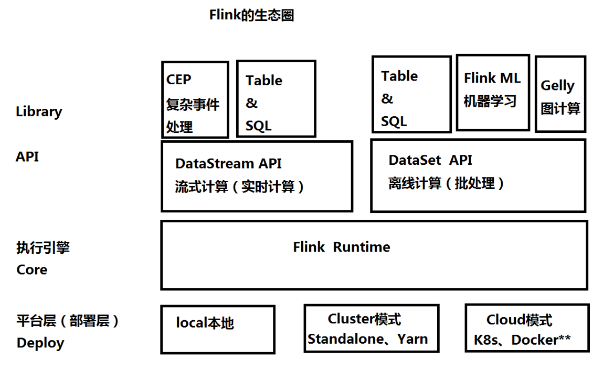
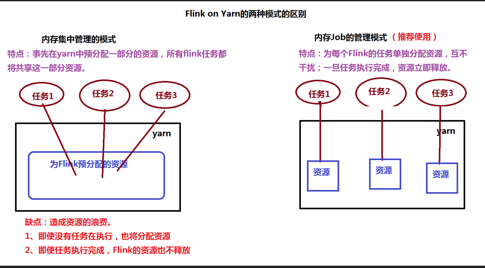
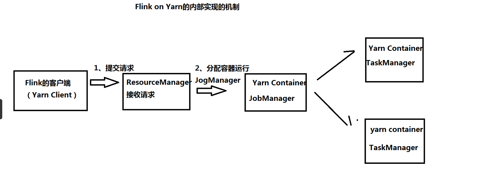
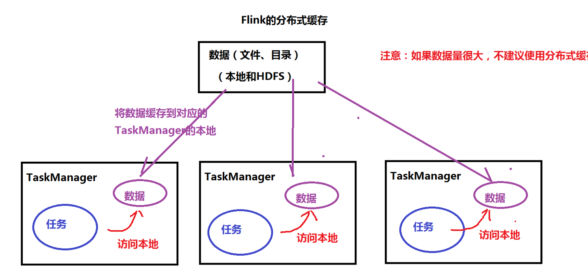

Flink课堂笔记
---------------------
一、Flink基础

	1、Flink的简介

		有边界的数据流：离线数据---> 离线计算 ----> DataSet API
		无边界的数据流：流式数据---> 流式计算 ----> DataStream API	
	
	2、Flink的体系架构和生态圈

	3、搭建Flink的环境
		（1）Flink Standalone模式：伪分布、全分布
				
				（*）伪分布环境
					演示执行任务Demo
						离线计算：
						bin/flink run examples/batch/WordCount.jar -input hdfs://bigdata111:9000/input/data.txt -output hdfs://bigdata111:9000/flink/wc1
						
						流式计算：
				
				（*）全分布环境：配置slave文件
					在bigdata112上安装
						修改flink-conf.yaml设置主节点的地址
						修改slaves文件
					
					复制到其他的节点
						scp -r flink-1.7.2/ root@bigdata113:/root/training
						scp -r flink-1.7.2/ root@bigdata114:/root/training
		
		
		（2）Flink on Yarn：
			（*）内存集中管理模式：所有的Flink任务都将共享事先申请的内存资源
					bin/yarn-session.sh -n 2 -jm 1024 -tm 1024 -d
					错误：
					Container [pid=61432,containerID=container_1583200037872_0001_01_000001] is running beyond virtual memory limits. Current usage: 158.5 MB of 1 GB physical memory used; 2.2 GB of 2.1 GB virtual memory used. Killing container
					
				 执行任务
					bin/flink run examples/batch/WordCount.jar -input hdfs://bigdata111:9000/input/data.txt -output hdfs://bigdata111:9000/flink/wc1
					
					bin/flink run examples/batch/WordCount.jar -input hdfs://bigdata111:9000/input/data.txt -output hdfs://bigdata111:9000/flink/wc2
					
					bin/flink run examples/batch/WordCount.jar -input hdfs://bigdata111:9000/input/data.txt -output hdfs://bigdata111:9000/flink/wc3
					
			（*）内存Job管理模式：每个任务单独申请资源，彼此互不干扰
					bin/flink run -m yarn-cluster -yn 1 -yjm 1024 -ytm 1024 examples/batch/WordCount.jar 
					
					-m：运行在yarn上
					-yn：分配一个NodeManager
					-yjm: JobManager的内容
					-ytm：TaskManager内存
		
		（3）Flink on Yarn的两种模式的区别

		（4）Flink on Yarn的内部实现的机制

		
		
		（5）Flink HA的实现：利用ZooKeeper
			flink-conf.yaml文件
				high-availability: zookeeper
				high-availability.zookeeper.quorum: bigdata112:2181,bigdata113:2181,bigdata114:2181 
				high-availability.zookeeper.path.root: /flink
				high-availability.cluster-id: /cluster_one
				high-availability.storageDir: hdfs://bigdata111:9000/flink/recovery
		
			masters和zoo.cfg和slaves文件
			
			使用scp命令复制到其他的节点上
			scp -r flink-1.7.2/ root@bigdata113:/root/training
			scp -r flink-1.7.2/ root@bigdata114:/root/training
			

			日志：
				Starting HA cluster with 2 masters.
				Starting standalonesession daemon on host bigdata112.
				Starting standalonesession daemon on host bigdata113.
				Starting taskexecutor daemon on host bigdata113.
				Starting taskexecutor daemon on host bigdata114.
		
		（6）Flink UI
		
	4、Flink的分布式缓存

	5、对比：Flink、Storm、Spark Streaming
	
二、Flink入门开发案例：WordCount（Java、Scala）

	1、批处理开发
	2、流处理开发
	3、Flink Scala Shell
	4、Flink的并行度分析
	
三、Flink DataSet API：离线计算---------算子

	1、map、flatMap、mapPartition
	2、filter、distinct
	3、join操作
	4、笛卡尔积
	5、first—N
	6、外连接操作：左、右、全
	
四、Flink DataStream API：流式计算

	1、数据源：source
		（1）基本数据源
		（2）自定义数据源
	2、Connector：source/sink
	3、转换操作Transformation
	4、Data Sink
	
五、Flink的高级特性

	1、广播变量
	2、累加器和计数器
	
六、状态管理和恢复

	1、状态
	2、检查点的配置
	3、后端存储：state backend存储模式
	4、配置后端存储
	5、恢复重启策略

七、Flink Table&SQL

	1、Flink Table&SQL简介
	2、开发Flink Table&SQL程序
	3、使用Flink SQL Client
