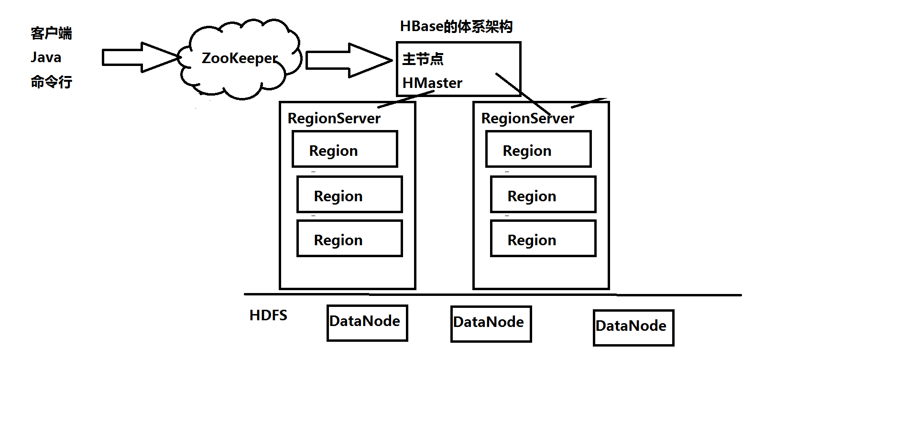
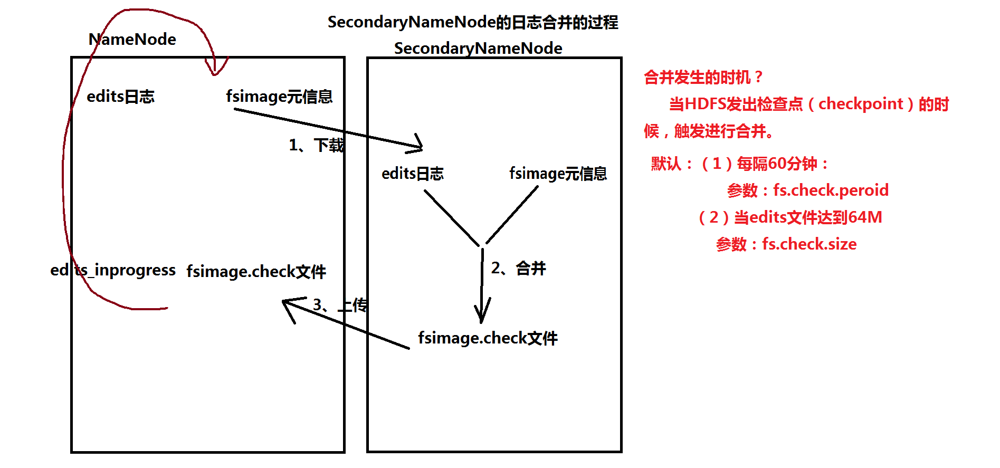
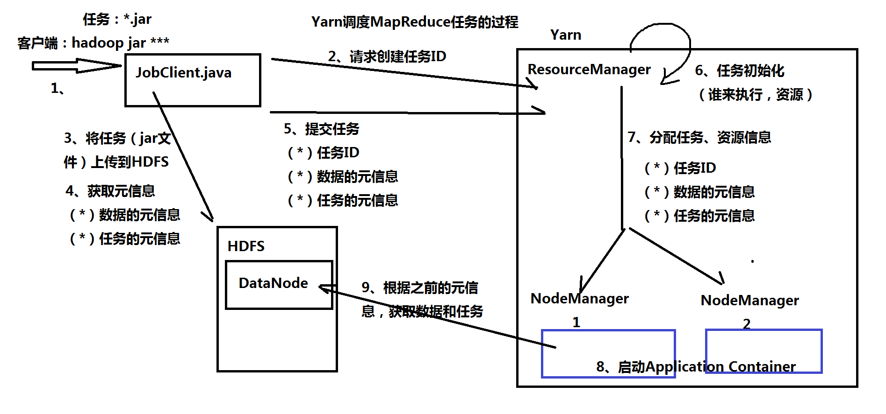
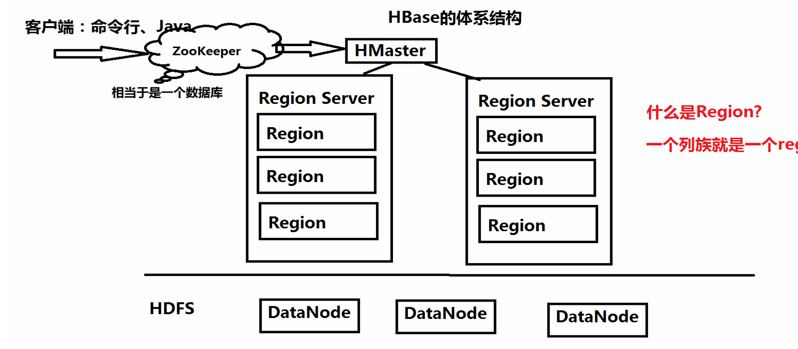
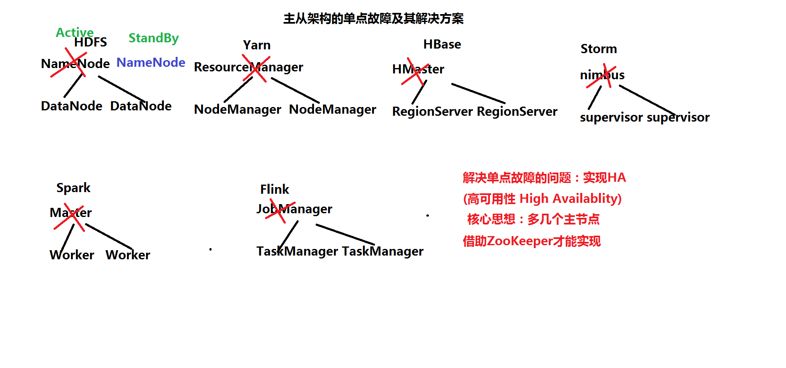

1.3课堂笔记  Hadoop的体系架构
-------------------------------------------

一、HDFS的体系架构

	1、NameNode：主节点
		（*）职责：管理HDFS
		            接收客户端的请求：数据上传，数据下载
					维护HDFS：维护edits文件（客户端的操作日志）、维护fsimage文件（元信息文件）
		
		（*）edits文件（客户端的操作日志）
			 位置：$HADOOP_HOME/tmp/dfs/name/current
			 Demo: 创建一个目录 
					hdfs dfs -mkdir /tools
					
			（1）edits_inprogress_0000000000000000105是当前正在操作的日志，都是二进制
			（2）日志查看器
					hdfs oev -i edits_inprogress_0000000000000000105 -o ~/a.xml
					  <RECORD>
						<OPCODE>OP_MKDIR</OPCODE>
						<DATA>
						  <TXID>106</TXID>
						  <LENGTH>0</LENGTH>
						  <INODEID>16416</INODEID>
						  <PATH>/tools</PATH>
						  <TIMESTAMP>1582478082044</TIMESTAMP>
						  <PERMISSION_STATUS>
							<USERNAME>root</USERNAME>
							<GROUPNAME>supergroup</GROUPNAME>
							<MODE>493</MODE>
						  </PERMISSION_STATUS>
						</DATA>
					  </RECORD>
		
		（*）fsimage文件（元信息文件）：记录的是数据块的位置信息，冗余信息
			位置：$HADOOP_HOME/tmp/dfs/name/current
			Demo：上传数据 hdfs dfs -put hadoop-2.7.3.tar.gz /tools
			提供元信息查看器
			hdfs oiv -i fsimage_0000000000000000104 -o ~/b.xml -p XML
	
	2、DataNode：从节点
		（*）按照数据块来保存数据：1.x：64M   2.x：128M
		（*）数据块的位置
			$HADOOP_HOME/tmp/dfs/data/current/BP-90413187-192.168.157.111-1582475681214/current/finalized/subdir0/subdir0
	
		（*）Demo：上传数据 hdfs dfs -put hadoop-2.7.3.tar.gz /tools
					大概204M
					
		（*）设置数据块冗余度的一般原则：冗余度跟数据节点个数一致，最大不超过3
	
	3、Secondary NameNode：第二名称节点，跟NameNode运行在一起
		（*）不是NameNode热备
		（*）职责：定期进行日志信息的合并：把edits----> fsimage文件
		（*）重点：掌握日志合并的过程

	补充一点：检查点
		（1）HDFS：触发日志的合并
		（2）Oracle：会以最高优先级唤醒数据库的写进程，写脏数据
		（3）Spark和Flink：容错机制
	
二、Yarn的体系架构
	
	
	1、ResourceManager：主节点
		职责：（*）接收客户端的请求：执行MapReduce任务的请求
			  （*）资源的分配：CPU、内存、网络
			  （*）任务的分配
	
	2、NodeManager：从节点
		职责：  （*）从ResourceManager获取任务和资源
				（*）执行任务
	
	3、Yarn调度MapReduce任务的过程：画图

	4、Yarn的资源分配方式：3种
		（1）FIFO Scheduler  先来先得，问题：没有考虑任务的优先级
		（2）Capacity Scheduler：容器管理的调度规则，允许多个组织共享集群的资源
		（3）Fair Scheduler：公平调度原则，假设：任务具有相同的优先级，平均分配系统的资源。

三、HBase：基于HDFS之上的NoSQL数据库
	1、HMaster：主节点
	2、RegionServer：从节点
	3、ZooKeeper：当成“数据库”

四、主从架构的单点故障的问题，需要实现HA（High Availablity高可用性）

**什么是单点故障问题？**
HDFS中的NameNode，Yarn中ResourceManager，HBase中HMaster,Spark中Master，Storm中Nimbus起着“老大”的角色，那么“老大”挂了怎么办呢？这可就麻烦了，只要老大挂了，等于整个集群的服务都用不了了，NameNode挂了整个集群的HDFS就用不了了，HBase的HMaster挂了整个集群的Hbase都用不了了，等等。这就是所谓单点故障问题。单点指只有一个主节点。

**解决方案**
基于ZooKeeper实现HA（High Availablity）的功能

