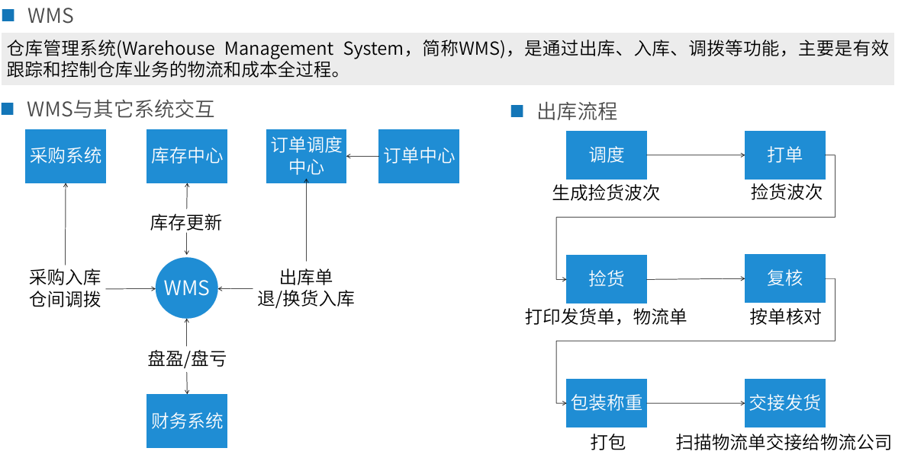
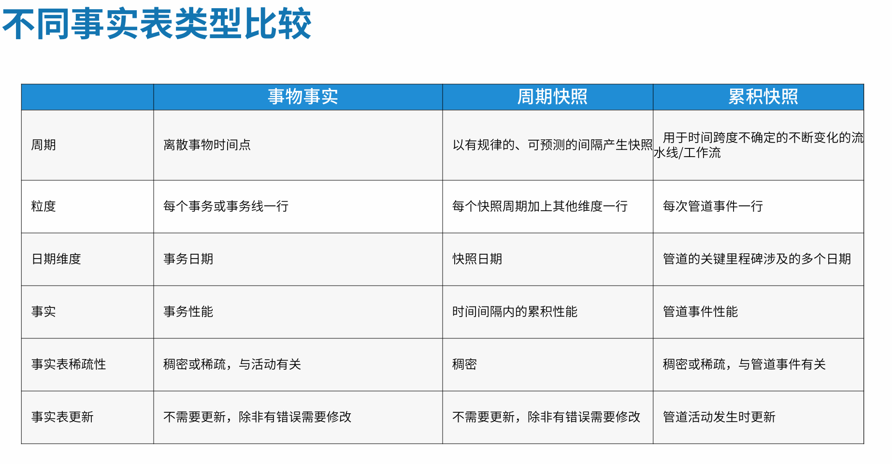

参考链接：

[什么是数据集市](https://www.ibm.com/cn-zh/topics/data-mart#/)

[什么是从属的数据集市？什么是独立的数据集市？](http://www.tjxzj.net/5418.html#/)

[olap](https://segmentfault.com/a/1190000040428093#/)

[数仓建设中最常用模型--Kimball维度建模详解原](https://cloud.tencent.com/developer/article/1772027)
[维度建模](https://blog.csdn.net/mark_wu2000/article/details/82668787#/)
## 理论框架
### 产品架构

商品

库存

采购

WMS

订单

### 应用场景

### 星型模式与OLAP多维数据库

#### OLAP

操作型数据库和数据仓库在目的、功能和设计上都有显著的区别。操作型数据库主要用于日常数据处理，要求高并发性和数据的完整性和一致性。而数据仓库则用于数据分析，需要支持大量的历史数据和复杂的查询请求，并提供数据汇总、转换等功能

### 数据仓库架构

从属：性能：
当数据仓库的查询性能出现问题，可以考虑建立几个从属数据集市，将查询从数据
库移出到数据集市。
安全：
每个部门可以完全控制他们自己的数据集市。
数据一致：
因为每个数据集市的数据来源都是同一个数据仓库，有效消除了数据不一致的情况

### 维度建模
• 事实表 每个数据仓库中都包含有一个或多个事实表，一般事实表中只存放数字或者一些统计(Count、
Sum)    的事实信息（简称为度量，如：数量、金额等信息）。

• 维度表 业务人员如何描述来自业务过程度量事件的数据（常用语过滤及分类事实数据）。

• 粒度 粒度是指数据仓库的数据单位中保存数据的细化或综合程度的级别。细化程度越高，粒度级别
就越小；相反，细化程度越低，粒度级就越大。

• 业务过程 常用行为动词表示、由业务系统支撑、可以获取关键性度量，可以分：主题域内的单业务
过程、多业务过程、跨主题域的业务过程；（如：采购下单、质检、预约入库等；有时也使用名词：
订单、成本费用、用户，这些有些看情况可以设计到数据集市或维度，而不做为业务过程）。

• 两种模型模式 星型模式、雪花模式

