## 日志原始数据的输入

三部分讲解，首先是日志传输的基本流程，然后是跨机房来传输的流程。再就是如何保证日志传输的可靠性

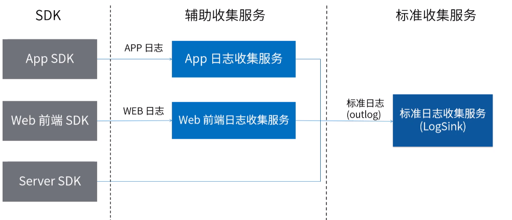
APP端和web端的日志，首先会流经各自的辅助收集服务，然后再变成标准日志的形式，传送到标准资质收集服务，而server等的日志则不需要经过辅助收集服务，可直接以标准日志的形式发送到标准日志收集服务，我们的标准日志收集服务，接收到日志之后会将它发往两个地方。首先我们会实时的发往kafka，然后我们会批量上传到hdfs不同产品不同端的日志，会有一个key来做区分。例如a和b按照不同的key形成卡夫卡中不同的topic，例如log下划线a log下划线b我们查往hdfs的文件，也会存放于不同key标识的目录下，存储的文件名会包括日期时分秒的时间，以及一个序列号，这里的时分苗指的是日志文件中第一条日志的时间戳，序列号主要是为了保证我们标准日志收集服务的不同实例，同时上传时不会发生文件名冲突
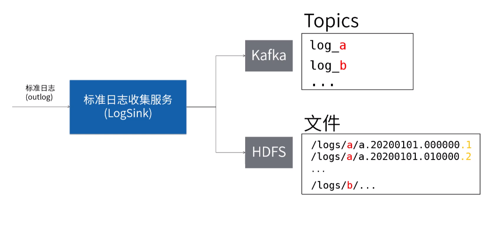

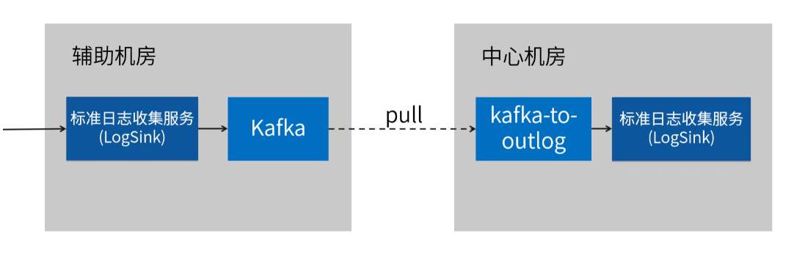
保证传输可靠性的方法。由于日志数据是我们分析产品状况指导决策的重要数据，我们需要尽量保证日志的可靠性，为了保证其可靠性，我们使用了如下的几个方法，本地缓存、反压，优先使用破以及确认机制。

### 本地缓存
，我们在APP端的SDK实现了本地缓存机制，新生成的日志并不是直接发往日志收集服务，而是先存储在本地发送的工作则是交给单独的发送日志逻辑，这样的方式一方面可以实现批量上传，提高吞吐量的效果。另一方面，在网络故障的时候还可以做重试，从而保证日志能够成功地传输到我们的日志收集服务，
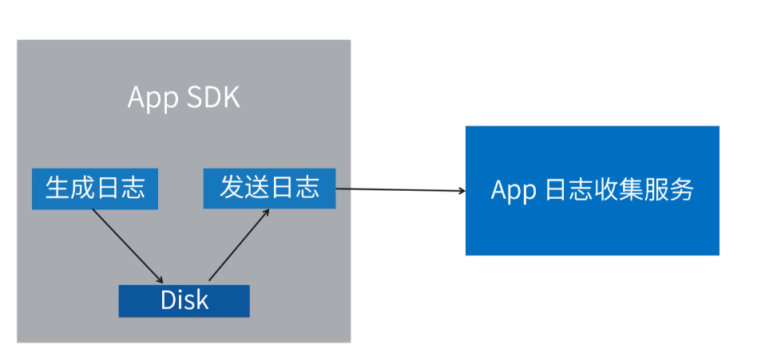

### 反压
，我们在辅助日志收集服务跟标准日志收集服务之间的传输中使用了反压策略，当标准日志收集服务在单位时间内接收到了过量的日志，它就会主动的限制接收速度，这种限制会通过TCP的协议传导到发送端，是发送端的发送指令被阻塞，这样我们就能够保证标准日志收集服务，不会被短时间内过量的日志击垮，导致数据丢失
（kafka应该放在辅助机房，为什么？如上方所示，如果卡不卡在中心机房，会导致生产者与卡夫卡之间的链路在公网传输。我们知道公网传输的延迟通常会较大，这就会造成生产者经常得不到卡不卡的快速确认，）

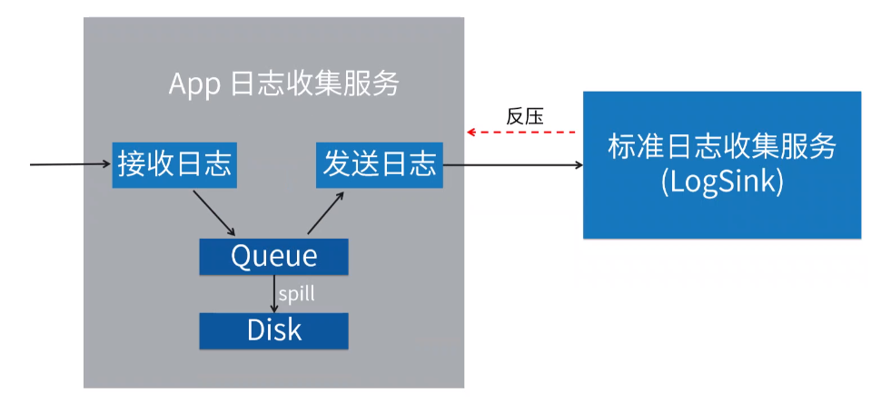

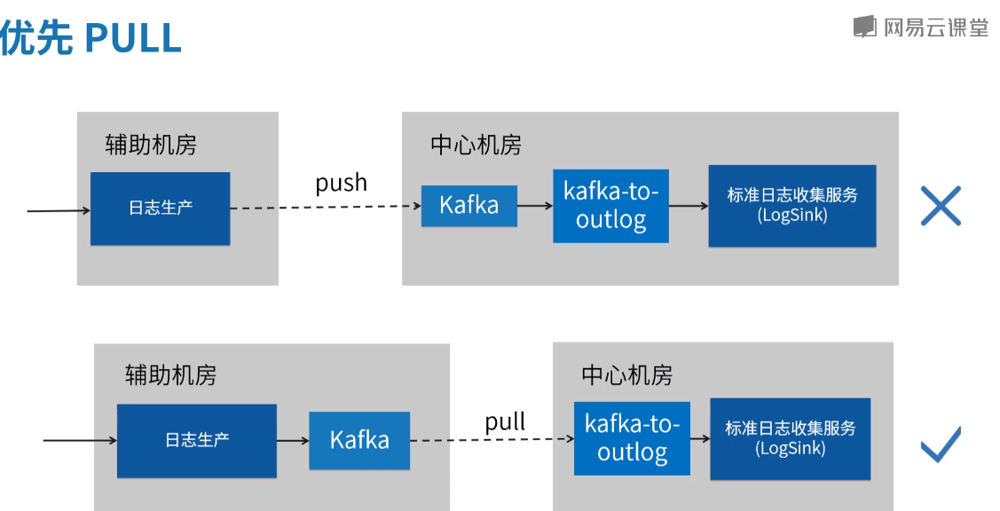

确认机制。我们刚才介绍过 APP日志收集服务与标准日志收集服务的通信之间有反压机制，这种反压机制可能会使得web日志收集服务内存中的队列发生溢出，溢出之后的数据会存到本地文件，我们会有一个批量发送的组件，在标准日志收集服务不满的时候，将溢出的日志文件批量的发送至标准日志收集服务，每发送一批，我们都会要求标准日志收集服务进行确认，只有收到了确认，他才会认为发送成功，才会删除本地的溢出文件。以上是我们保证日志传输可靠性的几个方法和机制

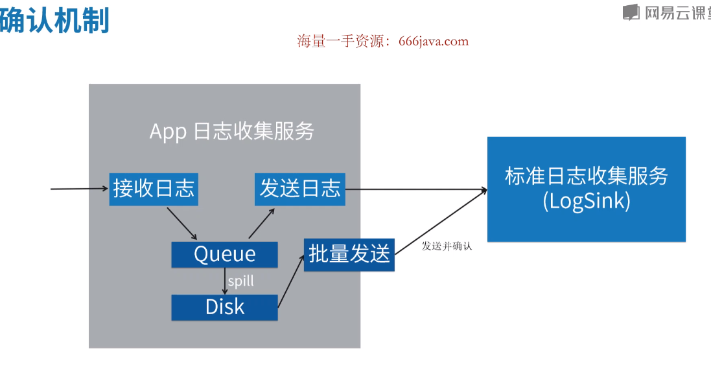

## 业务数据库的输入

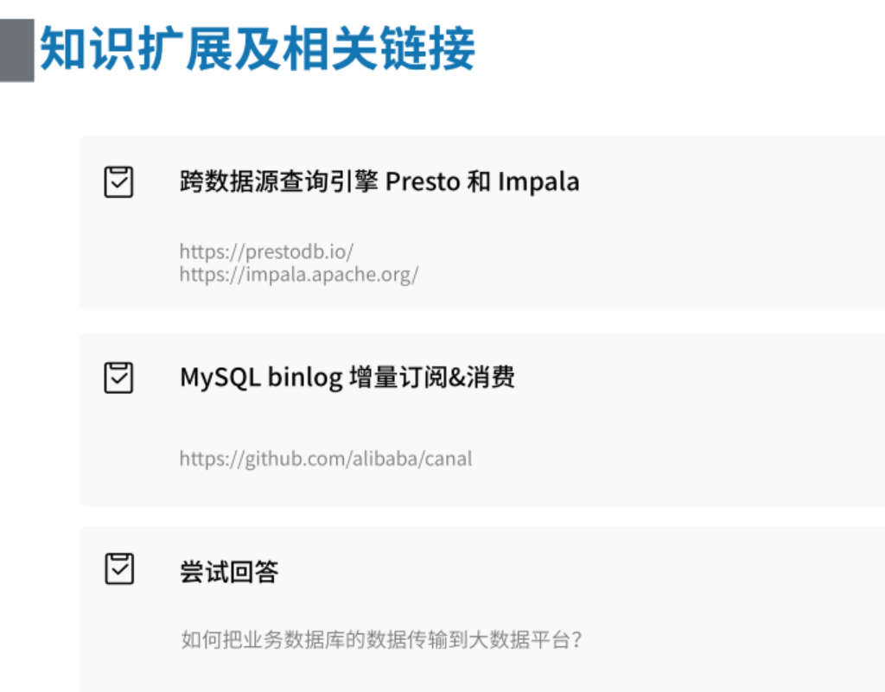
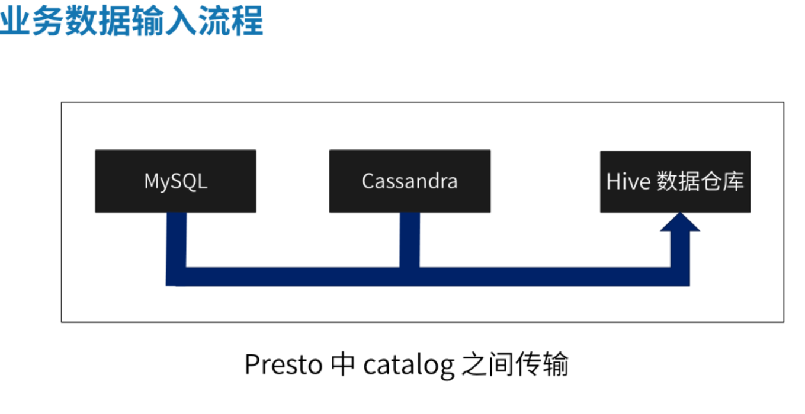

## 日志数据源生成

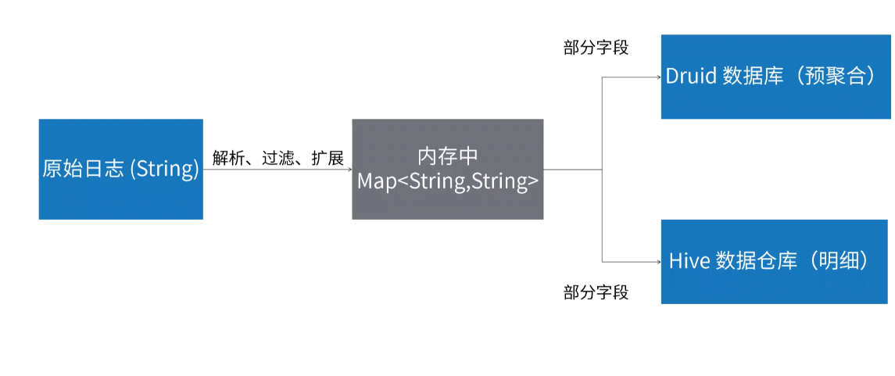

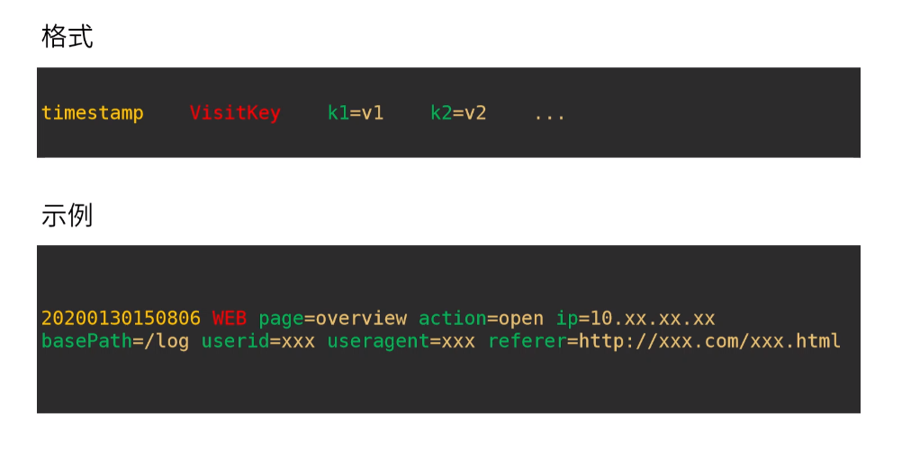

### 解析
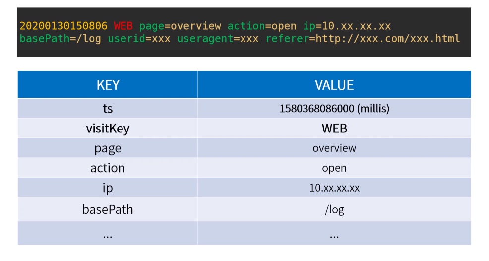

### 过滤
内网IP过滤
垃圾流量
无效事件（与客户无关）
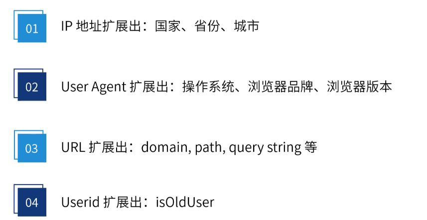

### 存储策略
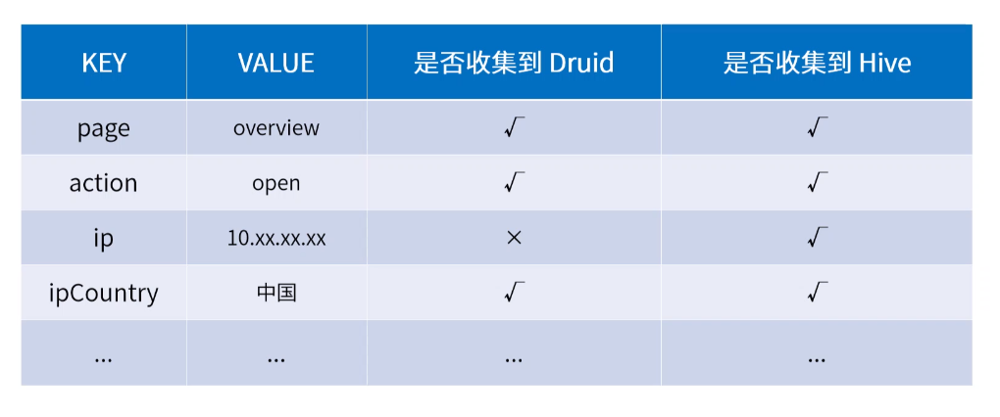
[Apache Druid与Hive集成：高性能实时数据分析](https://developer.baidu.com/article/details/2951100)

[ip地址解析](https://www.ipip.net/)

## 日志数据源存储到hive

## 数仓任务的调度系统
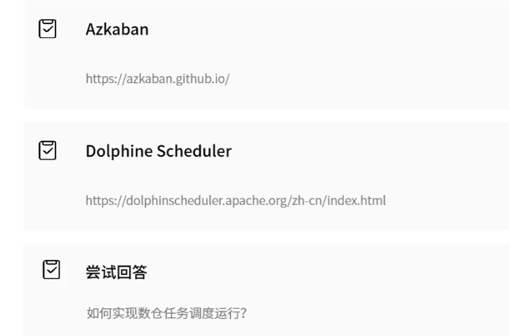