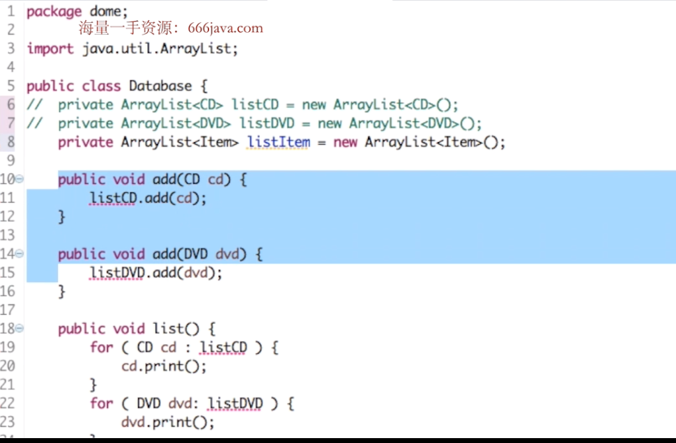
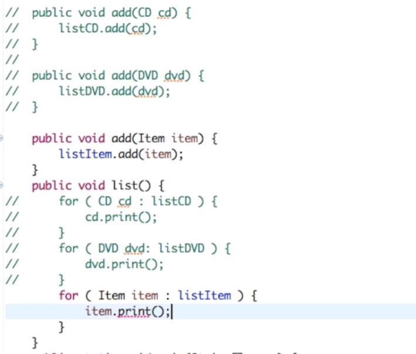
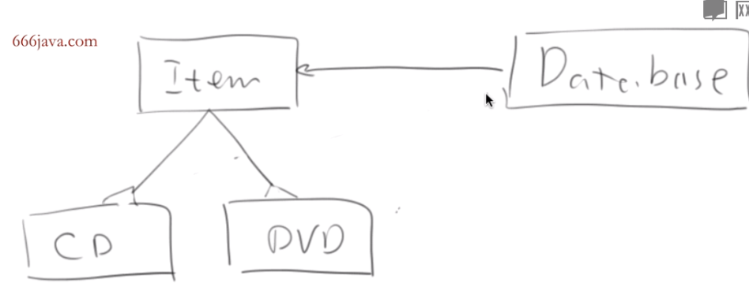
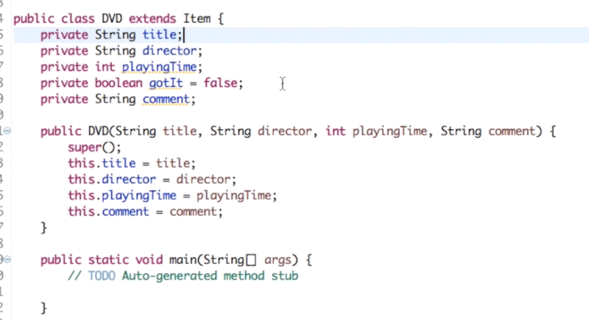
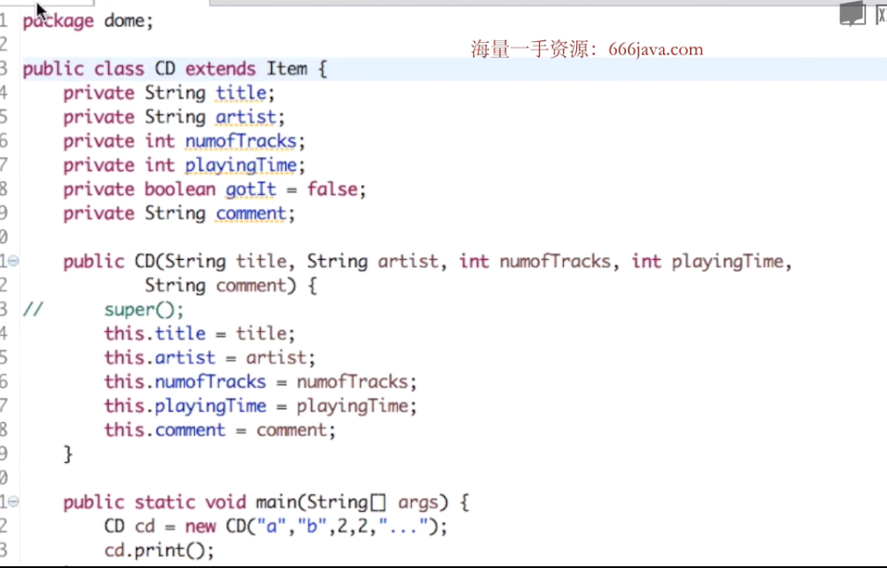
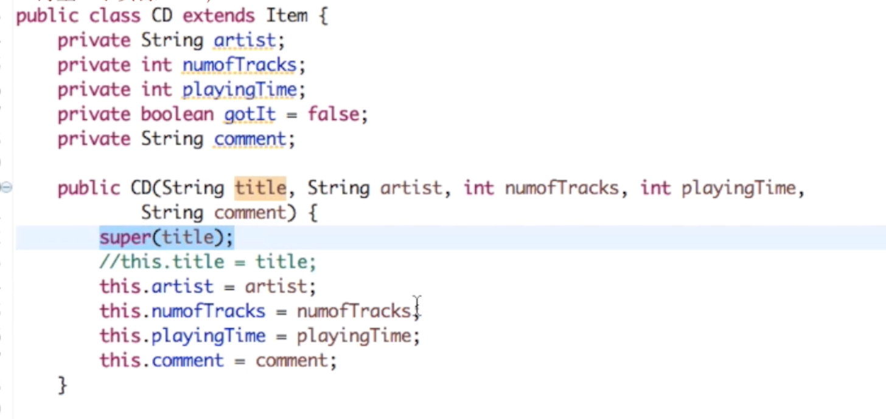
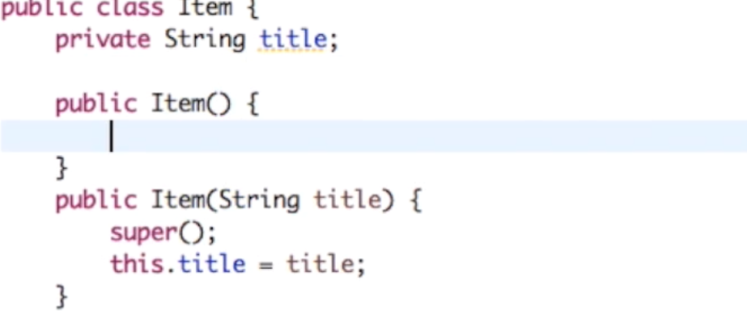

## 继承

像dvd和cd都可以这么写，但是维护起来麻烦
所以需要继承

CD extends了Item，是它的子类

database类只需要管理Item
完成这个事情之后我们发现：
在database类中只需要管理Item，item写出print之类的方法如果子类中没有，就会直接用item的print方法，
如果有就用子类本身

这是我们说到方法，再看看CD和DVD共有的属性title，可以放到父类但是父类private子类也不能直接用，改成protected正合适（没办法的办法），或者super(title)

还存在重复情况，此时我们可以都用在Item上

super()就相当于调用父类的空构造器，所以在父类得有

如果某个属性在父类子类还是重复了，那在子类中还是用子类的
方法名重复了，super.XX调用父类的方法

......不多写了
看别人的博客吧https://www.qcqx.cn/article/bfb663c6.html