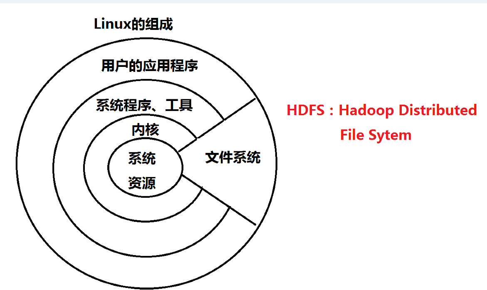
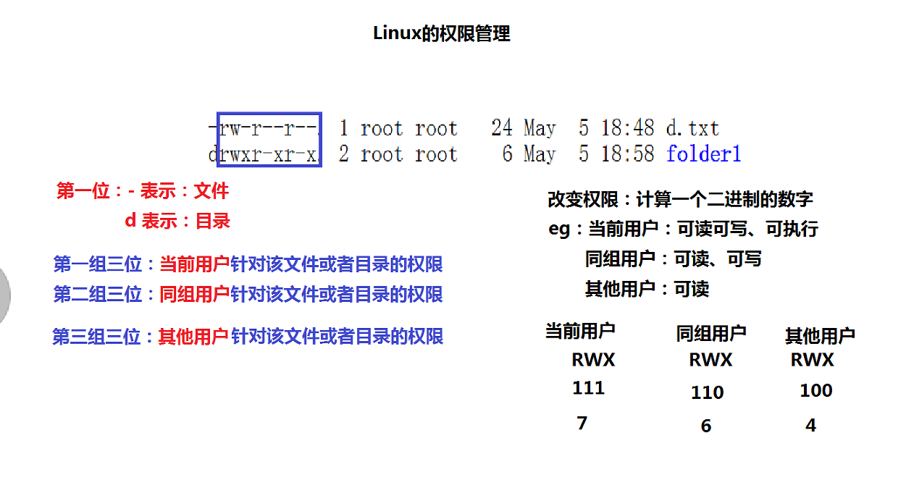

1.0-Linux基础
==========================================
一、Linux简介

二、Linux的安装

三、vi编辑器的使用

	1、运行模式
		（1）编辑模式：等待命令的输入，比如：输入 i
		（2）插入模式：正常输入文本
		（3）命令模式：在编辑模式上，输入:
		注意：在插入模式上，输入esc键
		
	2、vi编辑器的命令
		q: 退出
		wq: 保存并退出
		w + 文件名
		q! 强制退出
		wq! 保存并强制退出
		set number 显示行号
		set nonumber

四、文件目录操作

	（1）ls 显示文件和目录列表 
			 -l 列出文件的详细信息
			 -a 列出当前目录所有文件，包含隐藏文件
		HDFS：hdfs dfs -ls /
	 
	（2）mkdir 创建目录
			-p 父目录不存在情况下先生成父目录
			
		HDFS：hdfs dfs -mkdir /mydata
		
	（3）cd 切换目录
	     pwd 显示当前工作目录 
	
	（4）touch 生成一个空文件
		 echo 生成一个带内容文件，更常用的是，查看环境变量
		
	（5）cat、tac 显示文本文件内容
		 cat是从第一行开始写；tac是从最后一行开始写
		 more，less 分页显示文本文件内容 
		 
	（6）cp 复制文件或目录
		HDFS：hdfs dfs -cp /mydata/a.txt /mydata/b.txt
	
		 rm 删除文件
			-r 同时删除该目录下的所有文件	
			-f 强制删除文件或目录
		 HDFS：hdfs dfs -rm /mydata

		 mv 移动文件或目录、文件或改名
			HDFS：hdfs dfs -mv /mydata/a.txt /mydata/b.txt
	
	find 在文件系统中查找指定的文件
	 -name  文件名
	 
	wc 统计文本文档的行数，字数，字符数
	grep 在指定的文本文件中查找指定的字符串
	例如：grep best book.txt

	rm dir 删除空目录
	tree 显示目录目录改名树 
	
	ln 建立链接文件
	
	例如 ln -s /home/itcast/familyA/house/roomB /home/roomB （目录名在前，连接名在后）
	
	head，tail分别显示文件开头和结尾内容
	#     注释行

五、Linux的权限管理

	HDFS：  hdfs dfs -chmod 764 /mydata/data.txt

六、安装JDK

	echo $JAVA_HOME

