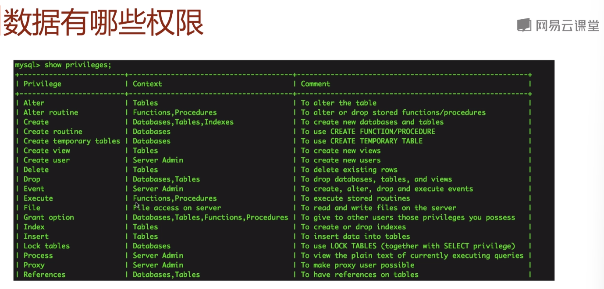

## 启动与停止MySQL服务：
启动
sudo /etc/init.d/mysqlstart
或者
sudo service mysqlstart
停止
sudo /etc/init.d/mysqlstop
或者
sudo service mysqlstop
重启
sudo service mysqlrestart
查看状态
sudo/etc/init.d/mysqlstatus

## 验证是否安装成功与连接
mysql-V
连接
指定socket文件和用户名、密码
mysql-S/tmp/mysql.sock -uroot -p
指定IP和端口
mysql-h127.0.0.1 -P3306 -uroot -p
连接进去之后
数据库状态
status;
展示当前连接showprocesslist;


详细教程：  https://www.w3school.com.cn/sql/index.asp

## 练习

```sql
#查看当前有哪些数据库
showdatabases;
#使用名为test的数据库
usetest;
#创建一张学生表
createtablestu(
id int(10), name varchar(20),
ageint(10),
primary key(id));
#每一张表都需要包含一个主键，主键唯一标识一条记录，唯一的字段，不可重复不能为空，通过`primary key`关键字来定义。
#查看创建好的表
showcreatetablestu;
#新加一个字段
alter tablestu add column gender varchar(20);
#修改一个字段
alter tablestumodify column gender varchar(40);
#删除一个字段
alter tablestu drop column gender;
#删除表
drop tablestu;
#查看当前数据库中的表
showtables;
#向表中插入数据
insert into stu(id,name,age) values(1,'pw',28);
#插入全部字段时可以只写表名
insert into stu values(2,'nss',29);
1
#查看刚才添加的数据,"*"代表查询全部字段
select * fromstu;
#如果只想查询两个字段，则只写要查询的字段名
select name,agefromstu;
#也可以根据某个条件进行查询，比如只查询id为1的记录
select nameagefromstuwhereid=1;
#更新语句
updatestu setage=29 whereid=1;
#删除
deletefromstuwhereid=1
```


新手入门SQL，强烈推荐MICK的《SQL基础教程》。这本书逻辑清晰，直白易懂，介绍了SQL所有的基础语句。掌握了这本书中的内容，就可以利用SQL进行简单的数据分析了。


《SQL基础教程》

在这篇文章里我对《SQL基础教程》中的几乎所有的SQL基础语句进行了总结和摘抄，面试前可以把这些SQL语句集中记忆一遍。下一篇文章我会教大家如何利用这篇文章中提到的SQL基础语句进行数据分析的实操。欢迎大家关注我的专栏~

___

**首先，什么是SQL？**

SQL是Structured Query Language的缩写，意思是结构化查询语言，是一种在数据库管理系统（Relational Database Management System, RDBMS）中查询数据，或通过RDBMS对数据库中的数据进行更改的语言。

常见的RDBMS有：

-   Oracle Database：甲骨文公司的RDBMS
-   SQL Server ：微软公司的RDBMS
-   DB2：IBM 公司的RDBMS
-   PostgreSQL：开源的RDBMS
-   MySQL ：开源的RDBMS

不同RDBMS的SQL语言略有不同，由于MySQL是开源的，免费容易获取，国内很多公司用的都是MySQL，所以本篇文章汇总的是MySQL的SQL语言。

使用SQL在RDBMS中查询数据的过程是这样的：


图片来自《SQL基础教程》

用户在客户端通过SQL语言，将需要的数据和对数据进行的操作的请求发送给RDBMS，RDBMS 根据该语句的内容返回所请求的数据，或者对存储在数据库中的数据进行更新。

根据对RDBMS 赋予的指令种类的不同，SQL 语句可以分为以下三类。

**●DDL（Data Definition Language，数据定义语言）**

用来创建或者删除存储数据用的数据库以及数据库中的表等对象。DDL 包含以下几种指令。

CREATE： 创建数据库和表等对象

DROP： 删除数据库和表等对象

ALTER： 修改数据库和表等对象的结构

**●DML（Data Manipulation Language，数据操纵语言）**

用来查询或者变更表中的记录。DML 包含以下几种指令。

SELECT：查询表中的数据

INSERT：向表中插入新数据

UPDATE：更新表中的数据

DELETE：删除表中的数据

**●DCL（Data Control Language，数据控制语言）**

用来确认或者取消对数据库中的数据进行的变更。除此之外，还可以对RDBMS 的用户是否有权限操作数据库中的对象（数据库表等）进行设定。DCL 包含以下几种指令。

COMMIT： 确认对数据库中的数据进行的变更

ROLLBACK： 取消对数据库中的数据进行的变更

GRANT： 赋予用户操作权限

REVOKE： 取消用户的操作权限

下面就让我们具体看看这三类语句分别包括哪些基础语句吧！

## **Ⅰ. DDL（Data Definition Language，数据定义语言）**

**1、 创建数据库(CREATE)**

**2、创建表(CREATE)**

```text
CREATE TABLE Product (product_id CHAR(4) NOT NULL, product_name VARCHAR(100) NOT NULL, product_type VARCHAR(32) NOT NULL, sale_price INTEGER , purchase_price INTEGER , regist_date DATE , PRIMARY KEY (product_id));
```

每一列的数据类型（后述）是必须要指定的，数据类型包括：

-   INTEGER 整数型
-   NUMERIC ( 全体位数, 小数位数)
-   CHAR 定长字符串
-   VARCHAR 可变长字符串
-   DATE 日期型

**3、 删除表(DROP)**

**4、表定义的更新(ALTER)**

-   在表中增加一列(ADD COLUMN)

```text
ALTER TABLE Product ADD COLUMN product_name_pinyin VARCHAR(100);
```

-   在表中删除一列(DROP COLUMN)

```text
ALTER TABLE Product DROP COLUMN product_name_pinyin;
```

-   变更表名(RENAME)

```text
RENAME TABLE Poduct to Product;
```

## **Ⅱ. DML（Data Manipulation Language，数据操纵语言）**

**1、向表中插入数据(INSERT)**

-   包含列清单

```text
INSERT INTO Product (product_id, product_name, product_type, sale_price, purchase_price, regist_date) VALUES ('0001', 'T恤衫', '衣服', 1000, 500, '2009-09-20');
```

-   省略列清单

```text
START TRANSACTION; INSERT INTO Product VALUES ('0001', 'T恤衫', '衣服', 1000, 500, '2009-09-20'); INSERT INTO Product VALUES ('0002', '打孔器', '办公用品', 500, 320, '2009-09-11'); INSERT INTO Product VALUES ('0003', '运动T恤', '衣服', 4000, 2800, NULL); INSERT INTO Product VALUES ('0004', '菜刀', '厨房用具', 3000, 2800, '2009-09-20'); INSERT INTO Product VALUES ('0005', '高压锅', '厨房用具', 6800, 5000, '2009-01-15'); INSERT INTO Product VALUES ('0006', '叉子', '厨房用具', 500, NULL, '2009-09-20'); INSERT INTO Product VALUES ('0007', '擦菜板', '厨房用具', 880, 790, '2008-04-28'); INSERT INTO Product VALUES ('0008', '圆珠笔', '办公用品', 100, NULL,'2009-11-11'); COMMIT;
```

-   从其他表中复制数据

```text
INSERT INTO ProductCopy (product_id, product_name, product_type，sale_price, purchase_price, regist_date) SELECT product_id, product_name, product_type, sale_price, purchase_price, regist_date FROM Product;
```

-   INSERT 语句中的SELECT 语句，也可以使用WHERE 子句或者GROUP BY 子句等。

```text
INSERT INTO ProductType (product_type, sum_sale_price, sum_purchase_price) SELECT product_type, SUM(sale_price), SUM(purchase_price) FROM Product GROUP BY product_type;
```

**2、从表中查询出需要的列(SELECT)**

```text
SELECT product_id, product_name, purchase_price FROM Product;
```

-   查询出所有的列

-   为列设定别名(AS)

```text
SELECT product_id AS id, product_name AS name, purchase_price AS “价格” FROM Product;
```

-   将查询出的一列指定为常数

```text
SELECT ‘2009-02-24’ AS date, product_id, product_name FROM Product;
```

-   从查询结果中删除重复行(DISTINCT)

```text
SELECT DISTINCT product_type FROM Product;
```

**3、指定查询的条件(WHERE)**

```text
SELECT product_name, product_type FROM Product; WHERE product_type = '衣服';
```

**4、算数运算符和比较运算符**

-   算数运算符

加 +

减 -

乘 \*

除 /

注意：所有包含NULL 的计算，结果肯定是NULL。

```text
SELECT product_name, sale_price, sale_price * 2 AS "sale_price_x2" FROM Product;
```

-   比较运算符

等于 =

不等于 <>

大于 >

大于等于 >=

小于 <

小于等于 <=

```text
SELECT product_name, product_type, regist_date FROM Product WHERE regist_date < '2009-09-27';
```

-   将算数运算符和比较运算符结合使用：

```text
SELECT product_name, sale_price, purchase_price FROM Product WHERE sale_price - purchase_price >= 500;
```

注意：不能对NULL使用比较运算符，正确的方法是：

```text
SELECT product_name, purchase_price FROM Product WHERE purchase_price IS NULL; SELECT product_name, purchase_price FROM Product WHERE purchase_price IS NOT NULL;
```

**5、逻辑运算符(NOT、AND、OR)**

-   NOT

```text
SELECT product_name, product_type, sale_price FROM Product WHERE NOT sale_price >= 1000;
```

（也就是sale\_price<1000）

-   AND

AND运算符在其两侧的查询条件都成立时整个查询条件才成立，其意思相当于“并且”。

```text
SELECT product_name, purchase_price FROM Product WHERE product_type = '厨房用具' AND sale_price >= 3000;
```

-   OR

运算符在其两侧的查询条件有一个成立时整个查询条件都成立，其意思相当于“或者”。

```text
SELECT product_name, purchase_price FROM Product WHERE product_type = '厨房用具' OR sale_price >= 3000;
```

**6、对表进行聚合查询**

常用的五个聚合函数：

-   COUNT： 计算表中的记录数（行数）
-   SUM： 计算表中数值列中数据的合计值
-   AVG： 计算表中数值列中数据的平均值
-   MAX： 求出表中任意列中数据的最大值
-   MIN： 求出表中任意列中数据的最小值

-   计算全部数据的行数（包含NULL）

```text
SELECT COUNT(*) FROM Product;
```

-   计算某一列的行数（不包含NULL）

```text
SELECT COUNT(purchase_price) FROM Product;
```

-   计算删除重复数据后的行数

```text
SELECT COUNT(DISTINCT product_type) FROM Product;
```

（所有的聚合函数都可以使用DISTINCT）

-   SUM/AVG函数只能对数值类型的列使用，而MAX/MIN函数原则上可以适用于任何数据类型的列

```text
SELECT MAX(regist_date), MIN(regist_date) FROM Product;
```

**7、对表进行分组(GROUP BY)**

```text
SELECT product_type, COUNT(*) FROM Product GROUP BY product_type;
```

-   GROUP BY和WHERE并用时SELECT语句的执行顺序：

FROM → WHERE → GROUP BY → SELECT

```text
SELECT purchase_price, COUNT(*) FROM Product WHERE product_type = '衣服' GROUP BY purchase_price;
```

-   为聚合结果指定条件(HAVING)

```text
SELECT product_type, COUNT(*) FROM Product GROUP BY product_type HAVING COUNT(*) = 2;
```

**8、对查询结果进行排序(ORDER BY)**

-   **子句的书写顺序**

**SELECT → FROM → WHERE → GROUP BY → HAVING → ORDER BY**

**子句的执行顺序：**

**FROM → WHERE → GROUP BY → HAVING → SELECT → ORDER BY**

```text
SELECT product_id, product_name, sale_price, purchase_price FROM Product ORDER BY sale_price;
```

-   升序(ASC)或降序(DESC)

```text
SELECT product_id, product_name, sale_price, purchase_price FROM Product ORDER BY sale_price DESC;
```

注意：默认升序

**9、数据的删除(DELETE)**

-   清空表

-   指定删除对象（搜索型DELETE）

```text
DELETE FROM Product WHERE sale_price >= 4000;
```

**10、数据的更新(UPDATE)**

-   更新整列

```text
UPDATE Product SET regist_date = '2009-10-10';
```

-   指定条件的更新（搜索型UPDATE）

```text
UPDATE Product SET sale_price = sale_price * 10 WHERE product_type = '厨房用具';
```

-   多列更新

```text
UPDATE Product SET sale_price = sale_price * 10, purchase_price = purchase_price / 2 WHERE product_type = '厨房用具';
```

**11、视图**

-   创建视图(CREATE VIEW)

```text
CREATE VIEW ProductSum (product_type, cnt_product) AS SELECT product_type, COUNT(*) FROM Product GROUP BY product_type;
```

注意：定义视图时不能使用ORDER BY子句

-   使用视图

```text
SELECT product_type, cnt_product FROM ProductSum;
```

-   删除视图(DROP VIEW)

**12、子查询（一次性视图）**

```text
-- 在FROM子句中直接书写定义视图的SELECT语句 SELECT product_type, cnt_product FROM ( SELECT product_type, COUNT(*) AS cnt_product FROM Product GROUP BY product_type ) AS ProductSum;
```

-   标量子查询

在WHERE子句中使用标量子查询

```text
SELECT product_id, product_name, sale_price FROM Product WHERE sale_price > (SELECT AVG(sale_price) FROM Product);
```

注意：能够使用常数或者列名的地方，无论是SELECT 子句、GROUP BY 子句、HAVING 子句，还是ORDER BY 子句，几乎所有的地方都可以使用标量子查询。

-   关联子查询

```text
SELECT product_type, product_name, sale_price FROM Product AS P1 WHERE sale_price > (SELECT AVG(sale_price) FROM Product AS P2 WHERE P1.product_type = P2.product_type GROUP BY product_type);
```

这里起到关键作用的就是在子查询中添加的WHERE 子句的条件。该条件的意思就是，在同一商品种类中对各商品的销售单价和平均单价进行比较。

**13、函数**

函数大致可以分为以下几种。

-   算术函数（用来进行数值计算的函数）
-   字符串函数（用来进行字符串操作的函数）
-   日期函数（用来进行日期操作的函数）
-   转换函数（用来转换数据类型和值的函数）
-   聚合函数（用来进行数据聚合的函数）

-   算数函数

ABS (数值) —— 绝对值

MOD (被除数, 除数) —— 求余

ROUND (对象数值, 保留小数的位数) —— 四舍五入

-   字符串函数

CONCAT (字符串1, 字符串2, 字符串3) —— 拼接

LENGTH (字符串) —— 字符串长度

LOWER (字符串) —— 小写

UPPER (字符串) —— 大写

REPLACE (对象字符串，替换前的字符串，替换后的字符串) —— 替换

SUBSTRING（对象字符串 FROM 截取的起始位置 FOR 截取的字符数）—— 截取

-   日期函数

CURRENT\_DATE —— 当前日期

CURRENT\_TIME —— 当前时间

CURRENT\_TIMESTAMP —— 当前的日期和时间

EXTRACT (日期元素 FROM 日期)

-   转换函数

CAST（转换前的值 AS 想要转换的数据类型）—— 类型转换

COALESCE (数据1，数据2，数据3……) —— 将NULL转换为其他值

**14、谓词**

-   LIKE谓词

前方一致查询：

```text
SELECT * FROM SampleLike WHERE strcol LIKE 'ddd%';
```

也可用\_（下划线）代替%，但\_只能代表一个字符

```text
SELECT * FROM SampleLike WHERE strcol LIKE 'abc_';
```

中间一致查询：

```text
SELECT * FROM SampleLike WHERE strcol LIKE '%ddd%';
```

后方一致查询：

```text
SELECT * FROM SampleLike WHERE strcol LIKE '%ddd';
```

-   BETWEEN谓词

```text
SELECT product_name, sale_price FROM Product WHERE sale_price BETWEEN 100 AND 1000;
```

BETWEEN 的特点就是结果中会包含100 和1000 这两个临界值。

-   IS NULL和IS NOT NULL谓词

为了选取出某些值为NULL 的列的数据，不能使用=，而只能使用特定的谓词IS NULL

```text
SELECT product_name, purchase_price FROM Product WHERE purchase_price IS NULL;
```

-   IN谓词

```text
SELECT product_name, purchase_price FROM Product WHERE purchase_price IN (320, 500, 5000);
```

也可以用NOT IN

```text
SELECT product_name, purchase_price FROM Product WHERE purchase_price NOT IN (320, 500, 5000);
```

注意：在使用IN 和NOT IN 时是无法选取出NULL 数据的。

使用子查询作为IN谓词的参数：

```text
SELECT product_name, sale_price FROM Product WHERE product_id IN (SELECT product_id FROM ShopProduct WHERE shop_id = '000C');
```

-   EXIST谓词

```text
SELECT product_name, sale_price FROM Product AS P WHERE EXISTS (SELECT * FROM ShopProduct AS SP WHERE SP.shop_id = '000C' AND SP.product_id = P.product_id);
```

也可以用NOT EXIST

**15、CASE表达式**

```text
SELECT product_name, CASE WHEN product_type = '衣服' THEN CONCAT('A:', product_type) WHEN product_type = '办公用品' THEN CONCAT('B:', product_type) WHEN product_type = '厨房用具' THEN CONCAT('C:',product_type) ELSE NULL END AS abc_product_type FROM Product;
```

**16、表的加减法**

-   表的加法(UNION)

```text
SELECT product_id, product_name FROM Product UNION SELECT product_id, product_name FROM Product2;
```

通过UNION 进行并集运算时可以使用任何形式的SELECT 语句，WHERE、GROUP BY、HAVING 等子句都可以使用，但是ORDER BY 只能在最后使用一次。

注意：UNION会删去两个表中的重复记录。如果想保留重复记录，可以在UNION后面加ALL

-   选取表中的公共部分(INTERSECT)

MySQL不支持INTERSECT

-   表的减法(EXCEPT)

MySQL不支持EXCEPT

**17、以列为单位对表进行联结(JOIN)**

-   内联结(INNER JOIN)

```text
SELECT SP.shop_id, SP.shop_name, SP.product_id, P.product_name, P.sale_price FROM ShopProduct AS SP INNER JOIN Product AS P ON SP.product_id = P.product_id;
```

像这样使用联结运算将满足相同规则的表联结起来时，WHERE、GROUP BY、HAVING、ORDER BY 等工具都可以正常使用.

-   外联结(OUTER JOIN)

```text
SELECT SP.shop_id, SP.shop_name, SP.product_id, P.product_name, P.sale_price FROM ShopProduct AS SP LEFT OUTER JOIN Product AS P ① ON SP.product_id = P.product_id;
```

-   三张以上的表的联结

```text
SELECT SP.shop_id, SP.shop_name, SP.product_id, P.product_name, P.sale_price, IP.inventory_quantity FROM ShopProduct AS SP INNER JOIN Product AS P ① ON SP.product_id = P.product_id INNER JOIN InventoryProduct AS IP ② ON SP.product_id = IP.product_id WHERE IP.inventory_id = 'P001';
```

## **Ⅲ. DCL（Data Control Language，数据控制语言）**

**1、创建事务(START TRANSACTION) - 提交处理(COMMIT)**

```text
START TRANSACTION; -- 将运动T恤的销售单价降低1000日元 UPDATE Product SET sale_price = sale_price - 1000 WHERE product_name = '运动T恤'; -- 将T恤衫的销售单价上浮1000日元 UPDATE Product SET sale_price = sale_price + 1000 WHERE product_name = 'T恤衫'; COMMIT;
```

**2、取消处理(ROLLBACK)**

```text
START TRANSACTION; -- 将运动T恤的销售单价降低1000日元 UPDATE Product SET sale_price = sale_price - 1000 WHERE product_name = '运动T恤'; -- 将T恤衫的销售单价上浮1000日元 UPDATE Product SET sale_price = sale_price + 1000 WHERE product_name = 'T恤衫'; ROLLBACK;
```

# 管理权限


查看权限
show grant (for ...)


## 添加新用户建议 GRANT 命令

**一、grant 普通数据用户，查询、插入、更新、删除 数据库中所有表数据的权利。**

```
grant select on testdb.* to common_user@'%'
grant insert on testdb.* to common_user@'%'
grant update on testdb.* to common_user@'%'
grant delete on testdb.* to common_user@'%'
```

或者，用一条 MySQL 命令来替代：

```
grant select, insert, update, delete on testdb.* to common_user@'%'
```

**二、grant 数据库开发人员，创建表、索引、视图、存储过程、函数。。。等权限。**

grant 创建、修改、删除 MySQL 数据表结构权限。

```
grant create on testdb.* to developer@'192.168.0.%';
grant alter on testdb.* to developer@'192.168.0.%';
grant drop on testdb.* to developer@'192.168.0.%';
```

grant 操作 MySQL 外键权限。

```
grant references on testdb.* to developer@'192.168.0.%';
```

grant 操作 MySQL 临时表权限。

```
grant create temporary tables on testdb.* to developer@'192.168.0.%';
```

grant 操作 MySQL 索引权限。

```
grant index on testdb.* to developer@'192.168.0.%';
```

grant 操作 MySQL 视图、查看视图源代码 权限。

```
grant create view on testdb.* to developer@'192.168.0.%';
grant show view on testdb.* to developer@'192.168.0.%';
```

grant 操作 MySQL 存储过程、函数 权限。

```
grant create routine on testdb.* to developer@'192.168.0.%'; -- now, can show procedure status
grant alter routine on testdb.* to developer@'192.168.0.%'; -- now, you can drop a procedure
grant execute on testdb.* to developer@'192.168.0.%';
```

**三、grant 普通 DBA 管理某个 MySQL 数据库的权限。**

```
grant all privileges on testdb to dba@'localhost'
```

其中，关键字 **privileges** 可以省略。

**四、grant 高级 DBA 管理 MySQL 中所有数据库的权限。**

```
grant all on *.* to dba@'localhost'
```

**五、MySQL grant 权限，分别可以作用在多个层次上。**

1\. grant 作用在整个 MySQL 服务器上：

```
grant select on *.* to dba@localhost; -- dba 可以查询 MySQL 中所有数据库中的表。
grant all on *.* to dba@localhost; -- dba 可以管理 MySQL 中的所有数据库
```

2\. grant 作用在单个数据库上：

```
grant select on testdb.* to dba@localhost; -- dba 可以查询 testdb 中的表。
```

3\. grant 作用在单个数据表上：

```
grant select, insert, update, delete on testdb.orders to dba@localhost;
```

这里在给一个用户授权多张表时，可以多次执行以上语句。例如：

```
grant select(user_id,username) on smp.users to mo_user@'%' identified by '123345';
grant select on smp.mo_sms to mo_user@'%' identified by '123345';
```

4\. grant 作用在表中的列上：

```
grant select(id, se, rank) on testdb.apache_log to dba@localhost;
```

5\. grant 作用在存储过程、函数上：

```
grant execute on procedure testdb.pr_add to 'dba'@'localhost'
grant execute on function testdb.fn_add to 'dba'@'localhost'
```

**六、查看 MySQL 用户权限**

查看当前用户（自己）权限：

```
show grants;
```

查看其他 MySQL 用户权限：

```
show grants for dba@localhost;
```

**七、撤销已经赋予给 MySQL 用户权限的权限。**

revoke 跟 grant 的语法差不多，只需要把关键字 to 换成 from 即可：

```
grant all on *.* to dba@localhost;
revoke all on *.* from dba@localhost;
```

**八、MySQL grant、revoke 用户权限注意事项**

1\. grant, revoke 用户权限后，该用户只有重新连接 MySQL 数据库，权限才能生效。

2\. 如果想让授权的用户，也可以将这些权限 grant 给其他用户，需要选项 **grant option**

```
grant select on testdb.* to dba@localhost with grant option;
```

这个特性一般用不到。实际中，数据库权限最好由 DBA 来统一管理。

注意：创建完成后需要执行 **FLUSH PRIVILEGES** 语句。


## 数据库权限相关的表
比如


# 触发器与存储过程


