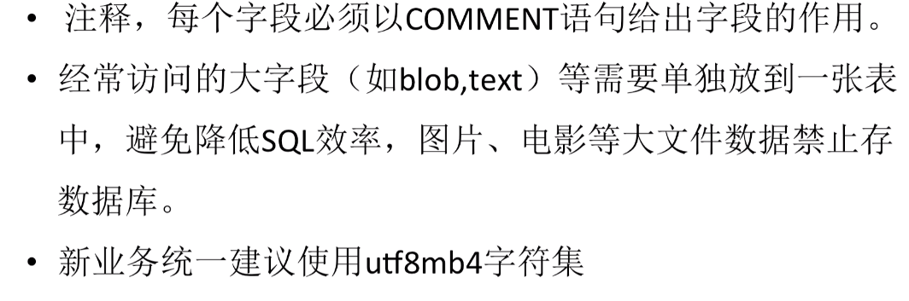
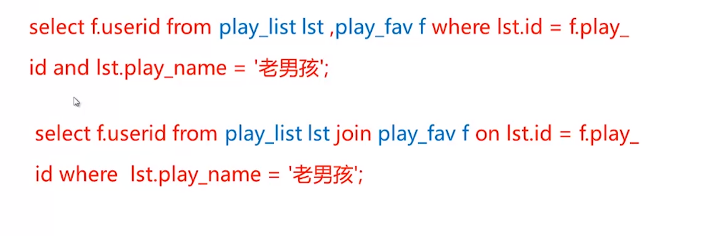
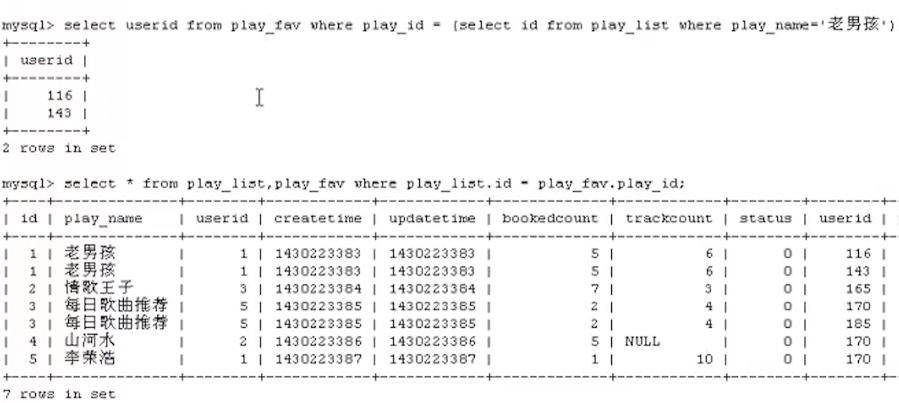
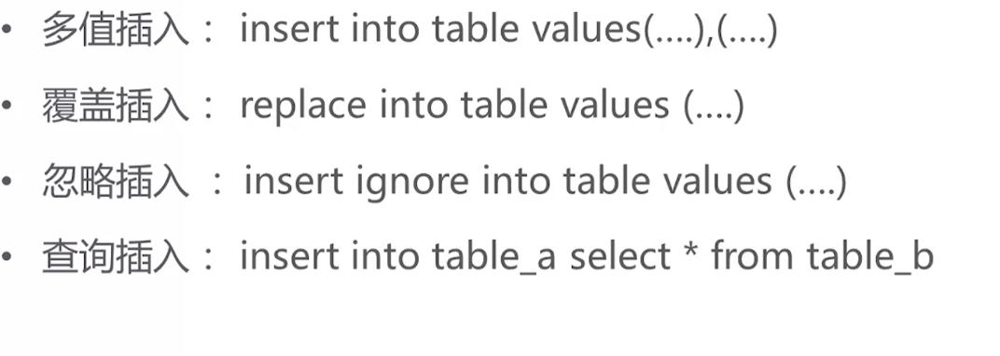

 

## 1
```sql
DROP TABLE IF EXISTS `tb_account`;
/*!40101 SET@saved_cs_client = @@character_set_client */;
/*!40101 SET character_set_client = utf8 */;
 
CREATE TABLE `tb_account` (
`account_id` int(11) NOT NULL AUTO_INCREMENT,
`nick_name` varchar(20) DEFAULT NULL,
`true_name` varchar(20) DEFAULT NULL,
`sex`char(1) DEFAULT NULL,
`mail_address` varchar(50) DEFAULTNULL,
`phone1` varchar(20) NOT NULL,
`phone2` varchar(20) DEFAULT NULL,
`password` varchar(30) NOT NULL,
`create_time` datetime DEFAULT NULL,
`account_state` tinyint(4) DEFAULT NULL,
`last_login_time` datetime DEFAULT NULL,
`last_login_ip` varchar(20) DEFAULT NULL,
PRIMARY KEY(`account_id`)
) ENGINE=InnoDB DEFAULT CHARSET=utf8mb4;
/*!40101 SET character_set_client = @saved_cs_client */;
--
-- Tablestructurefor table`tb_goods`
--
DROP TABLE IF EXISTS `tb_goods`;
/*!40101 SET@saved_cs_client = @@character_set_client */;
/*!40101 SET character_set_client = utf8 */;
CREATE TABLE `tb_goods` ( 
`goods_id` bigint(20) NOT NULL AUTO_INCREMENT,
`goods_name` varchar(100) NOT NULL,
`pic_url` varchar(500) NOT NULL,
`store_quantity` int(11) NOT NULL,
1 
`goods_note` varchar(800) DEFAULT NULL,
`roducer`varchar(500)DEFAULT NULL,
`category_id` int(11) NOT NULL,
PRIMARY KEY(`goods_id`)
) ENGINE=InnoDB DEFAULT CHARSET=utf8mb4;
/*!40101 SET character_set_client = @saved_cs_client */;
--
-- Tablestructurefor table`tb_goods_category`
--
DROP TABLE IF EXISTS `tb_goods_category`;
/*!40101 SET@saved_cs_client = @@character_set_client */;
/*!40101 SET character_set_client = utf8 */;
CREATE TABLE `tb_goods_category` (
`category_id` int(11) NOT NULL AUTO_INCREMENT,
`category_level` smallint(6) NOT NULL,
`category_name` varchar(500) DEFAULT NULL,
`upper_category_id` int(11) NOT NULL,
PRIMARY KEY(`category_id`)
) ENGINE=InnoDB DEFAULT CHARSET=utf8mb4;
/*!40101 SET character_set_client = @saved_cs_client */;
--
-- Tablestructurefor table`tb_order`
--
DROP TABLE IF EXISTS `tb_order`;
/*!40101 SET@saved_cs_client = @@character_set_client */;
/*!40101 SET character_set_client = utf8 */;
CREATE TABLE `tb_order` (
`order_id` bigint(20) NOT NULL AUTO_INCREMENT,
`account_id` int(11) NOT NULL,
`create_time` datetime DEFAULT NULL,
`order_amount` decimal(12,2) DEFAULT NULL,
`order_state` tinyint(4) DEFAULT NULL,
2
`update_time` datetime DEFAULTNULL,
`rder_ip`varchar(20)DEFAULTNULL,
`pay_method` varchar(20) DEFAULTNULL,
`user_notes` varchar(500) DEFAULTNULL,
PRIMARYKEY(`order_id`)
) ENGINE=InnoDB DEFAULT CHARSET=utf8mb4;
/*!40101 SET character_set_client = @saved_cs_client */;
--
-- Tablestructurefor table`tb_order_item`
--
DROP TABLE IF EXISTS `tb_order_item`;
/*!40101 SET@saved_cs_client = @@character_set_client */;
/*!40101 SET character_set_client = utf8 */;
CREATE TABLE `tb_order_item` (
`order_item_id` bigint(20) NOTNULLAUTO_INCREMENT,
`order_id` bigint(20) NOTNULL,
`goods_id` bigint(20) NOTNULL,
`goods_quantity` int(11) NOTNULL,
`goods_amount` decimal(12,2) DEFAULTNULL,
PRIMARYKEY(`order_item_id`),
UNIQUEKEY`uk_order_goods` (`order_id`,`goods_id`)
) ENGINE=InnoDB DEFAULT CHARSET=utf8mb4;
/*!40101 SET character_set_client = @saved_cs_client */;/*!40103SETTIME_ZONE=@OLD_TIME_ZONE*/;
```


----------------------------------------------------

## 2
Tablestructurefor`play_fav`
-- ----------------------------
```sql
DROP TABLE IF EXISTS `play_fav`;
CREATE TABLE `play_fav` (
`userid` bigint(20) NOTNULLCOMMENT '收藏用户id',
`play_id` bigint(20) NOTNULLCOMMENT '歌单id',
`createtime` bigint(20) NOTNULLCOMMENT '收藏时间',
`status` int(11) DEFAULT '0' COMMENT '状态，是否删除',
PRIMARYKEY(`play_id`,`userid`),
KEY`IDX_USERID` (`userid`)
) ENGINE=InnoDB DEFAULT CHARSET=utf8 COMMENT='歌单收藏表';
-- ----------------------------
-- Records of play_fav
-- ----------------------------
INSERT INTO play_favVALUES ('2', '0', '0', '0');
INSERT INTO play_favVALUES ('116', '1', '1430223383', '0');
INSERT INTO play_favVALUES ('143', '1', '0', '0');
INSERT INTO play_favVALUES ('165', '2', '0', '0');
INSERT INTO play_favVALUES ('170', '3', '0', '0');
INSERT INTO play_favVALUES ('185', '3', '0', '0');
INSERT INTO play_favVALUES ('170', '4', '0', '0');
INSERT INTO play_favVALUES ('170', '5', '0', '0');
-- ----------------------------
-- Tablestructurefor `play_list`
-- ----------------------------
DROP TABLE IF EXISTS `play_list`;
CREATE TABLE `play_list` (
`id` bigint(20) NOT NULL COMMENT '主键',
`play_name` varchar(255) DEFAULT NULL COMMENT '歌单名字',
`userid` bigint(20) NOTNULLCOMMENT '歌单作者账号id',
`createtime` bigint(20) DEFAULT '0' COMMENT '歌单创建时间',
`updatetime` bigint(20) DEFAULT '0' COMMENT '歌单更新时间',
`bookedcount` bigint(20) DEFAULT '0' COMMENT '歌单订阅人数',
`trackcount` int(11) DEFAULT '0' COMMENT '歌曲的数量',
`status` int(11) DEFAULT '0' COMMENT '状态,是否删除',
PRIMARYKEY(`id`),
KEY`IDX_CreateTime` (`createtime`),
KEY`IDX_UID_CTIME` (`userid`,`createtime`)
) ENGINE=InnoDB DEFAULT CHARSET=utf8 COMMENT='歌单';
-- ----------------------------
-- Records of play_list
-- ----------------------------
INSERT INTO play_list VALUES ('1', '老男孩', '1', '1430223383', '1430223383', '5', '6', '0');
INSERT INTO play_list VALUES ('2', '情歌王子', '3', '1430223384', '1430223384', '7', '3', '0');
INSERT INTO play_list VALUES ('3', '每日歌曲推荐', '5', '1430223385', '1430223385', '2', '4', '0');
INSERT INTO play_list VALUES ('4', '山河水', '2', '1430223386', '1430223386', '5', null, '0');
INSERT INTO play_list VALUES ('5', '李荣浩', '1', '1430223387', '1430223387', '1', '10', '0');
INSERT INTO play_list VALUES ('6', '情深深', '5', '1430223388', '1430223389', '0', '0', '1');

```
连接性能大概率优于子查询




```sql
-- ----------------------------
-- Tablestructurefor `song_list`
-- ----------------------------
DROP TABLE IF EXISTS `song_list`;
CREATE TABLE `song_list` (
`id` bigint(20) NOT NULL COMMENT '主键',
`song_name` varchar(255) NOT NULL COMMENT '歌曲名',
`artist` varchar(255) NOT NULL COMMENT '艺术节',
`createtime` bigint(20) DEFAULT '0' COMMENT '歌曲创建时间',
`updatetime` bigint(20) DEFAULT '0' COMMENT '歌曲更新时间',
`album` varchar(255) DEFAULT NULL COMMENT '专辑',
`playcount` int(11) DEFAULT '0' COMMENT '点播次数',
`status` int(11) DEFAULT '0' COMMENT '状态,是否删除',
PRIMARY KEY(`id`),
KEY `IDX_artist` (`artist`),
KEY `IDX_album` (`album`)
) ENGINE=InnoDB DEFAULT CHARSET=utf8 COMMENT='歌曲列表';
----------------------------
-- Records ofsong_list
-- ----------------------------
INSERT INTO song_list VALUES ('1', 'Good Lovin' 'Gone Bad', 'Bad Company', '0', '0', 'Straight Shooter', '453', '0');
INSERT INTO song_list VALUES ('2', 'Weep No More', 'Bad Company', '0', '0', 'Straight Shooter', '280', '0');
INSERT INTO song_list VALUES ('3', 'Shooting Star', 'Bad Company', '0', '0', 'Straight Shooter', '530', '0');
INSERT INTO song_list VALUES ('4', '大象', '李志', '0', '0', '1701', '560', '0');
INSERT INTO song_list VALUES ('5', '定西', '李志', '0', '0', '1701', '1023', '0');
INSERT INTO song_list VALUES ('6', '红雪莲', '洪启', '0', '0', '红雪莲', '220', '0');
INSERT INTO song_list VALUES ('7', '风柜来的人', '李宗盛', '0', '0', '作品李宗盛', '566', '0');


DROP TABLE IF EXISTS `tbl_proc_test`; 
CREATE TABLE `tbl_proc_test` ( 
`id` int(11) NOT NULL AUTO_INCREMENT, 
`num` int(11) DEFAULT NULL, 
PRIMARY KEY(`id`)
)
ENGINE=InnoDB AUTO_INCREMENT=30 DEFAULT CHARSET=utf8; 
-- ---------------------------- 
-- Records oftbl_proc_test 
-- ---------------------------- 
INSERT INTO tbl_proc_test VALUES ('11', '1'); 
INSERT INTO tbl_proc_test VALUES ('12', '2'); 
INSERT INTO tbl_proc_test VALUES ('13', '6'); 
INSERT INTO tbl_proc_test VALUES ('14', '24'); 
INSERT INTO tbl_proc_test VALUES ('15', '120'); 
INSERT INTO tbl_proc_test VALUES ('16', '720'); 
INSERT INTO tbl_proc_test VALUES ('17', '5040'); 
INSERT INTO tbl_proc_test VALUES ('18', '40320'); 
INSERT INTO tbl_proc_test VALUES ('19', '362880'); 
INSERT INTO tbl_proc_test VALUES ('20', '3628800'); 
INSERT INTO tbl_proc_test VALUES ('21', '1'); 
INSERT INTO tbl_proc_test VALUES ('22', '2'); 
INSERT INTO tbl_proc_test VALUES ('23', '6'); 
INSERT INTO tbl_proc_test VALUES ('24', '24'); 
INSERT INTO tbl_proc_test VALUES ('25', '1'); 
INSERT INTO tbl_proc_test VALUES ('26', '2'); 
INSERT INTO tbl_proc_test VALUES ('27', '6'); 
INSERT INTO tbl_proc_test VALUES ('28', '24'); 
INSERT INTO tbl_proc_test VALUES ('29', '120'); 
-- ---------------------------- 
-- Tablestructurefor `tbl_test1` 
-- ---------------------------- 
DROP TABLE IF EXISTS `tbl_test1`; 
CREATE TABLE `tbl_test1` ( 
`user` varchar(255) NOT NULL COMMENT '主键', 
`key` varchar(255) NOT NULL, 
`value` varchar(255) NOT NULL, 
PRIMARY KEY(`user`,`key`) 
) ENGINE=InnoDB DEFAULT CHARSET=utf8 COMMENT='行列转换测
试'; 
-- ---------------------------- 
-- Records oftbl_test1 
-- ---------------------------- 
INSERT INTO tbl_test1 VALUES ('li', 'age', '18'); 
INSERT INTO tbl_test1 VALUES ('li', 'dep', '2'); 
INSERT INTO tbl_test1 VALUES ('li', 'sex', 'male'); 
INSERT INTO tbl_test1 VALUES ('sun', 'age', '44'); 
INSERT INTO tbl_test1 VALUES ('sun', 'dep', '3'); 
INSERT INTO tbl_test1 VALUES ('sun', 'sex', 'female'); 
INSERT INTO tbl_test1 VALUES ('wang', 'age', '20'); 
INSERT INTO tbl_test1 VALUES ('wang', 'dep', '3'); 
INSERT INTO tbl_test1 VALUES ('wang', 'sex', 'male'); 
-- ---------------------------- 
-- Procedurestructurefor `proc_test1` 
-- ---------------------------- 
DROP PROCEDURE IF EXISTS `proc_test1`;

DELIMITER $$

CREATE DEFINER=`root` PROCEDURE `proc_test1`(IN total INT, OUT res INT)
BEGIN 
    DECLARE i INT; 
    SET i = 1; 
    SET res = 1;

    IF total <= 0 THEN
        SET total = 1;
    END IF;

    WHILE i <= total DO
        SET res = res * i;
        INSERT INTO tbl_proc_test(num) VALUES (res);
        SET i = i + 1;
    END WHILE;
END$$

DELIMITER ;
