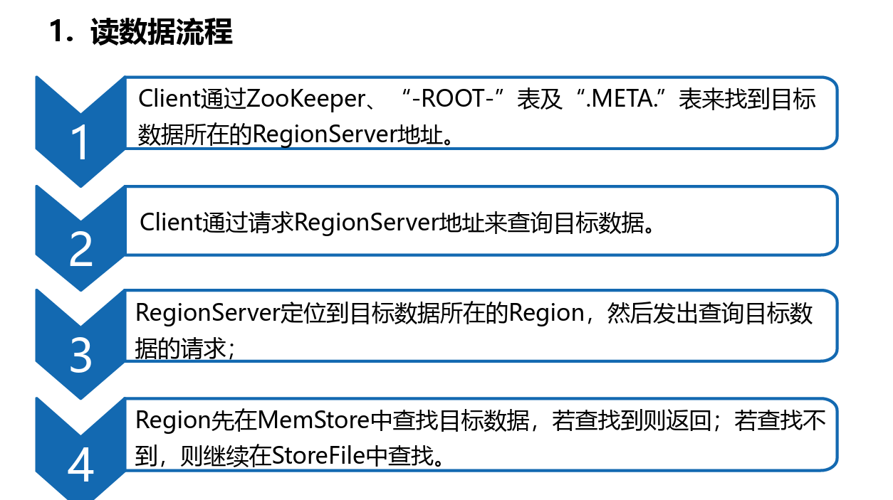
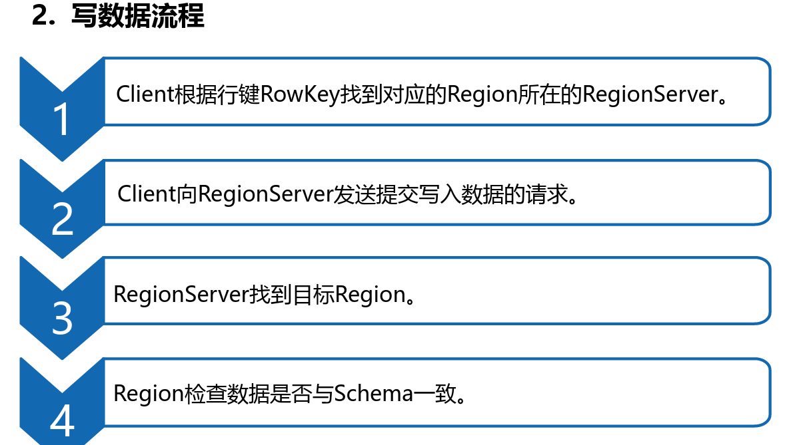
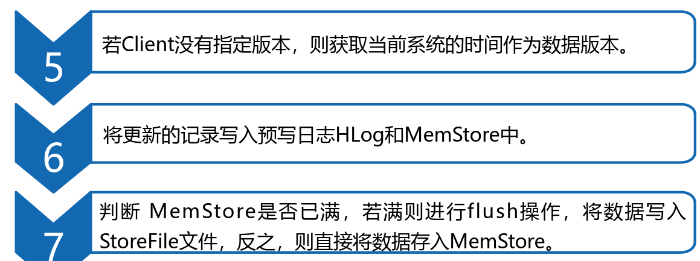

[TOC]

create 创建表
put插入或更新数据
scan扫描表并返回表的所有数据
describe查看表的结构
get获取指定行或列的数据
count统计表中数据的行数
delete删除指定行或者列的数据
deleteall删除整个行或列的数据
truncate删除整个表中的数据，但是结构还在
drop删除整个表，数据和结构都删除（慎用）

Admin是一个类，用于建立客户端和HBase 数据库的连接
HBaseConfiguration是一个类，用于将HBase配置添加到配置文件中
HTableDescriptor是一个接口，用于描述表的信息
HColumnDescriptor是一个类，用于描述列族的信息
Table是一个接口，用于实现HBase表的通信
Put是一个类，用于插入数据操作
Get是一个类，用于查询单条记录
Delete是一个类，用于删除数据
Scan是一个类，用于查询所有记录
Result是一个类，用于查询返回的单条记录结果

在实际业务中，由于HBase不支持使用SQL语
法，因此我们操作和计算HBase分布式数据库中的数
据是非常不方便的，并且效率也低。由于Hive支持标
准的SQL语句，因此，我们可以将HBase和Hive进行
整合，通过使用Hive数据仓库操作HBase分布式数据
库中的数据，以此来满足实际业务的需求。
