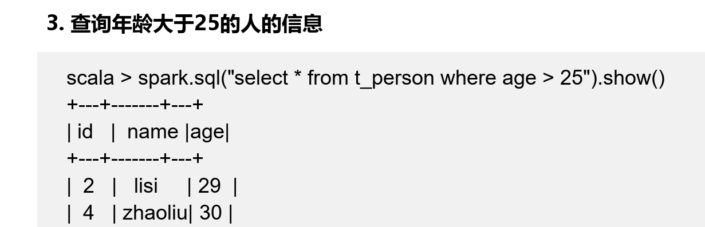

Spark SQL是Spark用来处理结构化数据的一个模块，它
提供了一个编程抽象结构叫做DataFrame的数据模型（即带
有Schema信息的RDD），Spark SQL作为分布式SQL查询引
擎，让用户可以通过SQL、DataFrames API和Datasets API
三种方式实现对结构化数据的处理
Spark SQL架构与Hive架构相比，把底层的MapReduce执行引擎更改为
Spark，还修改了Catalyst优化器，Spark SQL快速的计算效率得益于Catalyst优
化器。从HiveQL被解析成语法抽象树起，执行计划生成和优化的工作全部交给
Spark SQL的Catalyst优化器进行负责和管理。

Catalyst优化器在执行计划生成和优化的工作时，离不开内部的五大组件。
• SqlParse：完成SQL语法解析功能，目前只提供了一个简单的SQL解析器。
• Analyze：主要完成绑定工作，将不同来源的Unresolved LogicalPlan和元
数据进行绑定，生成Resolved LogicalPlan。
• Optimizer：对Resolved Lo;gicalPlan进行优化，生成
OptimizedLogicalPlan。
• Planner：将LogicalPlan转换成PhysicalPlan。
• CostModel：主要根据过去的性能统计数据，选择最佳的物理执行计划

### dataframe
在Spark中，DataFrame是一种以RDD为基础的分布式数据集。
DataFrame的结构类似传统数据库的二维表格，可以从很多数据
源中创建，如结构化文件、外部数据库、Hive表等数据源。

DataFrame可以看作是分布式的Row对象的集合，在二维表数据集的每一
列都带有名称和类型，这就是Schema元信息，这使得Spark框架可获取更多数
据结构信息，从而对在DataFrame背后的数据源以及作用于DataFrame之上数
据变换进行针对性的优化，最终达到提升计算效率

df有两种操作风格
DSL风格：

SQL风格：

### Dataset

Dataset提供了特定域对象中的强类型集合，也就是在RDD
的每行数据中添加了类型约束条件，只有约束条件的数据类
型才能正常运行。Dataset结合了RDD和DataFrame的优
点，并且可以调用封装的方法以并行方式进行转换等操作。

### 三者比较
RDD数据的表现形式，即序号（1），此时RDD数据没有数据类型和元数据信息。
• DataFrame数据的表现形式，即序号（2），此时DataFrame数据中添加Schema
元数据信息（列名和数据类型，如ID：String），DataFrame每行类型固定为Row
类型，每列的值无法直接访问，只有通过解析才能获取各个字段的值。

Dataset数据的表现形式，序号（3）和（4），其中序号（3）是在RDD每
行数据的基础之上，添加一个数据类型（value：String）作为Schema元数据
信息。而序号（4）每行数据添加People强数据类型，在Dataset[Person]中里
存放了3个字段和属性，Dataset每行数据类型可自定义，一旦定义后，就具有
错误检查机制。

以上为考试知识点，具体实际操作看另一个spark文件夹